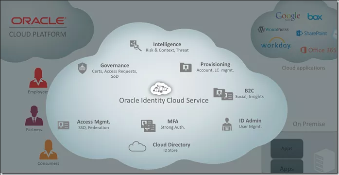
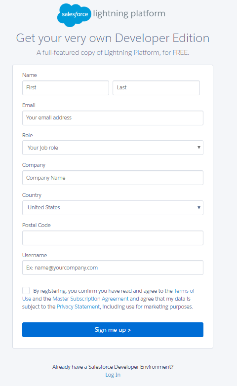
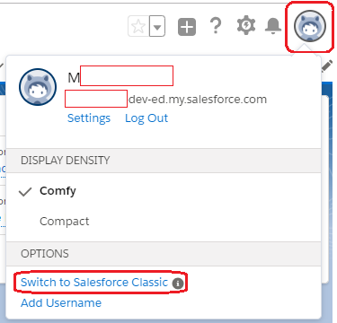
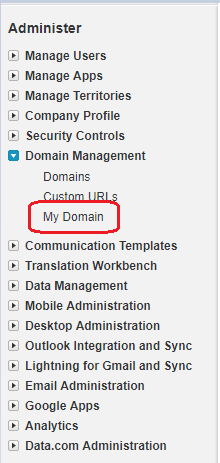
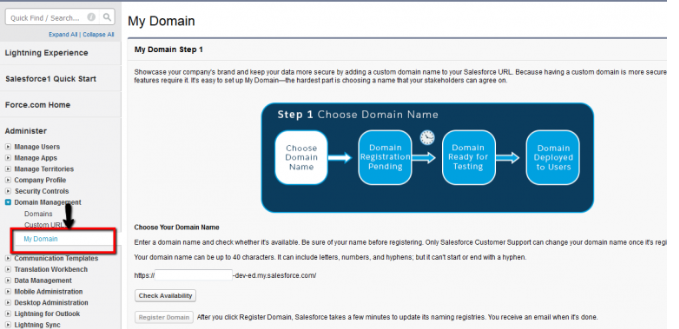
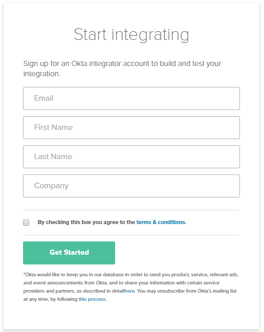
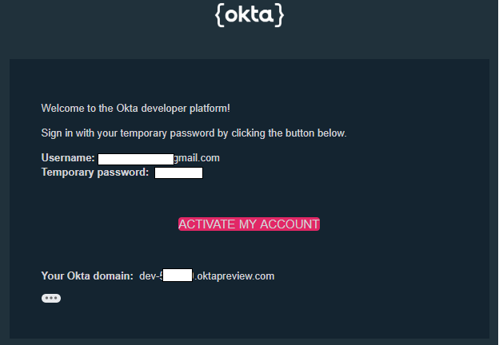
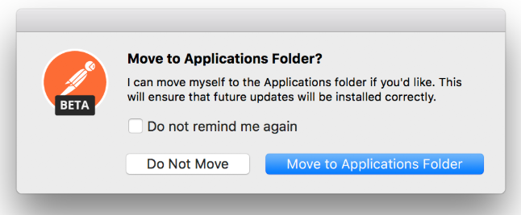

# Introduction

## About this Workshop

For the workshop lab exercises, the current version of the Oracle Identity Cloud Service (IDCS) is being demonstrated.

Identity Cloud Service is Oracle’s next generation comprehensive security and identity platform that provides an innovative, fully integrated service that delivers all the core identity and access management capabilities through a Cloud platform “as a service”. The design of Identity Cloud Service (IDCS) is based on micro service architecture which is naturally aligned with Cloud principles of Scalability, Elasticity, Resilience, Ease of Deployment, Functional Agility, Technical Adoption and Organization Alignment.

At high level, Oracle Identity Cloud Service offers the following functionalities:

* Identity & Access Management
* Integration with on-prem Active Directory or 3rd party Identity Systems
* Single-Sign-On (SSO)
* User Authentication Service
* Identity Federation service (SAML)
* OAuth services
* Auditing & Reporting Services

Estimated Lab Time: 5 hours


## IDCS Architecture
Oracle Identity Cloud Service is a new platform service which is available as part of Oracle’s broad portfolio of PaaS services.  IDCS is implemented as a set of micro-services, and the design philosophy is API-first with support for modern standards such as SCIM, OAUTH, SAML and OpenID Connect.

The following diagram illustrates the IDCS architecture, organized as a series of service layers.  



## Lab Configuration and Details
This workshop is hosted in the Oracle Public Cloud (OPC).  It includes a combination of cloud services, hosted on-premises software and 3rd party software.  Aside from the Identity Cloud Service, the remaining components are included to enable demonstrating integration, including identity synchronization, federation, authentication, SSO and more.


The following summarizes the components in our workshop:

* Oracle Cloud Infrastructure (OCI)
* Oracle Identity Cloud Service (IDCS)

Third-party SaaS Applications

* Salesforce – used for IDCS Application Integration
* Google – used for IDCS Federation
* Okta – used for IDCS Federation

Third-party Components

* Postman – used for IDCS REST API User Management


## Concepts and Terminology

This section provides a brief review of a few of the concepts and terms, which will be used throughout the workshop.

*	Oracle Public Cloud (OPC) – OPC describes Oracle’s overall cloud portfolio, which consists of the industry’s broadest and most complete portfolio of SaaS, PaaS and IaaS cloud services.  OPC services exist across the globe via dozens of global data centers.

*	SaaS / PaaS / IaaS – These are the three service categories of Oracle cloud services.   SaaS stands for software-as-a-service and more generally might represent cloud services such as Oracle Customer Experience (CX), Salesforce.com, WorkDay, Office365, etc.  PaaS stands for platform-as-a-service and refers to middleware services such as Java, database, integration, identity, etc.  IaaS stands for infrastructure-as-a-service and represents services such as compute, network and storage.  Top providers for IaaS include Microsoft (Azure), Amazon (AWS) and Oracle.

*	Tenant – a tenant represents a subscription to a cloud service.  Many of Oracle’s cloud services (including Identity Cloud Service) are multi-tenant, which means that multiple customers (e.g. departments, companies, organizations, agencies, etc.) subscribe to and are serviced by a common cloud service operating in OPC.  In a multi-tenant scenario, each tenant has its own data, configuration settings, users and other service-related artefacts.  

*	OAUTH 2.0 – OAUTH is a standard protocol for delegating authorization.  It’s a way for an entity to be authorized to access resources (services, API, data) stored in a remote provider.  For example, an on-premises application might leverage the IDCS REST API to retrieve information about users or groups from IDCS for use within its application.  The REST API is protected by the OAUTH service, to ensure the client application is registered and authorized to a specific scope of REST API.  Thus, OAUTH prevents internet-visible services (such as IDCS REST API) from being consumed by an unauthorized user or application.

*	SAML 2.0 – SAML stands for Security Assertion Mark-up Language.  It is a standard for federating user authentication.  SAML defines two participating entities, the Service Provider and the Identity Provider.  When a user attempts to access an application or service (at the Service Provider) which is configured for SAML, rather than log the user in through local ID/PW, the SP causes the user authentication to be performed by the Identity Provider.  There is therefore a trust relationship established between SP and IDP.  Oracle IDCS can be configured to take the role of Service Provider and/or Identity Provider.  As a service provider, IDCS enables self-service profile management, password reset, etc.

*	Identity Provider – This type of provider, also known as an Identity Assertion provider, provides identifiers for users who want to interact with Oracle Identity Cloud Service using a website that's external to Oracle Identity Cloud Service.


## Advantages of the Oracle Solution

This section briefly introduces some of the economical, business and technical benefits of the Oracle Identity Cloud Service solution:

*	**Open and Standards-based** – Rapidly integrate cloud and on-premises applications using a 100% open and standards-based solution.  Examples of supported standards include System for Cross-domain Identity Management (SCIM), Open Authorization (OAUTH 2.0), Security Assertion Markup Language (SAML 2.0), Representational State Transfer (REST), OpenID Connect and others!

*	**Secure Defense In-depth** – Benefit from layers of defense with Oracle’s Identity Cloud Service hosted as an Oracle Public Cloud (OPC) service and integrated with your on-premises enterprise capabilities.

*	**Hybrid Identity** – Manage user identities for both cloud and on-premises applications with enterprise-grade hybrid deployments.  Several options exist to integrate and exchange data between your on-premises and IDCS environments.

*	**Oracle’s Market Leadership in Cloud Identity** – Oracle Identity Cloud Service is not Oracle’s first entry into the cloud identity market.  We have been providing cloud identity services for the past 4-years, for a variety of Oracle Public Cloud (OPC) services.  Considering identity services handling the needs of 35,000 customers, at scale with over 30-million daily logins and you realize that Oracle is a cloud identity market leader before introducing IDCS!

*	**Modern architecture** – While some vendors’ idea of cloud services is simply to deploy their on-premises applications in a “cloud” data center, Oracle has completely rewritten our solution from the ground up.  The architecture is API-first and built on a micro-services architecture leveraging open standards.  It provides a true platform for identity services.

*	**Service Breadth** – Some first-generation vendors solved niche problems for providing identity cloud services (e.g. SSO to SaaS applications, etc.).  However, the reality is that enterprises of all sizes will not want to have an integrated-best-of-breed solution in the cloud.  The vast majority will select a service partner with the right solution, which solves enterprise-grade needs.  Equally imperative is finding a business partner which can support both your on-premises and cloud identity infrastructure and enable the transition to cloud at your pace and in your time-frame.  That vendor is Oracle.


## Objectives

At the end of this workshop, you will have a good understanding of
* User and group management
* Catalog use and SSO configuration
* SAML-based and Social Federation
* Conditional and adaptive MFA


## Prerequisites

The following summarizes the external components in our workshop:

1.	Google Account
2.	Salesforce Developer Account
3.	Okta Integrator Account
4.	Postman native application

### Create a Gmail account

To sign up for Gmail, create a Google Account

1.	Go to the [Google Account creation page](https://accounts.google.com/SignUp)
2.	Follow the steps on the screen to set up your account.
3.	Use the account you created to sign in to Gmail.


### Create a Salesforce Developer Account

Salesforce is providing free developer edition. Steps to create free developer account in salesforce.com

1.	Open a browser and access the [Salesforce Developer Account](https://developer.salesforce.com/signup) signup page
2.	Fill in the signup form:
    - Enter your First Name and Last Name
          For *Email*, enter your email address (you will need to open an activation email)
          NOTE: Use the Gmail account that you have created at Step 1.
    - For *Username*, specify a unique user name in the form of an email address
    - Check the Master Subscription Agreement checkbox and click the *Sign Me Up* button
   


3.	Check your email. You will receive an activation email for your Developer Edition Account.
4.	Click the link in the activation email. Enter your new password information and click *Save*.

#### Register a Custom domain in Salesforce

A custom domain or My Domain is a way to have your own Salesforce org customized URL rather than a common Salesforce URL.

To use some features in Salesforce, My Domain is required. Such features include

* display  *Lightning components* in Lightning component tabs, Lightning Pages, the Lightning App Builder, or lightning standalone apps.
* integrate *social sign-on with authentication providers*, such as Facebook and Google.
* use *Single sign-on (SSO)* with external identity providers. In our workshop scenario, this is going to be *Oracle Identity Cloud Service*.
    Note: You have to select “Switch to Salesforce Classic”.

1.	From your Salesforce *homepage* navigate to your profile (the “View profile” icon on the top right corner).
2.	In the *Options* menu, select “Switch to Salesforce classic”

    


3.	Navigate to *Setup(classic)* –> *Administer* –> *Domain Management* –> select *My Domain*.

    

    

4.	Enter, the subdomain name which you want to use within the Salesforce generic URL - it can be the account name used in the Oracle Cloud account sign up (used to identify your cloud account)

    

5. Click on the Check Availability button. (If your name is already taken, choose a different one.). Click on the Register Domain button.

   

6.	Salesforce updates its domain registries with your new. When it’s done, you receive a confirmation email. It can take a few minutes before your domain is available.
7.	After you receive the activation email, from the email click on the link to get back to the Log in screen with custom domain URL.


### Create an Okta Integrator Account

1. Open a browser and access the [Okta Integrator page](https://www.okta.com/integrate/signup/)

2.	Fill in the signup form:

    - Enter your *Email*
    NOTE: Use the Gmail account that you have created at Step 2.
    - Enter your *First Name* and *Last Name*
    - Enter the *Company* name – it can be the account name used in the Oracle Cloud account sign up (used to identify your cloud account)

   

3.	Verify Your Email Address. Okta will send you a verification email. Please go to your inbox and verify your account to continue.Click on *Activate my account* in the verification email.

    

4.	Set a new password and activate your account.


### Install the Postman native application

1. Postman is available as a native app for macOS, Windows, and Linux operating systems.

To install Postman, go to the [apps page](https://learning.getpostman.com/docs/postman/launching_postman/installation_and_updates/) and click *Download* for macOS / Windows / Linux depending on your platform.

*macOS installation*

Once you’ve downloaded and unzipped the app, double click on Postman. You will be prompted to move file into the "Applications" folder. Click "Move to Applications Folder" to ensure future updates can be installed correctly. The app will open after the prompt.



*Windows installation*

Once you’ve downloaded the installer file, run it and follow the instructions on the screen.

*Linux  installation*

For installation on Linux, perform the following steps:

1.	First download and unzip the file
2.	And then create a desktop file by name Postman.desktop. Create the Postman.desktop file in the following location:

```
~/.local/share/applications/Postman.desktop
```

Use the content below in the above file:
```
  [Desktop Entry]
  Encoding=UTF-8
  Name=Postman
  Exec=YOUR_INSTALL_DIR/Postman/app/Postman %U
  Icon=YOUR_INSTALL_DIR/Postman/app/resources/app/assets/icon.png
  Terminal=false
  Type=Application
  Categories=Development;
```

Once the Postman.desktop file is created, the Postman app can be opened using application launchers. You can check your desktop and double-click the Postman icon.

You may proceed to the first lab.

## Additional Information

This workbook is primarily designed to provide the necessary instructions and context to allow you to complete the labs in the Oracle Identity Cloud Service Workshop.  If you would like additional information about the Oracle solution, you can contact your local Oracle account team and/or review some of the following publicly available information about the solution.

* [Identity Cloud Service website](https://cloud.oracle.com/en_US/identity)
* [Solution Data Sheet](http://www.oracle.com/technetwork/middleware/id-mgmt/overview/idcs-datasheet-3097388.pdf)
* [Product documentation](http://docs.oracle.com/cloud/latest/identity-cloud/index.html)
* [Blogs](https://blogs.oracle.com/imc/)

## Acknowledgements
* **Author** - SEHub Security and Manageability Team
* **Last Updated By/Date** - Lucian Ionescu, Principal Solution Engineer, 15.09.2020

## Need Help?
Please submit feedback or ask for help using our [LiveLabs Support Forum](https://community.oracle.com/tech/developers/categories/livelabsdiscussions). Please click the **Log In** button and login using your Oracle Account. Click the **Ask A Question** button to the left to start a *New Discussion* or *Ask a Question*.  Please include your workshop name and lab name.  You can also include screenshots and attach files.  Engage directly with the author of the workshop.

If you do not have an Oracle Account, click [here](https://profile.oracle.com/myprofile/account/create-account.jspx) to create one.

