# Load Data into an Instance

## Introduction

An identity provider, known as an Identity Assertion provider, provides identifiers for users who want to interact with Oracle Identity Cloud Service using a website that's external to Oracle Identity Cloud Service. A service provider is a website such as Oracle Identity Cloud Service that hosts applications. You can enable an identity provider and define one or more service providers. Your users can then access the applications hosted by the service providers directly from the identity provider.

Oracle Identity Cloud Service (IDCS) supports social identity providers so that users can log in to IDCS with their social credentials. Social login feature allows users to self-register in IDCS if they do not already have an account.


Following Social providers comes out-of-the-box with IDCS -
* Facebook
* Google
* LinkedIn
* Microsoft
* Twitter

IDCS also supports any generic social identity provider that is OpenID Connect compliant.

The following links are to a video showing the configuration with Google and IDCS.  The screens are dated, but the parameters and concepts are helpful.

[](youtube:-OwFAGJw3vo)

Another video – with more detail, but with the older style screens:

[](youtube:JU8ArDvzWq0)


Estimated Lab Time: 30 minutes

### Objectives

In this lab, you will:
*	configure federation in Google
*	configure federation in IDCS
*	verify Social Login

### Prerequisites

* An Oracle Free Tier or Paid Account
* A Google Account

## **STEP 1**: Configure Google

* *Personas*:
    - Administrator

A quick tutorial for integrating Google Sign-in into your web app is found at this [link](https://developers.google.com/identity/sign-in/web/sign-in).

This guide also provides a detailed tutorial on how to integrate Google as an IdP for IDCS.

In order to use Google as an IdP for IDCS, we need to obtain Auth 2.0 credentials from Google. This can be done by having a developer account on google and create an application for this purpose.


1.	To start, please click on the [OpenIDConnect protocol page](https://developers.google.com/identity/protocols/OpenIDConnect) on the *Google Identity Platform* page.

2.	Scroll down to the sub-heading *Obtain OAuth 2.0 credentials* and click on the hyperlinked *Credentials* page. A new Window will open which will ask you to login with your Google account. *Sign in* with the Google account you created during the prerequisites section of this workshop.
    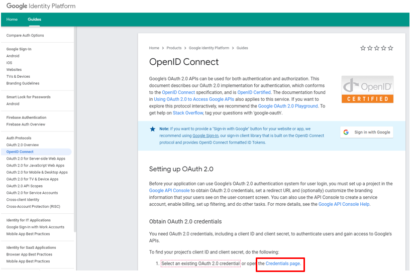

3.	Click on *Select a project* and select *NEW PROJECT*.
    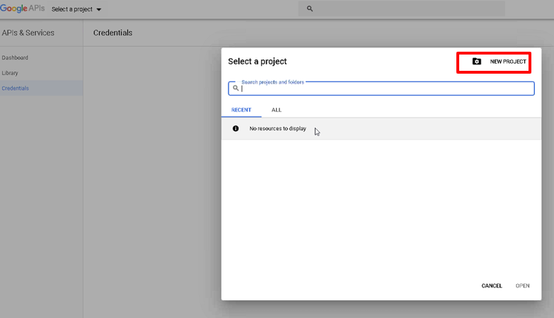

4.	Choose a name for your project and click *CREATE*.
    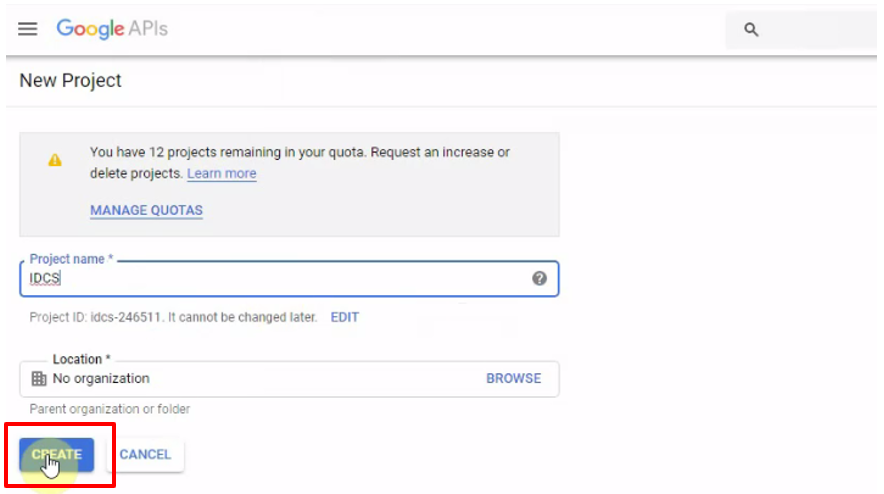

5.	Under *Credentials*, click on *OAuth consent screen*.

6.	Choose an *Application name*.
    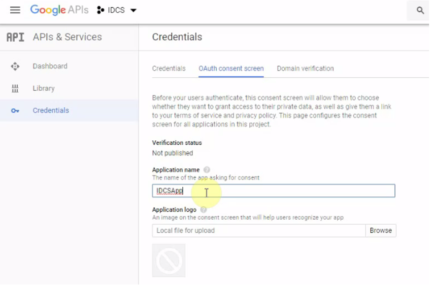

7.	For *authorized domains*, choose *oraclecloud.com* and click on *Save*.
    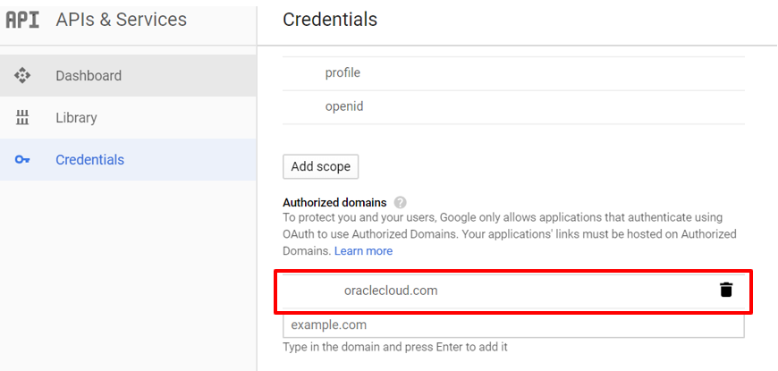

8.	Click on *Create credentials* and select *OAuth client ID*.
    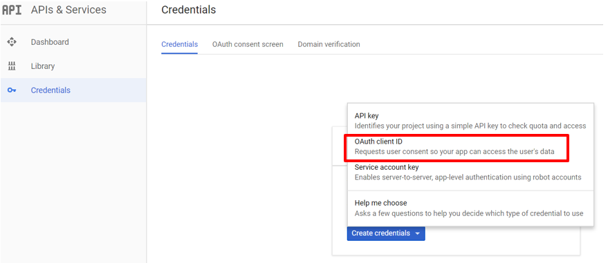

9.	Choose *Web application* and a *name*.

10.	Set the *Authorized redirected URL* to the following value:

    ```
    https://<your tenant>/oauth2/v1/social/callback
    ```

11.	Click on *Create* in order to create the keys.
    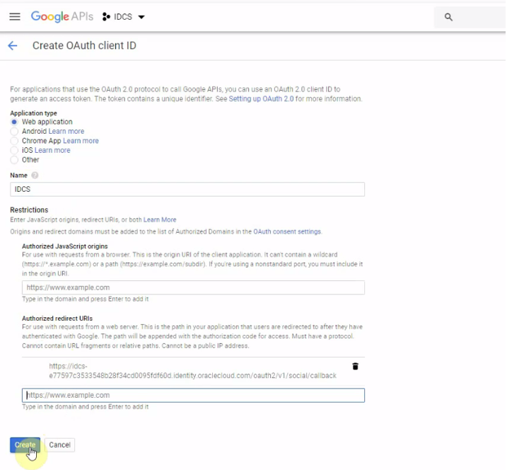

12.	You will receive the *client ID* and the *client secret*. Save those for later.
    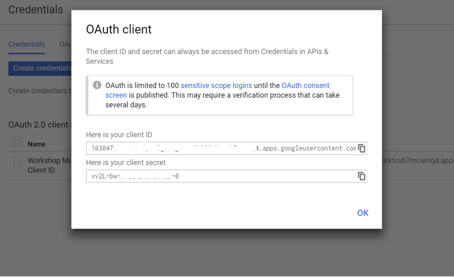


## **STEP 2:** Configure IDCS

* *Personas*:
    - Administrator

Now return to *IDCS* and enter the provider parameter values in order to configure Google as a Social IdP.

1.	Go to IDCS admin console. From the left sidebar menu, go to the *Security* tab and then to *Identity Providers*.

2.	Click on *Add Social IDP*

3.	Select the type as *Google*. Provide a name of the provider (e.g “Google-<<student name>>” and click *Next*.
    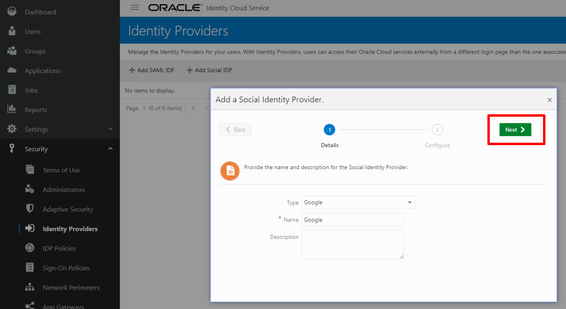

4.	Fill in the *Client ID* and *Client Secret* we obtained before.
    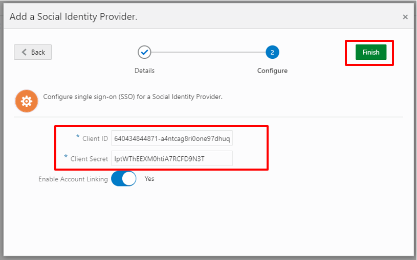

5.	Click on *Finish*. Then, click on the menu button on the right side and select *Activate* in order to activate Google as an IdP.
    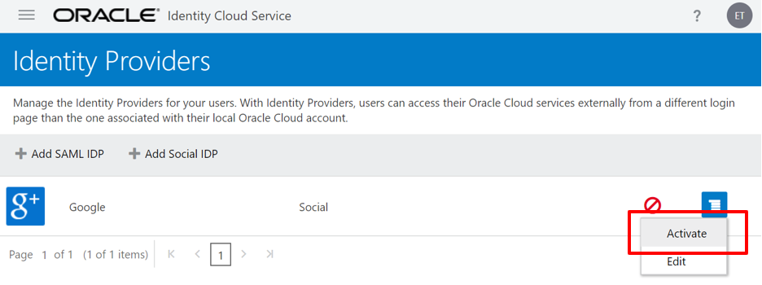

    Now, Google is defined as a social IdP for IDCS but it is still not visible at the sign in page. The next steps describe how to assign it to a IDP policy in order to make Google visible on the IDCS login page.

6.	Click again the menu button and select the option *Show on Login Page* in order to show Google as an IdP on the IDCS login page.
    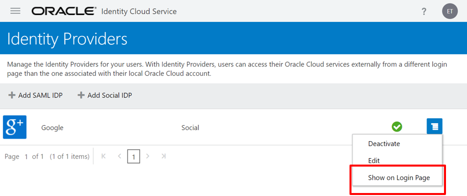

    Once setup for to *Show on Login Page*, you’ll see an "eye".

    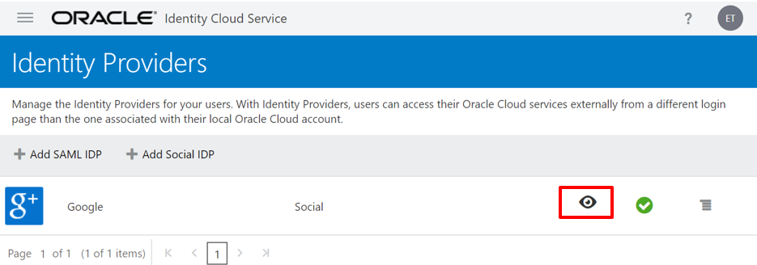

7.	In the sidebar menu, click on *Security* and then on *IDP Policies*. Click on *Default Identity Policy*.
    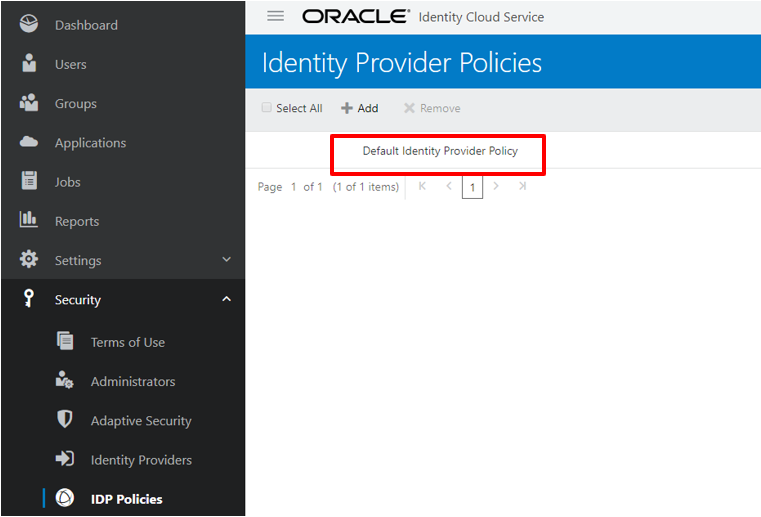

8.	Select the *Identity Providers* tab and click on *Assign* in order to assign Google as an IdP.
    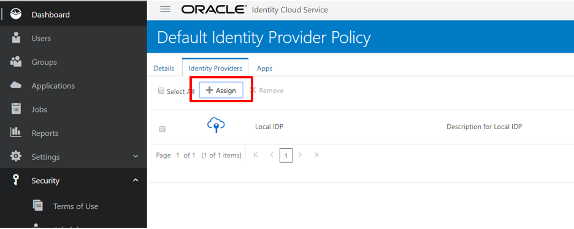

9.	Select *Google* and click *OK*.
    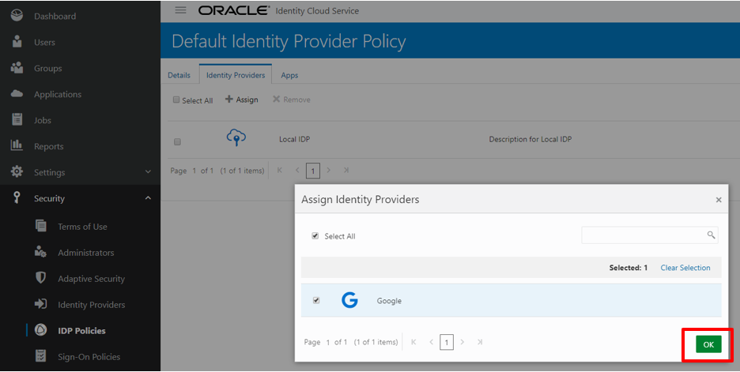

10.	Google appears now in the list of Identity Providers. Google has now been configured and assigned as an IdP for IDCS. The next step will be to link your Google account with your IDCS account. In order to do that, click *My Profile*.
    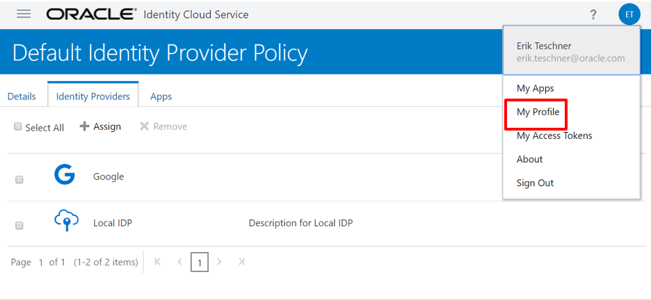

11.	Under *My Profile*, select the tab *Social Accounts*. Click on *Link a Social Account* in order to link your Gmail account to your IDCS account.
    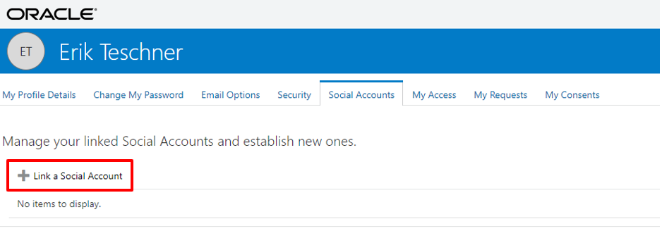

12.	Click the *hamburger menu* and click *Link*.
    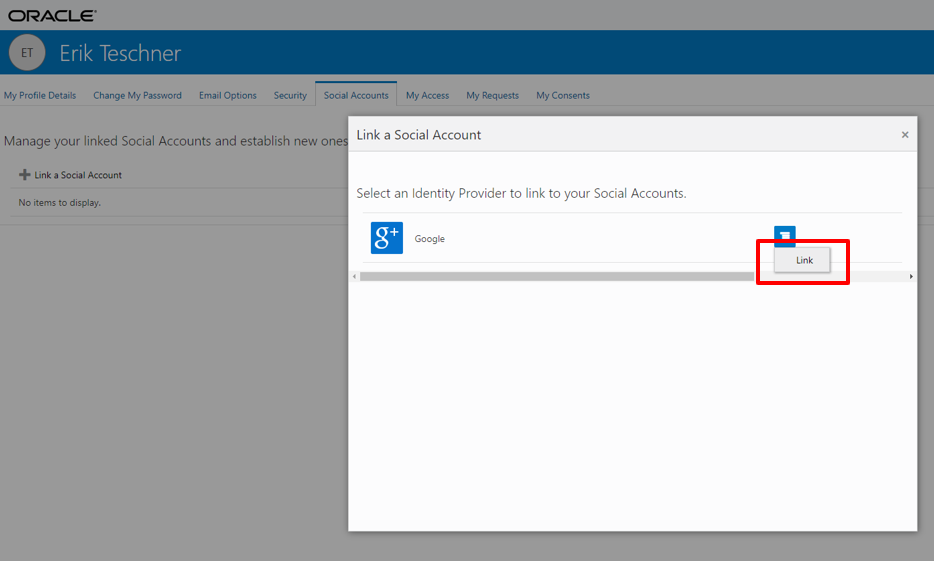

13.	Your Gmail account is now linked to your IDCS account. Click *Sign Out* in order to sign out from IDCS.
    

## **STEP 3:** Verify Social Login

* *Personas*:
    - End User

Now return to *IDCS* and enter the provider parameter values in order to configure Google as a Social IdP.

1.	Go to IDCS admin console. Click on *Google* as a Sign In method.
    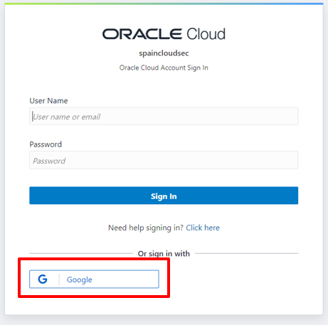

2.	The Sign in page of Google pops up. Fill in your Gmail address and password and click *Next*.
    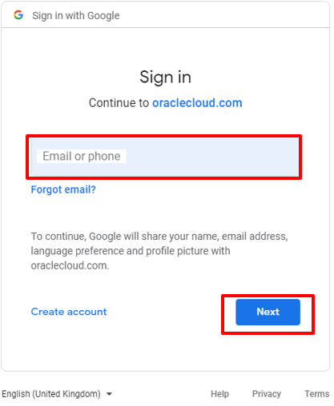

3. Google redirects to the *My Apps* page of IDCS. The integration of Google as an IdP for IDCS is successfully tested.
    


You may now proceed to the next lab

## Acknowledgements
* **Author** - SEHub Security and Manageability Team
* **Last Updated By/Date** - Lucian Ionescu, Principal Solution Engineer, 15.09.2020

## Need Help?
Please submit feedback or ask for help using our [LiveLabs Support Forum](https://community.oracle.com/tech/developers/categories/livelabsdiscussions). Please click the **Log In** button and login using your Oracle Account. Click the **Ask A Question** button to the left to start a *New Discussion* or *Ask a Question*.  Please include your workshop name and lab name.  You can also include screenshots and attach files.  Engage directly with the author of the workshop.

If you do not have an Oracle Account, click [here](https://profile.oracle.com/myprofile/account/create-account.jspx) to create one.

