# Autonomous Data Warehouse (ADW) and Oracle Application Express (APEX)

## Introduction

This lab walks you through the steps to get started using the Oracle Autonomous Data Warehouse (ADW) and Oracle Application Express (APEX) provided with your Autonomous Data Warehouse on Oracle Infrastructure Cloud (OCI). You will provision a new ADW instance as well as use APEX to create a workspace and user, load data, and create an app.

*In addition to the workshop*, feel free to watch the walkthrough companion video:

### Objectives
-   Learn how to provision a new Autonomous Data Warehouse (ADW)
-   Learn how to download an ADW cloud wallet file 
-   Learn how to create an APEX workspace and user
-   Learn how to load data with APEX
-   Learn how to create an app with APEX

### Prerequisites
-   Assumes the participant has completed the Register for Free Tier/Cloud Login Lab

### Estimated Time to Complete Lab
30 minutes

### Extra Resources
Watch this video to learn more about Autonomous Database.

-   To learn more about Oracle Application Express (APEX), feel free to explore the capabilities by clicking on this link: [APEX Overview](https://apex.oracle.com/en/)
-   Additionally, to see an example of what kind of sites and apps are possible to quickly create with APEX, check out a showcase by clicking on this link: [Built with APEX](https://www.builtwithapex.com/)

## **STEP 1**: Create an ADW Instance

1. If after logging in, you are taken to the screen below, click on **Infrastructure Dashboard**.  If you do not see the screen below when you login, skip this step and move on to the next step below.

    

2. Once you are logged in, you are taken to the OCI Console. Click **Create an ADW Database**

    

3. This will bring up the Create Autonomous Data Warehouse screen where you will specify the configurations of the instance. Compartments are used to organize resources in the Cloud. Using the drop down, select the compartment of your choice.  Here, we are selecting **CloudDataWorkshop** from the compartment list.

4. Specify a memorable display name for the instance. Also specify your database's name, use **ADW\_FIRSTNAME\_LASTNAME** for this lab.

    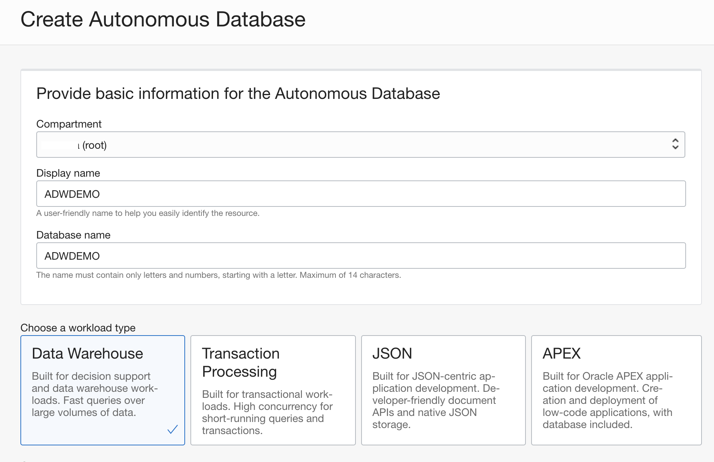

5. Then, scroll down and select the CPU core count and Storage (TB) size. Here, we use 2 CPU and 1 TB of storage.

    

6. Uncheck Auto scaling for the purposes of this workshop.

7. Then, specify an ADMIN password for the instance, and a confirmation of it. Make a note of this password.

    

8. For this lab, we will select **License Included** for the license type. If your organization owns Oracle Database licenses already, you may bring those license to your cloud service.

9. Make sure everything is filled out correctly, then proceed to click on **Create Autonomous Database**.

    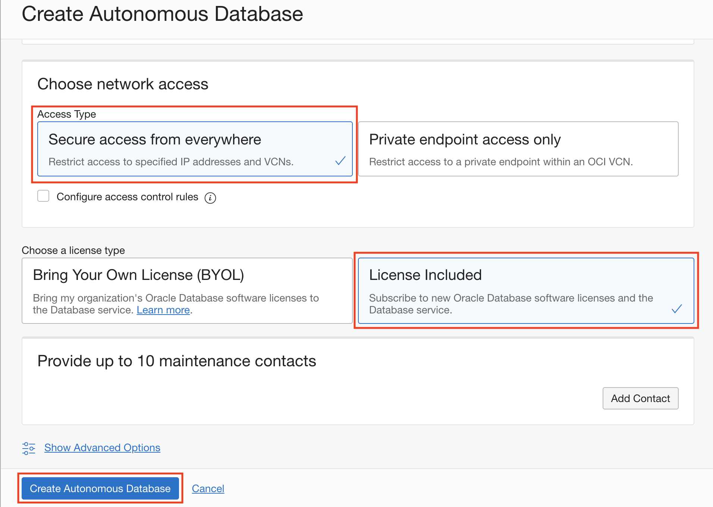

10. Your instance will begin provisioning. Once the state goes from Provisioning to Available, click on your ADW display name to see its details.  Note: Here, the name is ADWDEMO, but instead, you should see your **ADW\_FIRSTNAME\_LASTNAME**.

    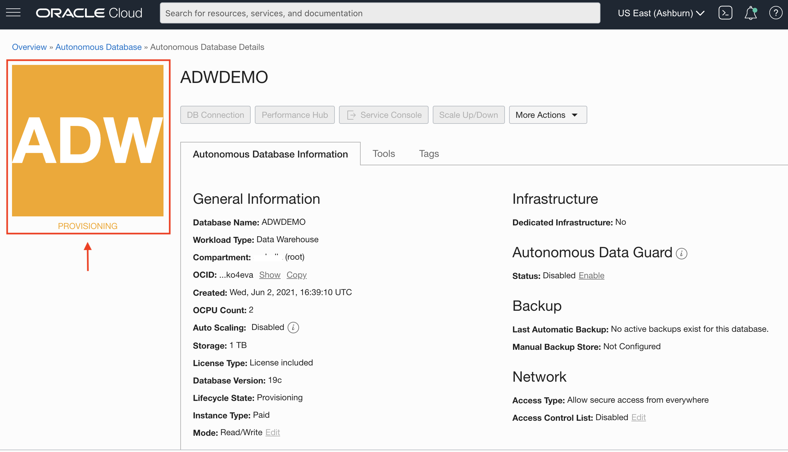

11. You now have created your first Autonomous Data Warehouse instance. Have a look at your instance's details here including its name, database version, CPU count and storage size.

    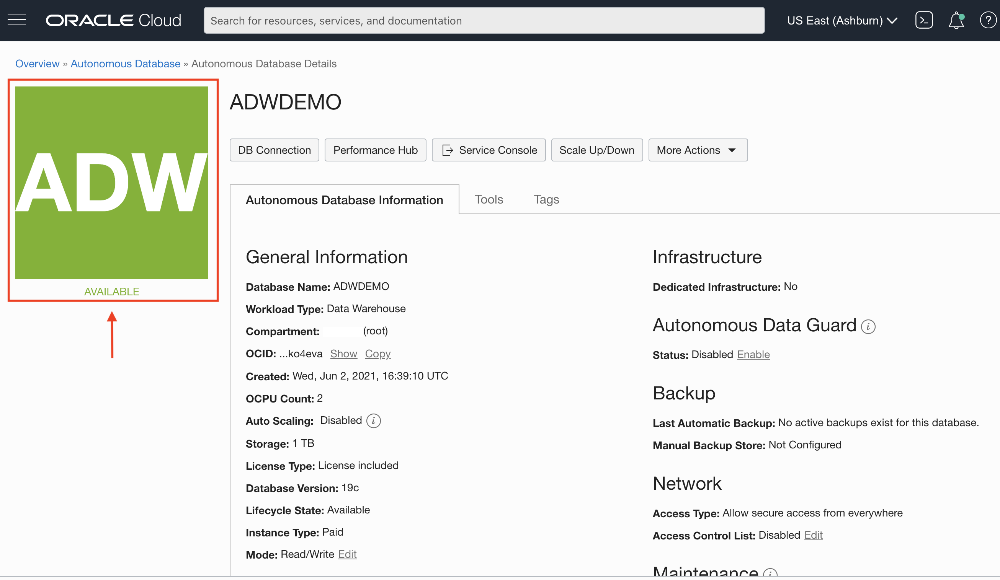

## **STEP 2**: Download the Connection Wallet
As ADW only accepts secure connections to the database, you need to download a wallet file containing your credentials first. The wallet can be downloaded either from the instance's details page, or from the ADW service console. In this case, we will be showing you how to download the wallet file from the instance's details page. This wallet file can be used with a local version of software such as SQL Developer as well as others. It will also be used later in the lab so make note of where it is stored.

1. Go back to the Oracle Cloud Console and open the Instances screen. Find your database, click the action menu and select **DB Connection**.

    

2. Under Download a Connection Wallet, click **Download**.

    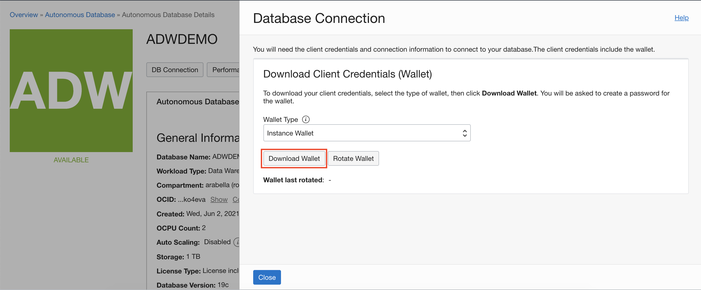

3. Specify a password of your choice for the wallet. You will need this password when connecting to the database via SQL Developer later, and is also used as the JKS keystore password for JDBC applications that use JKS for security. Click **Download** to download the wallet file to your client machine. Download the wallet to a location you can easily access, because we will be using it in the next step.
*Note: If you are prevented from downloading your Connection Wallet, it may be due to your browser's pop-blocker. Please disable it or create an exception for Oracle Cloud domains.*

    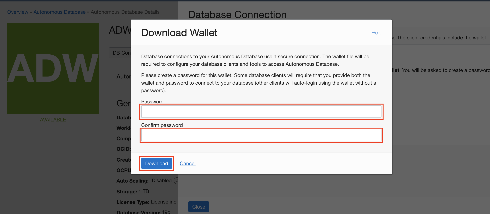

## **STEP 3**: Access APEX

1. From the Autonomous Data Warehouse instance details page, click on **Service Console**.

    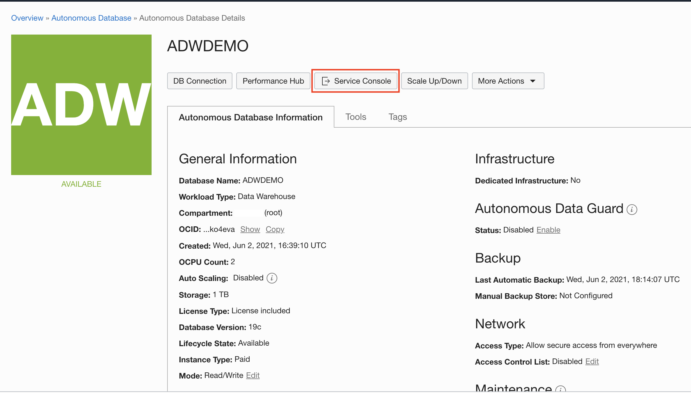

2. Then, click on **Development**.

    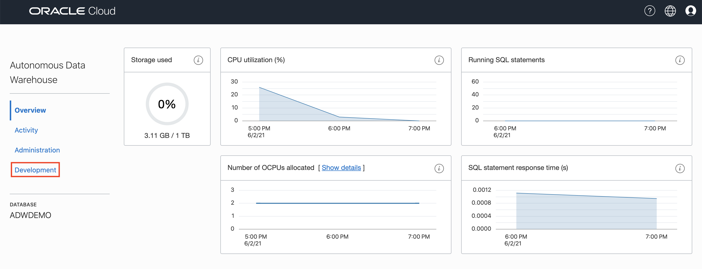

3. Next, continue by clicking on **Oracle APEX**.

    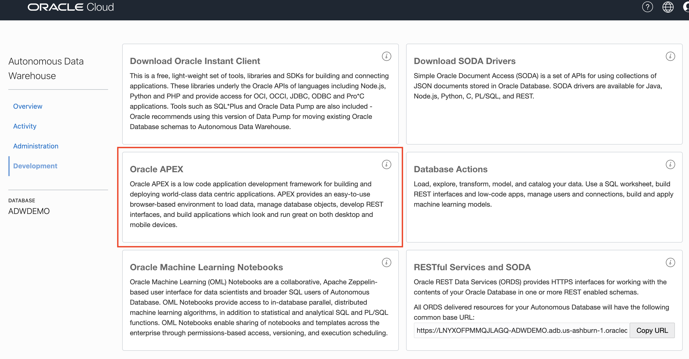

4. Sign in with your ADMIN **password** for your ADW instance that you noted down earlier and click **Sign in to Administration Services**.

    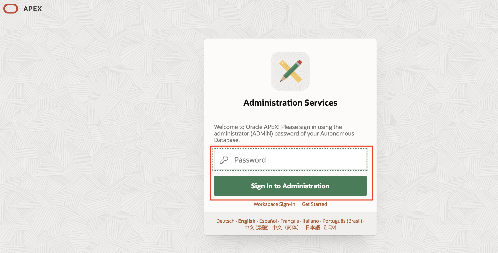

## **STEP 4**: Create a Workspace and User

1. You will now be on the Welcome page. Click **Create Workspace**.

    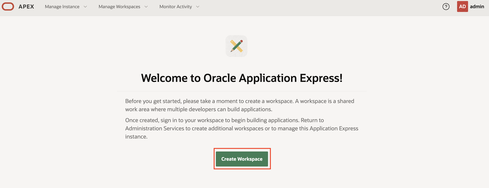

2. Then, create a Database User and Workspace Name. For this workshop, use **DEVELOPER** for both. 

3. **Note**: it is essential you make sure to use **DEVELOPER** as many files and configurations in later labs depend on it. Please do not use a different name here for this workshop.

4. Then, specify a password for the **DEVELOPER** user you just created. Make a note of this password.

5. Click **Create Workspace** to continue.

    

## **STEP 5**: Sign in as the New User

1. After your Workspace is created, sign out of ADMIN by clicking **ADMIN**.

    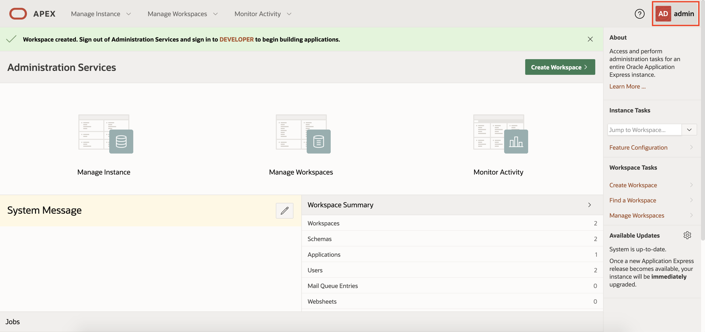

2. Finish signing out by clicking on **Sign out**.

    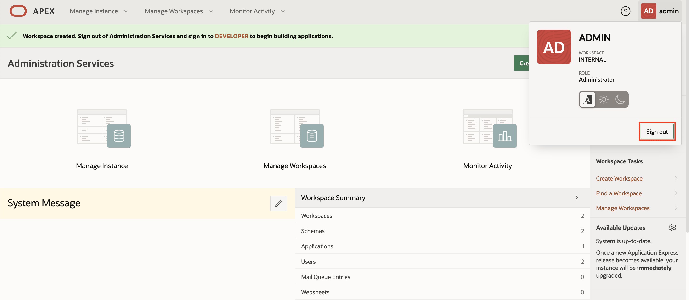

3. Then, click **Return to Sign in Page** .

    

4. Sign in to the DEVELOPER Workspace as the DEVELOPER Username with the DEVELOPER password you noted earlier and click on **Sign In** afterwards.

    

## **STEP 6**: Load Data through APEX

1. Click on **SQL Workshop**.

    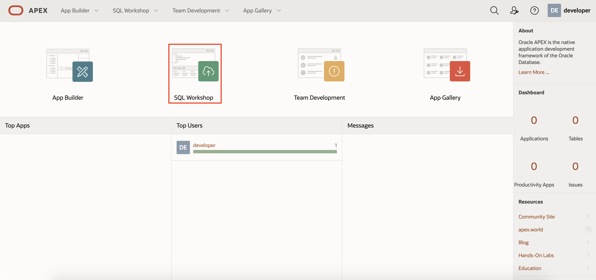

2. Then click on **Utilities**.

    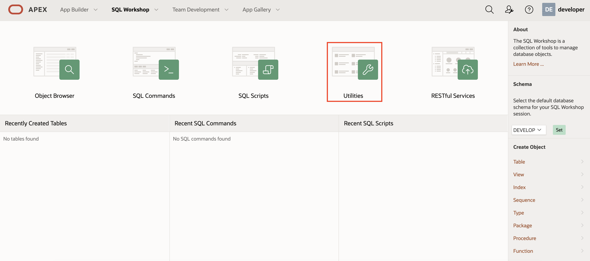

3. Finally, click on **Data Workshop**.

    

4. You will download a dataset file from this workshop to load into your APEX app. You can download it by clicking on the following text link: [Download Transactions_History.xlsx here](https://objectstorage.us-ashburn-1.oraclecloud.com/p/12bfXzt-Xjke4OhGSREiN9Duebr2AWesAp-vMkloItQ/n/c4u03/b/solutions-library/o/Transactions_History.xlsx). Then, open your browser window again back to the APEX page.

5. Continue by clicking on **Load Data** which allows you to load CSV, XLSX, XML, and JSON data.

    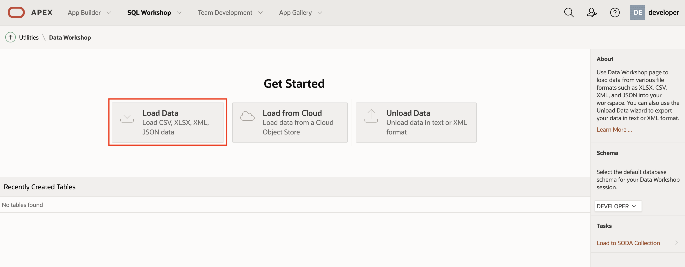

6. Click **Choose File** and select **Transactions_History.xlsx** that you just downloaded. 

    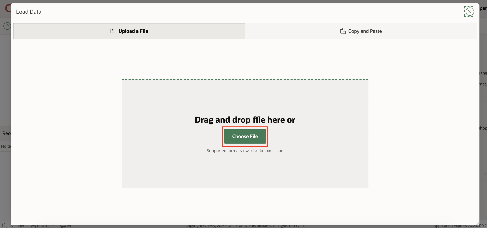

7. A preview will pop up where you can view some details about the data you are loading. Proceed by entering in a **Table Name**. For this lab, use **TRANSACTION_HISTORY** for the table name. For primary keys, leave the **Identity Column** option selected.

    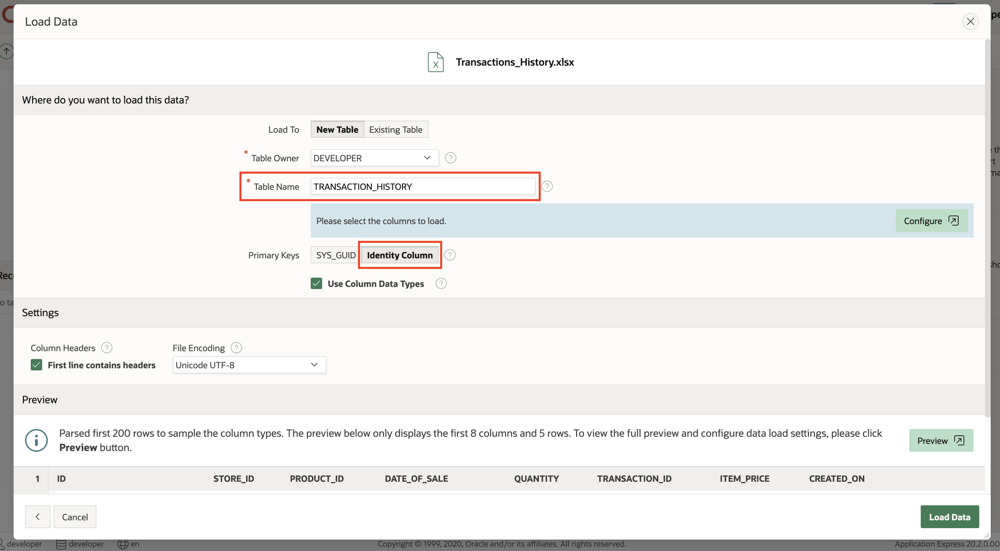

8. Finish by clicking on **Load Data**.

    

9. A table creation confirmation page should show up. Continue by clicking on **View Table** to view the table that has been added to your ADW through APEX.

    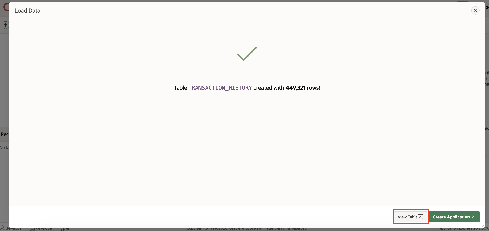

10. You will download another dataset file from this workshop to load into your APEX app. You can download it by clicking on the following text link: [Download US_CENSUS.csv here](https://objectstorage.us-ashburn-1.oraclecloud.com/p/5NcnFldIcsd-bGWyX2INoj0wx6sU0zIvOuEKHS4erz0/n/c4u03/b/solutions-library/o/US_CENSUS.csv). 

11. Then, open your browser window and navigate back to the **Data Workshop** section in APEX to then click **Load Data** again for this new file.

    

12. Choose **US_CENSUS.csv** as the data file to create a table. When loading in this table, keep the table options as shown below.

    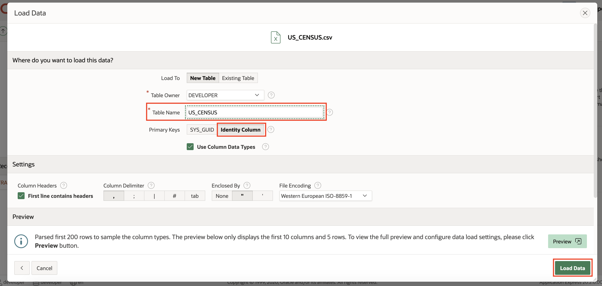

13. Confirm that the two data files you loaded have been imported as tables.

    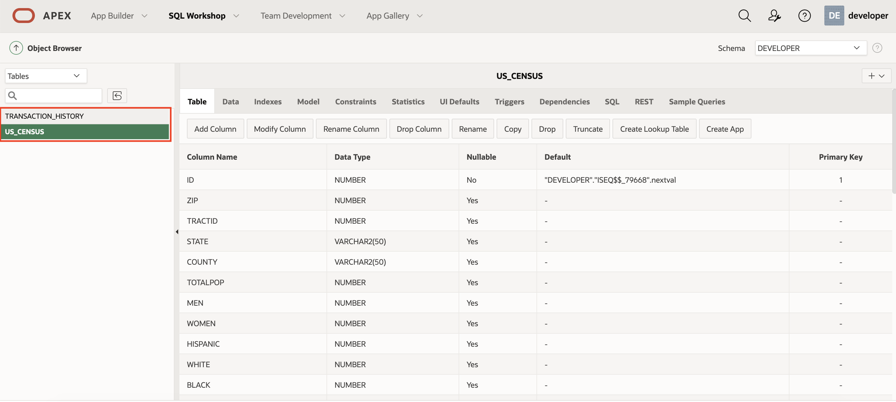

14. Now that the data has been loaded in, we have to make a minor change to one of the columns' data type.  With the  **TRANSACTION_HISTORY** table selected, click on **Modify Column**.

    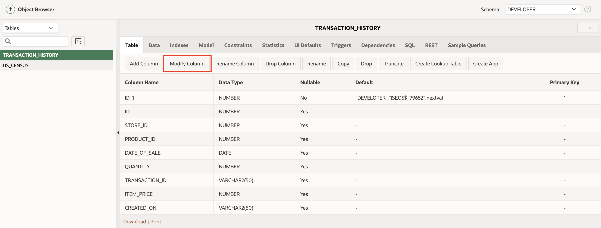

15. We want to modify the data type for the Date of Sale column.  To do this, select **DATE\_OF\_SALE (DATE)** from the **Column** dropdown.  Next, select **TIMESTAMP** from the **Datatype** dropdown.  Once you have made these selections, you can click **Next**.

    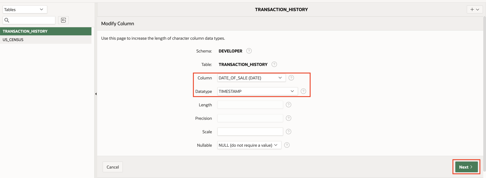

16. The next screen asks you to confirm your column modification request.  To confirm, click **Finish**.

    

You have now changed the data type for the Date of Sale column from a Date to a Timestamp.  When the data was loaded into APEX, this column was automatically configured as a Date data type, only including the calendar date of the sale.  When we switch this column to a Timestamp data type, we not only get the calendar date of the sale, but also the time of day that the sale occurred. This will come into play when we run our Machine Learning models in Lab 200.

## **STEP 7**: Create an App in APEX

1. You will download another data file from this workshop to create your APEX app. You can download it by clicking on the following text link: [Download ApexApp.sql here](https://objectstorage.us-ashburn-1.oraclecloud.com/p/8WEdglMP5bCOZLKBK5hMGY4-mnnSh7ZbzJMPn0lCh6Y/n/c4u03/b/solutions-library/o/ApexApp.sql). Then, open your browser window again back to the APEX page.

2. To start creating an app, click on **App Builder** on the top navigation bar.  Next, click on **Import**.

    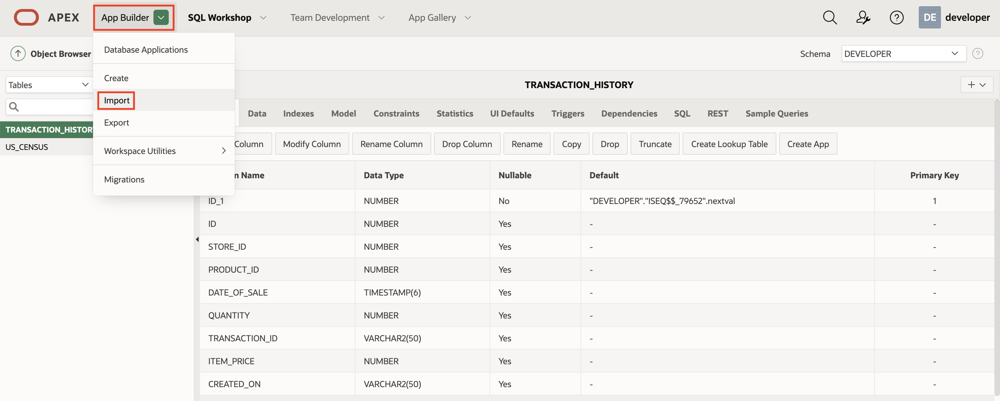

3. Click on the **Choose File** box and select **ApexApp.sql**, the data file you just downloaded.

4. We will be creating the app with default options. Continue by clicking **Next**.

    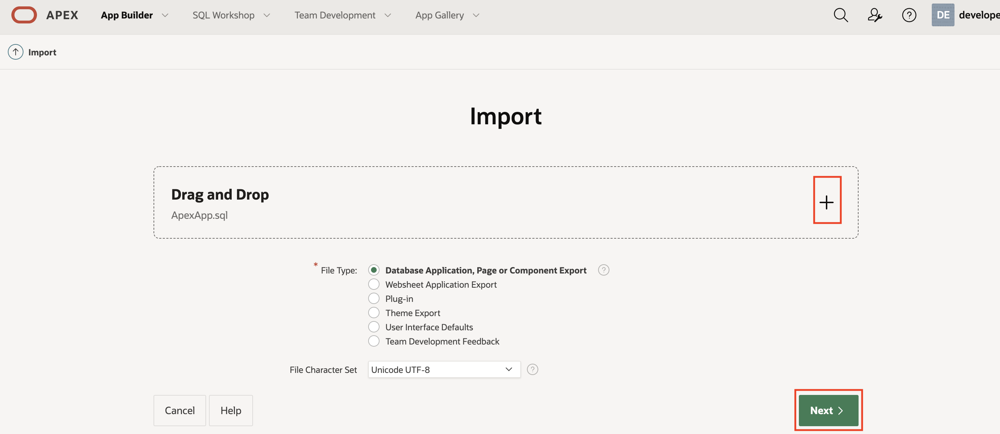

5. Then, click **Next**.

    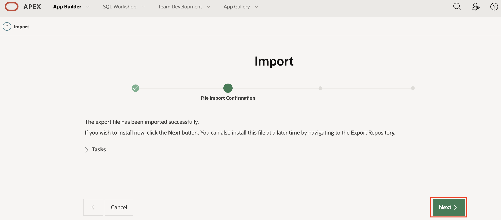

6. After this setup, continue by clicking **Install Application**.

    

7. Then, continue by clicking **Next**.

    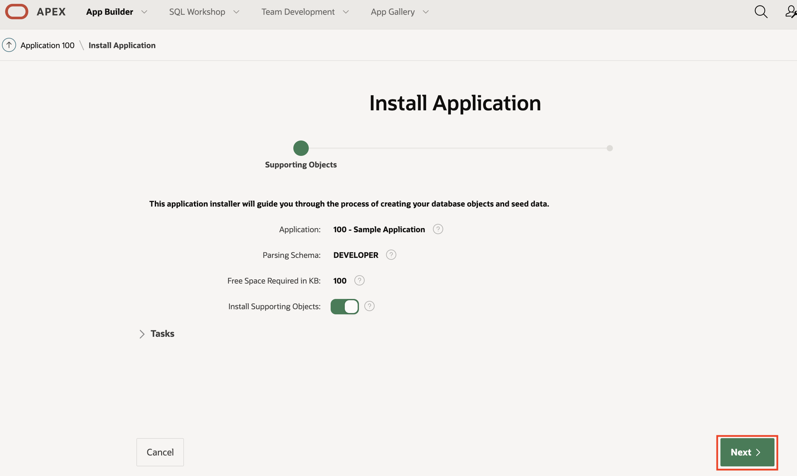

8. Finalize the creation by clicking **Install**.

    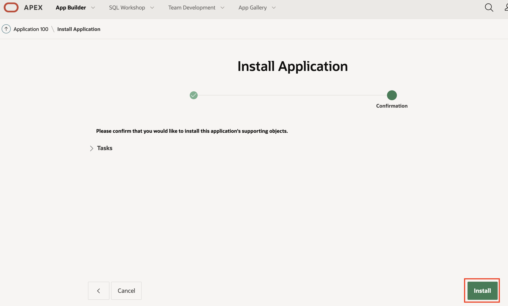

Congratulations. You have created an app!

## **STEP 8**: Test the App

1. Let's begin to test the app. Click on **Run Application**.

    

2. Sign in to the app as DEVELOPER for the username and the DEVELOPER password you noted earlier.

3. Click on **Sign In**.

    

You are now able to use your app that is connected to your Oracle Autonomous Data Warehouse (ADW) instance. Have a look at some of the navigation menu options. 

4. For example, click on **Stores**.

    

5. Then, click on one of the stores for an insight on Store Details.

    

Congratulations. You have quickly created an APEX application that is integrated with the data that you uploaded to your ADW instance, allowing you to act quickly and gain insights into your data.

Please proceed to the next lab.

## Summary

-   In this lab, you provisioned a new Autonomous Data Warehouse, downloaded an ADW cloud wallet file, created an APEX workspace and user, loaded data with APEX, and created an app with APEX.

## Acknowledgements

- **Author** - NATD Cloud Engineering - Austin Hub (Khader Mohiuddin, Jess Rein, Philip Pavlov, Naresh Sanodariya, Parshwa Shah)
- **Contributors** - Jeffrey Malcolm, QA Specialist, Arabella Yao, Product Manager Intern, DB Product Management
- **Last Updated By/Date** - Kamryn Vinson, QA Specialist, August 2020

## Need Help?
Please submit feedback or ask for help using our [LiveLabs Support Forum](https://community.oracle.com/tech/developers/categories/livelabsdiscussions). Please click the **Log In** button and login using your Oracle Account. Click the **Ask A Question** button to the left to start a *New Discussion* or *Ask a Question*.  Please include your workshop name and lab name.  You can also include screenshots and attach files.  Engage directly with the author of the workshop.

If you do not have an Oracle Account, click [here](https://profile.oracle.com/myprofile/account/create-account.jspx) to create one.    Please include the workshop name and lab in your request. 

