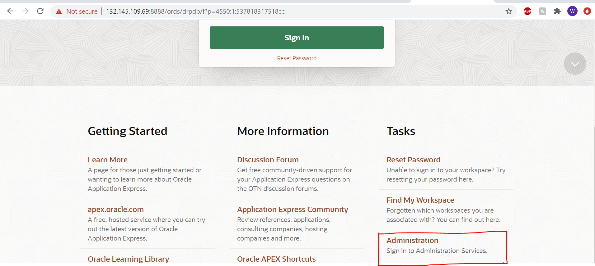
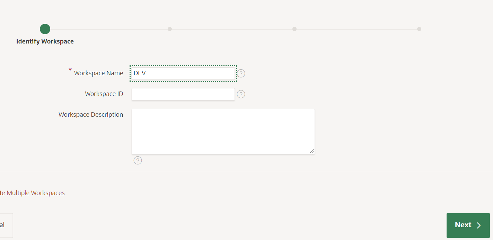
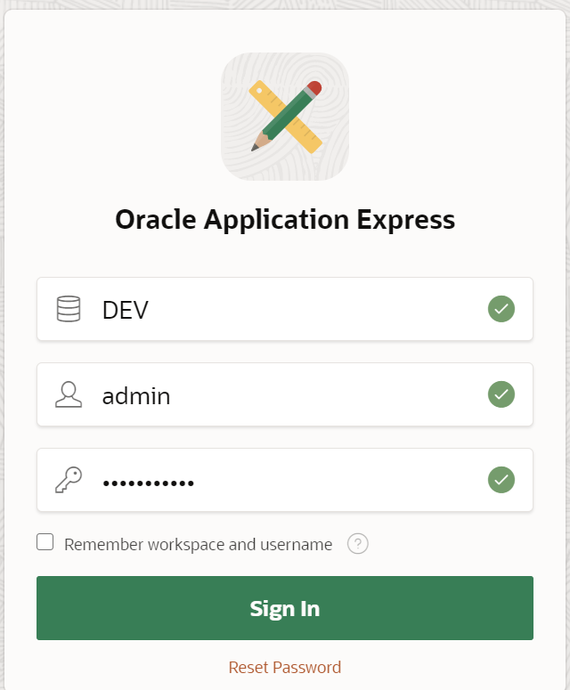
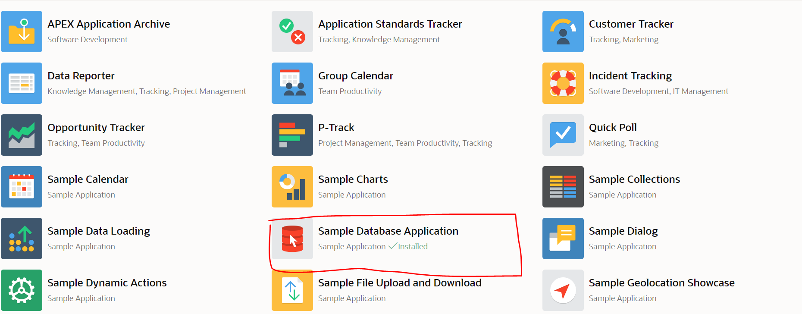
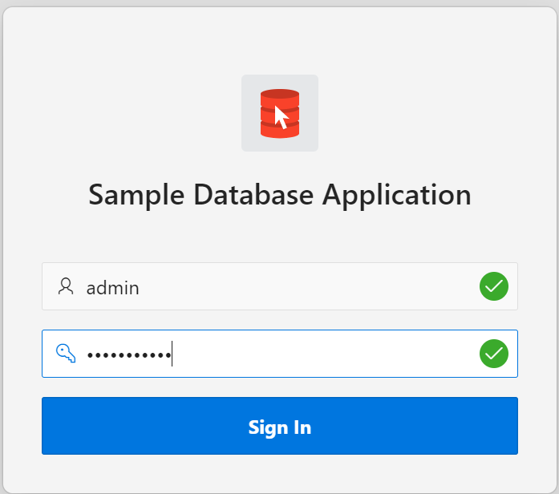
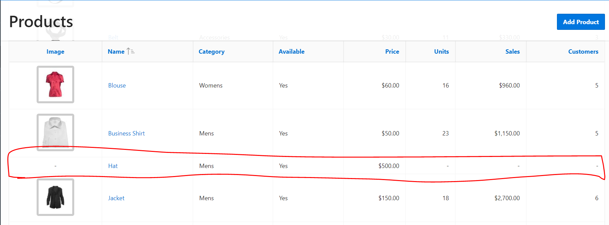

# Configure APEX instance for DR 

## Create an APEX Workspace & Sample Application in the source instance
1. Navigate to the APEX instance through a web browser i.e https://\<public-ip>:8888/ords/drpdb and select **Administration Services** from the bottom of the page.

2. Login using the username *admin* and the database admin password. If prompted, reset the password upon login. Once logged in select **Create Workspace**

3. Give the workspace a name (e.g "DEV") and click Next.
4. Add the following settings on the "Identify Schema" page:
    - **Re-use existing schema?:** No
    - **Schema Name:** (Choose any name e.g "DEV")
    - **Schema Password:** (Choose a password that conforms to the database password constraints)
    - **Space Quota (MB):** 100
5. Add the following settings on the "Identify Administrator" page:
    - **Administrator Username:** (Choose a username e.g. "admin")
    - **Administrator password:** (Choose a password that conforms to the database password constraints)
    - First Name: *Optional*
    - Last Name: *Optional*
    - **Email:** (Enter a valid email)
6. Click **Create Workspace** on the confirmation page.
7. Once the workspace is create log out of the **Administration Services**

8. Enter the workspace name created in step 3 and fill in the admin login created in step 5. Click  **Sign In**

9. On the landing page, select **App Gallery**

10. Select the **Sample Database Application** and click **Install App**

11. Once installed, click the green play button to run the App.

12. Log in using the same admin credentials created in step 5.

13. Make a change in the application to verify the successful replication later (e.g adding a new product "Hat")

    
We now have an APEX application that accesses the database to be replicated using RackWare!
