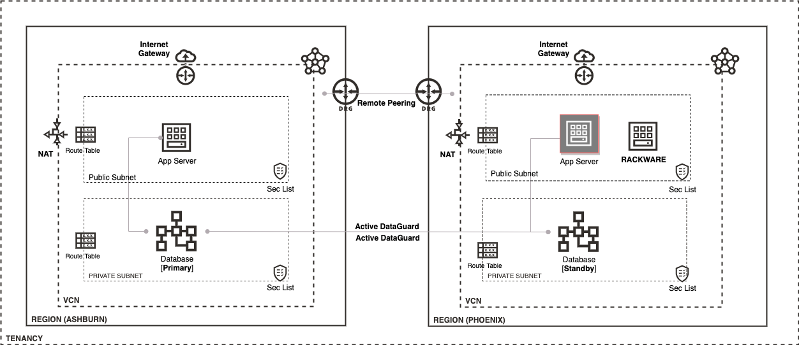

# DR RackWare Deployment on OCI

## Introduction
Welcome to this workshop where we will deploy the RackWare Migration Manager (RMM) on OCI as a Disaster Recovery solution.

Estimated Workshop Time: 2-3 hours

### Objectives
- Use terraform to create an APEX instance for DR
- Deploy and configure RMM on OCI
- Replicate APEX instances from source machines to autoprovision backup instances
- Perform a failover operation to simulate a DR scenario

### Architecture Overview

<!-- 
## Table of Contents

### [Lab 1: Disaster Recovery Network and connectivity Setup](LabGuide100.md)
  
### [Lab 2: Configure APEX instance for DR](LabGuide200.md)

### [Lab 3: Setting Up RackWare DR components](LabGuide300.md)

### [Lab 4: Complete DR Configuration & Perform Failover](LabGuide400.md) -->
