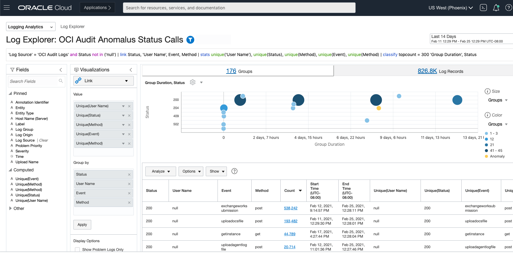

# Example Queries

## Introduction

This lab will provide various example queries for you to create your own dashboards and widgets

**Estimated Lab Time: 15 minutes**

### Objectives

**In this lab, you will:**
* Be able to use some sample queries to help familiarize yourself further with valuable query searches

### Prerequisites

* Labs 1-4 Completed
* An Oracle Cloud Environment
* EBS Cloud Manager, EBS 1-Click and Advanced Provisioned Instance, Network - All done in the previous workshop

## **STEP 1:** Sample Audit Queries

1. 'Log Source' = 'OCI Audit Logs' and Status not in ('null') | link Status, 'User Name', Event, Method | stats unique('User Name'), unique(Status), unique(Method), unique(Event), unique(Method) | classify topcount = 300 'Group Duration', Status

  

  - Name: OCI Audit Anomalus Status Calls

2. ‘Log Source’ = ‘OCI Audit Logs’ and ‘Availability Domain’ != ‘null’ and Method != ‘null’ | stats count(Method) by Method, ‘Availability Domain’

3. 'Log Source' = 'OCI Audit Logs' and Event != 'null' and Method != 'null' | stats count by Event | sort -Count

4. 'Log Source' = 'OCI Audit Logs' and 'OCI Resource Name' not in ('null') and Method != 'null' | stats count(Method) by Method, 'OCI Resource Name'

5. ‘Log Source’ = ‘OCI Audit Logs’ and ‘User Name’ != ‘null’ | timestats count as logrecords by ‘User Name’ | sort -logrecords

6. 'Log Source' = 'OCI Audit Logs' and Event != 'null' and Method != 'null' | stats count(Method) by Method, 'User Name'

7. ‘Log Source’ = ‘OCI Audit Logs’ and ‘User Name’ not in (‘null’, cloudguard) and ‘OCI Resource Name’ != null | stats count by ‘User Name’, ‘OCI Resource Name’

## **STEP 2:** Sample VCN Queries

1. ‘Entity Type’ = ‘OCI VCN Virtual Network Interface Card’ and ‘Log Source’ = ‘OCI VCN Flow Unified Schema Logs’ | stats count by Entity

2. ‘Entity Type’ = ‘OCI VCN Virtual Network Interface Card’ and ‘Log Source’ = ‘OCI VCN Flow Unified Schema Logs’ | eval vol = ‘Content Size Out’ / (1024 * 1024) | stats sum(vol) as ‘Egress (Mb)’ by ‘OCI Subnet OCID’

3. 'Entity Type' = 'OCI VCN Virtual Network Interface Card' and 'Log Source' = 'OCI VCN Flow Unified Schema Logs' | timestats count by 'OCI Subnet OCID'

4. ‘Entity Type’ = ‘OCI VCN Virtual Network Interface Card’ and ‘Log Source’ = ‘OCI VCN Flow Unified Schema Logs’ | stats count as logrecords by Entity

5. 'Entity Type' = 'OCI VCN Virtual Network Interface Card' and 'Log Source' = 'OCI VCN Flow Unified Schema Logs' | timestats avg('Packets In') by 'OCI Subnet OCID'

6. ‘Entity Type’ = ‘OCI VCN Virtual Network Interface Card’ and ‘Log Source’ = ‘OCI VCN Flow Unified Schema Logs’ | eval vol = ‘Content Size Out’ / (1024 * 1024) | timestats perhour(‘Packets In’) as ‘Packet Rate (per hr)’ by ‘OCI Subnet OCID’

## **STEP 3:** Sample Instance Queries

1. ‘Log Source’ = ‘Linux Secure Logs’ and Service = sudo | stats count by ‘User Name (Originating)’

2. ‘Entity Type’ = ‘Host (Linux)’ and (‘invalid user’ or ‘user unknown’) | stats count”

3. ‘Entity Type’ = ‘Host (Linux)’ and ‘User Name’ != null and ‘User Authentication Method’ = publickey | timestats count by Entity

4. ‘Entity Type’ = ‘Host (Linux)’ | stats count as ‘Log Entries’ by ‘Log Source’ | top limit = 10 ‘Log Entries’

5. ‘Entity Type’ = ‘Host (Linux)’ and ‘User Name’ != null and ‘Host IP Address (Client)’ != null | stats count by ‘Host IP Address (Client)’, ‘User Name’

6. ‘Entity Type’ = ‘Host (Linux)’ | stats count as ‘Log Entries’ by Service | top limit = 10 ‘Log Entries’

7. ‘Entity Type’ = ‘Host (Linux)’ and not (‘invalid user’ or ‘user unknown’) | stats count

  You can now go to your dashboard and add these widgets to your EBS Dashboard

  Another option is to create a Networking/Security Dashboard with your networking queries in addition to your ebs dashboard where you can filter your EBS/host log metrics in the EBS Dashboard and Network and Audit information in the Networking/Security Dashboard. You can add this dashboard by clicking Create Dashboard, naming it and saving.

This will now complete this workshop.

For more information on how to create widgets to understand your data refer to [visualize data using charts and controls](https://docs.oracle.com/en-us/iaas/logging-analytics/doc/visualize-data-using-charts-and-controls.html#GUID-93988D5B-9717-4F63-8362-16B08BC3E020)

## Acknowledgements
* **Author** - Quintin Hill, Cloud Engineering, Packaged Applications
* **Contributors** -  Kumar Varun, Logging Analytics Product Management
* **Last Updated By/Date** - Quintin Hill, Cloud Engineering, Mar 8 2021

## Need Help?
Please submit feedback or ask for help using our [LiveLabs Support Forum](https://community.oracle.com/tech/developers/categories/livelabsdiscussions). Please click the **Log In** button and login using your Oracle Account. Click the **Ask A Question** button to the left to start a *New Discussion* or *Ask a Question*.  Please include your workshop name and lab name.  You can also include screenshots and attach files.  Engage directly with the author of the workshop.

If you do not have an Oracle Account, click [here](https://profile.oracle.com/myprofile/account/create-account.jspx) to create one.
