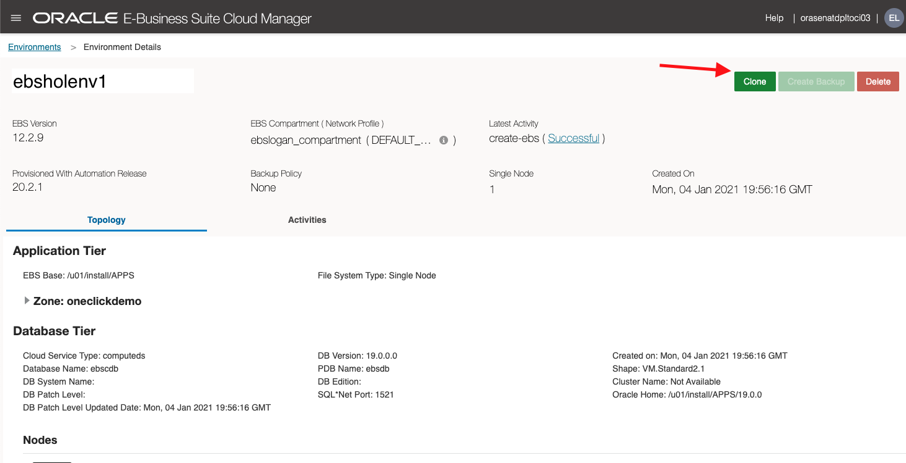
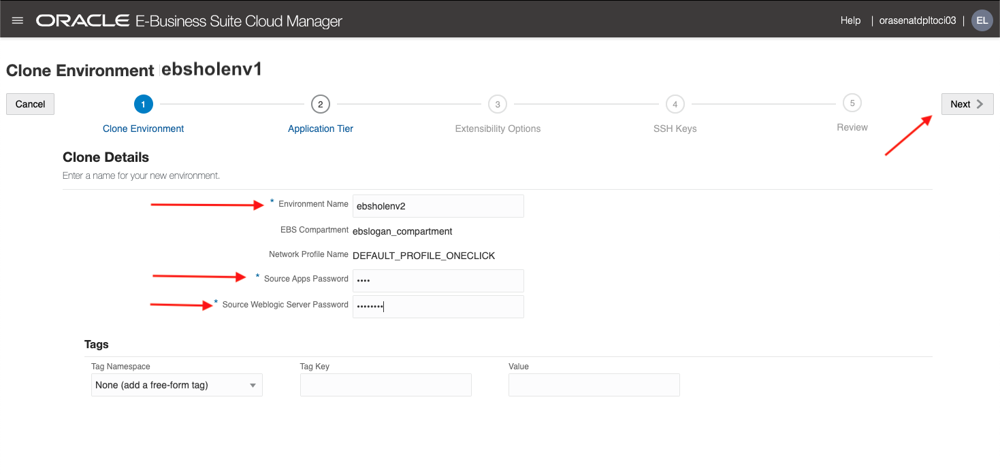
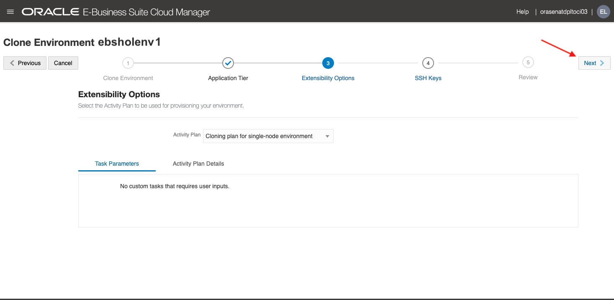
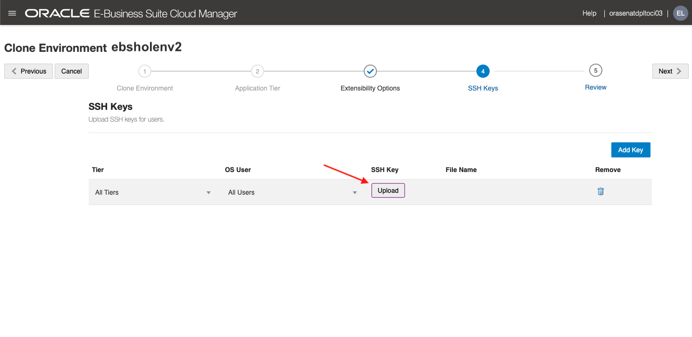
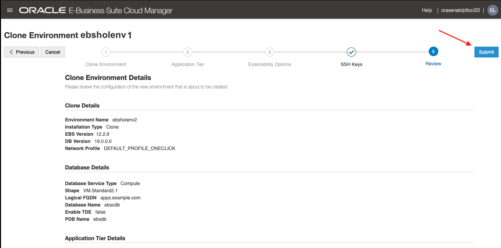
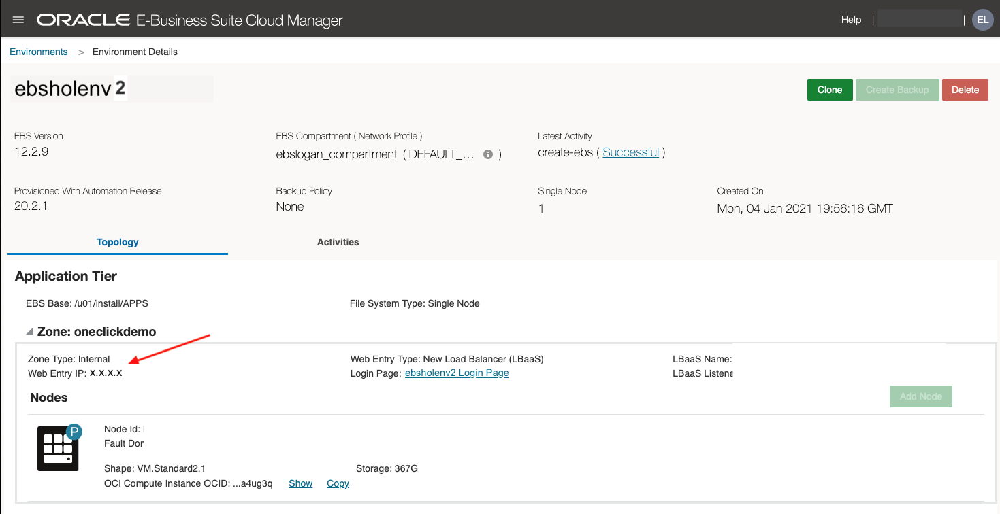

# Clone Your Oracle E-Business Suite Environment

## **Introduction**
In this lab, we will use the cloning feature of Oracle E-Business Suite Cloud Manager to clone your Oracle E-Business Suite environment.

Estimated Lab Time: 15 minutes

Watch this short video to preview how to clone Oracle E-Business Suite using cloud manager.

[](youtube:Rxm2_5uL0Lg)

### **Objectives**
* Cloning your EBS environment
* Configure Local Host Files for the Cloned Environment and Log in to Cloned Oracle E-Business Suite

### **Prerequisites**
* Tenancy Admin User
* Tenancy Admin Password
* Cloud Manager Admin Credentials

## **STEP 1:** Access the Clone Environment Page

1. Navigate to the Cloud Manager Environments page.

2. From the ebsholenv1 environment page, click **Clone** in the top right. 

  

  Enter Details (see screenshot and points below)

3. Enter the following values for the clone details (Note these variables in your key-data.txt):

    a. **Environment Name**: ebsholenv2

    b. **Source Apps Password**: apps

    c. **Source WebLogic Server Password**: welcome1

    d. Then Click **Next**

    

4. Application Tier: Click **Edit** And Enter and verify the following values
    
    a. **Web Entry Type**: New Load Balancer

    b. **Load Balancer Shape**: Select 100Mbps

    c. **Protocol**: https

    d. **Hostname**: ebsholenv2 

    e. **Protocol**: https

    f. **Hostname**: ebsholenv2

    g. **Port**: 443

    h. Click **Save Zone** and **Next**

  

5. Extensibility Options:
    
    a. Click **Next**

    
  
6. SSH Keys:

    a. Upload your SSH Key on the SSH Page

    

7. Review: 

    a. Review the information and click Submit

     

8. You can check the status of the activity to clone the environment in the Activities page. The new environment is listed on the Environments page.

## **STEP 2:** Configure Local Host Files for the Cloned Environment and Log in to Oracle E-Business Suite

1. Now click the Cloud Manager Environment: "ebsholenv2"

2. Then click the arrow next to **Zone: oneclickdemo**

  1. Note the IP address listed at **Web Entry IP:**



3. Edit the local hosts file on your laptop and add an entry.

  **For Windows users**

    1. Navigate to Notepad in your start menu.

    2. Hover over Notepad, right-click, and select the option **Run as Administrator**.

    3. In Notepad, navigate to ``File > Open``.

    4. Browse to ``C:\\Windows\System32\drivers\etc``

    5. Find the **file hosts**

        

    6. In the hosts file, scroll down to the end of the content.

    7. Add the following entry to the very end of the file:
    ``<ip_address> ebsholenv2.example.com``

    8. Save the file.

  **For Mac users**

    1. Open a Terminal Window.

    2. Enter the following command:

        ```
        <copy>
        sudo vi /etc/hosts
        </copy>
        ```

      This will then require your local computer password to edit the file. Enter and you should see a screen similar to the one shown below.

    3. Type 'i' to edit the file.

    4. Go to the last line and add the following entry as show below:
    ``<ip_address> ebsholenv2.example.com``

    5. Once you have finished editing the file hit 'esc' and type ':wq' to save and exit.

        

4. Log in to Oracle E-Business Suite:

  a. From the Cloud Manager environment page. Click the link following **Login Page:**

    

  b. When prompted, accept the warning concerning the certificate coming from an unauthorized certificate authority as we are using a self-signed certificate. (You will change the certificate with your own when executing this procedure outside of this hands-on lab.)

  c. On this page, you will log in to Oracle E-Business Suite with the credentials you generated in Lab 3, part 3.

  

## Acknowledgements

* **Author:** Quintin Hill, Cloud Engineering
* **Contributors:** 
  - Santiago Bastidas, Product Management Director
  - William Masdon, Cloud Engineering
  - Mitsu Mehta, Cloud Engineering
* **Last Updated By/Date:** Quintin Hill, Cloud Engineering, Sept 2020

## Need Help?
Please submit feedback or ask for help using our [LiveLabs Support Forum](https://community.oracle.com/tech/developers/categories/ebs-on-oci-automation). Please click the **Log In** button and login using your Oracle Account. Click the **Ask A Question** button to the left to start a *New Discussion* or *Ask a Question*.  Please include your workshop name and lab name.  You can also include screenshots and attach files.  Engage directly with the author of the workshop.

If you do not have an Oracle Account, click [here](https://profile.oracle.com/myprofile/account/create-account.jspx) to create one. 
