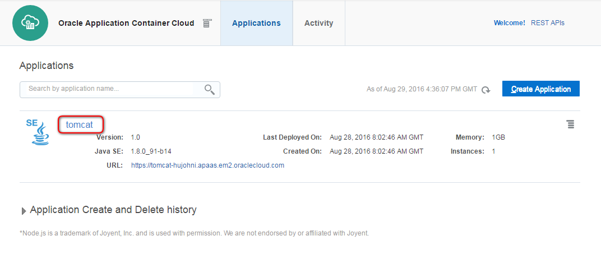
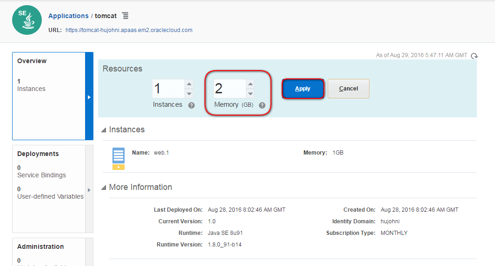
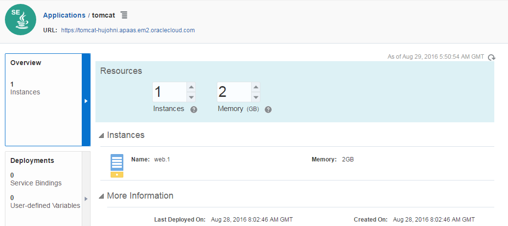

---
# ORACLE Cloud-Native DevOps workshop #
----
## Scale up/down Application Container Service using user interface and psm CLI tool ##

### About this tutorial ###
Oracle Application Container Cloud Service includes Oracle Java SE Cloud Service and Oracle Node Cloud Service. It provides a lightweight infrastructure so that you can run Java SE 7, Java SE 8, and Node.js applications in the Oracle Cloud.

Oracle offers a PaaS Service Manager (PSM) Command Line Interface (CLI) that enables users of Oracle Application Container Cloud Service, Oracle Database Cloud Service, and Oracle Java Cloud Service to create, monitor and manage their service instances from a command shell or script.

For more information about PSM see the [documentation](https://docs.oracle.com/cloud/latest/jcs_gs/jcs_cli.htm).

This tutorial demonstrates how to:

+ how to install and configure PaaS Service Manager Command Line Interface (psm CLI)
+ scale up Application Cloud Service instance using user interface
+ scale down Application Cloud Service instance using psm command line interface tool.
	
### Prerequisites ###

- [cURL command-line tool](http://curl.haxx.se/download.html). Usually cURL is already included in most of the Linux distributions and easy to install to Windows. You can use other tool to invoke REST API to download the latest version of the tool. (To install cURL is not scope of this documentation.)
- Python 3.3 or later. (To install Pyhton is not scope of this documentation.)
+ [Deploy Tomcat sample application to Oracle Application Container Cloud](../accs-tomcat/README.md)

### Steps ###

#### Download the latest version of command line tool ####
First identify your REST API server name. If you log in to your Oracle cloud account with a US data center, use **psm.us.oraclecloud.com** otherwise, use **psm.europe.oraclecloud.com**.

Use cURL to send a request. The format is:

	curl -X GET -u username:password -H X-ID-TENANT-NAME:<identitydomain> https://<rest-server>/paas/core/api/v1.1/cli/<identitydomain>/client -o /u01/psmcli.zip

This will write the response to a file named `psmcli.zip`.

Open a terminal and execute the cURL command above with your credentials, identity domain identifier and REST API server name. REST 

	[oracle@localhost Desktop]$ curl -X GET -u john.i.smith@xxxxx.com:password -H X-ID-TENANT-NAME:hujohni https://psm.europe.oraclecloud.com/paas/core/api/v1.1/cli/hujohni/client -o /u01/psmcli.zip
	% Total    % Received % Xferd  Average Speed   Time    Time     Time  Current
                                   Dload  Upload   Total   Spent    Left  Speed
	100 45968  100 45968    0     0  10993      0  0:00:04  0:00:04 --:--:-- 10999
	[oracle@localhost Desktop]$

Change to directory `/u01` and list directory to check the downloaded psmcli.zip file.

	[oracle@localhost Desktop]$ cd /u01
	[oracle@localhost u01]$ ls
	app  content  dpct  oepe-12.2.1.4.201608161938  psmcli.zip  python  wins

#### Installing the Command Line Interface

Install the PaaS CLI as a Python package.

Open a terminal, change to directory or make sure you are in directory `/u01` and use the PIP tool to install the CLI Python package.
	
	[oracle@localhost Desktop]$ cd /u01
	[oracle@localhost Desktop]$ sudo -H /u01/python/bin/pip3 install -U psmcli.zip
	Processing ./psmcli.zip
	Collecting requests<=2.8.1,>=2.7.0 (from psmcli==1.1.7)
	  Downloading requests-2.8.1-py2.py3-none-any.whl (497kB)
    	100% |████████████████████████████████| 501kB 469kB/s 
	Collecting keyring<=5.6,>=5.4 (from psmcli==1.1.7)
	  Downloading keyring-5.6.tar.gz (69kB)
    	100% |████████████████████████████████| 71kB 1.0MB/s 
	Collecting colorama==0.3.3 (from psmcli==1.1.7)
	  Downloading colorama-0.3.3.tar.gz
	Collecting PyYAML==3.11 (from psmcli==1.1.7)
	  Downloading PyYAML-3.11.zip (371kB)
    	100% |████████████████████████████████| 378kB 725kB/s 
	Installing collected packages: requests, keyring, colorama, PyYAML, psmcli
	  Running setup.py install for keyring ... done
      Running setup.py install for colorama ... done
      Running setup.py install for PyYAML ... done
      Running setup.py install for psmcli ... done
	Successfully installed PyYAML-3.11 colorama-0.3.3 keyring-5.6 psmcli-1.1.7 requests-2.8.1
	You are using pip version 8.1.1, however version 8.1.2 is available.
	You should consider upgrading via the 'pip install --upgrade pip' command.
	[oracle@localhost u01]$

####Configuring the Command Line Interface####
Prior to running CLI commands, configure your connection to the Oracle cloud.

Open a terminal and run the `setup` command. When prompted, enter your cloud user name, password, and identity domain. For example:

	[oracle@localhost u01]$ psm setup
	Username: john.i.smith@xxxxx.com
	Password: 
	Retype Password: 
	Identity domain: hujohni
	Region [us]: emea
	Output format [json]: 
	----------------------------------------------------
	'psm setup' was successful. Available services are:
	  o MySQLCS : Oracle Oracle MySQL Cloud Service
      o accs : Oracle Application Container Cloud Service
      o dbcs : Oracle Database Cloud Service
	  o ggcs : Oracle GoldenGate Cloud Service
      o jcs : Oracle Java Cloud Service
      o stack : Cloud Stack Manager
	----------------------------------------------------
	[oracle@localhost u01]$

The CLI provides help text for each available command. Use the help (or h) parameter to:

View the available services in your configured cloud account. For example:

	[oracle@localhost u01]$ psm help

	DESCRIPTION
  		A command line tool to interact with Oracle Cloud Platform Services (PaaS)

	SYNOPSIS
  		psm <service> <command> [parameters]

	AVAILABLE SERVICES
	  o MySQLCS
	       Oracle Oracle MySQL Cloud Service
	  o accs
	       Oracle Application Container Cloud Service
	  o dbcs
	       Oracle Database Cloud Service
	  o ggcs
	       Oracle GoldenGate Cloud Service
	  o jcs
	       Oracle Java Cloud Service
	  o stack
	       Cloud Stack Manager
	  o setup
	       Configure psm client options
	  o update
	       Update psm client to latest version
	  o log
	       View or update psm client log level
	  o help
	       Show help

	AVAILABLE PARAMETERS
	  -v, --version  
	       Show current version of psm client

	[oracle@localhost u01]$ 

#### Scale up Application Cloud Service instance using user interface ####

Go to your Application Container Cloud Service console. If your console is not yet opened then sign in to [https://cloud.oracle.com/sign-in](../common/sign.in.to.oracle.cloud.md) to [https://cloud.oracle.com](https://cloud.oracle.com). On the dashboard open the Application Container Cloud Service Console.

Click the link **tomcat** to open Application Container Cloud Service detail page.

The Overview page shows the assigned resources to the service. Modify RAM configuration from 1 to 2 GB. The Apply will appear, click the button. 

Confirm the scaling operation, click Apply. The service will restart to apply changes. 

During the restart a sand glass appears in the Application Container Cloud icon. The process takes few minutes. To update the pages click on refresh icon.

Once the restart ready the sand glass will disappear and the RAM size will show the requested value.

#### Scale down Application Cloud Service instance using psm command line interface tool ####

To scale down (back) the instance you will use psm tool. Open a terminal and list your application(s) deployed on Application Container Cloud Service. Execute the `psm accs apps` command to list the applications.

	[oracle@localhost cloud.demos]$ psm accs apps
	{
	    "applications":[
	        {
	            "identityDomain":"hujohni",
	            "appId":"7c0ab2ad-a1c3-482c-8542-add237657212",
	            "name":"tomcat",
	            "status":"RUNNING",
	            "createdBy":"john.i.smith@freemail.hu",
	            "creationTime":"2016-08-28T08:02:46.503+0000",
	            "lastModifiedTime":"2016-08-28T08:02:46.458+0000",
	            "subscriptionType":"MONTHLY",
	            "instances":[
	                {
	                    "name":"web.1",
	                    "status":"RUNNING",
	                    "memory":"2G",
	                    "instanceURL":"https://psm.europe.oraclecloud.com/paas/service/apaas/api/v1.1/apps/hujohni/tomcat/instances/web.1"
	                }
	            ],
	            "runningDeployment":{
	                "deploymentId":"5075e814-3430-45b2-9b02-61ec88f4b8ea",
	                "deploymentStatus":"READY",
	                "deploymentURL":"https://psm.europe.oraclecloud.com/paas/service/apaas/api/v1.1/apps/hujohni/tomcat/deployments/5075e814-3430-45b2-9b02-61ec88f4b8ea"
	            },
	            "lastestDeployment":{
	                "deploymentId":"5075e814-3430-45b2-9b02-61ec88f4b8ea",
	                "deploymentStatus":"READY",
	                "deploymentURL":"https://psm.europe.oraclecloud.com/paas/service/apaas/api/v1.1/apps/hujohni/tomcat/deployments/5075e814-3430-45b2-9b02-61ec88f4b8ea"
	            },
	            "appURL":"https://psm.europe.oraclecloud.com/paas/service/apaas/api/v1.1/apps/hujohni/tomcat",
	            "webURL":"https://tomcat-hujohni.apaas.em2.oraclecloud.com"
	        }
	    ]
	}
	[oracle@localhost cloud.demos]$ 

You should see the **tomcat** application and the previously configured 2 GB memory. Now use the tool the scale down the service. First check what is the usage of the `accs scale` command. 

	[oracle@localhost cloud.demos]$ psm accs scale help
	
	DESCRIPTION
	  Scale an Oracle Application Container Cloud Service instance for a specified
	  application to change instance count and memory limit
	
	SYNOPSIS
	  psm accs scale [parameters]
	       -n, --app-name <value>
	       [-i, --instances <value>]
	       [-m, --memory <value>]
	       [-of, --output-format <value>]
	
	AVAILABLE PARAMETERS
	  -n, --app-name    (string)
	       Name of the application
	
	  -i, --instances    (integer)
	       Number of instances
	
	  -m, --memory    (string)
	       Memory limit
	
	  -of, --output-format    (string)
	       Desired output format. Valid values are [json, html]
	
	EXAMPLES
	  psm accs scale -n ExampleApp -i 2 -m 2G
	
	[oracle@localhost cloud.demos]$ 

Note that you can always get help by executing `<command> help`.

According to the help to scale down the memory you need to define the name of the application and the memory limit.

	[oracle@localhost cloud.demos]$ psm accs scale -n tomcat -m 1G
	{
	    "processes":[
	        {
	            "processName":"web",
	            "instances":[
	                {
	                    "name":"web.1",
	                    "status":"RUNNING",
	                    "memory":"2G",
	                    "instanceURI":"https://psm.europe.oraclecloud.com/paas/service/apaas/api/v1.1/apps/hujohni/tomcat/instances/web.1"
	                }
	            ]
	        }
	    ],
	    "identityDomain":"hujohni",
	    "applicationDetails":"tomcat"
	}
	Job ID : 1919648
	[oracle@localhost cloud.demos]$ 

The job has been created to resize the memory of the service. To check what is happening with your application get the details using psm. Execute `psm accs app -n tomcat`:

	[oracle@localhost cloud.demos]$ psm accs app -n tomcat
	{
	    "identityDomain":"hujohni",
	    "appId":"7c0ab2ad-a1c3-482c-8542-add237657212",
	    "name":"tomcat",
	    "status":"RUNNING",
	    "createdBy":"john.i.smith@freemail.hu",
	    "creationTime":"2016-08-28T08:02:46.503+0000",
	    "lastModifiedTime":"2016-08-28T08:02:46.458+0000",
	    "subscriptionType":"MONTHLY",
	    "instances":[
	        {
	            "name":"web.1",
	            "status":"RUNNING",
	            "memory":"1G",
	            "instanceURL":"https://psm.europe.oraclecloud.com/paas/service/apaas/api/v1.1/apps/hujohni/tomcat/instances/web.1"
	        }
	    ],
	    "runningDeployment":{
	        "deploymentId":"5075e814-3430-45b2-9b02-61ec88f4b8ea",
	        "deploymentStatus":"READY",
	        "deploymentURL":"https://psm.europe.oraclecloud.com/paas/service/apaas/api/v1.1/apps/hujohni/tomcat/deployments/5075e814-3430-45b2-9b02-61ec88f4b8ea"
	    },
	    "lastestDeployment":{
	        "deploymentId":"5075e814-3430-45b2-9b02-61ec88f4b8ea",
	        "deploymentStatus":"READY",
	        "deploymentURL":"https://psm.europe.oraclecloud.com/paas/service/apaas/api/v1.1/apps/hujohni/tomcat/deployments/5075e814-3430-45b2-9b02-61ec88f4b8ea"
	    },
	    "currentOngoingActivity":"Scaling Application",
	    "appURL":"https://psm.europe.oraclecloud.com/paas/service/apaas/api/v1.1/apps/hujohni/tomcat",
	    "webURL":"https://tomcat-hujohni.apaas.em2.oraclecloud.com",
	    "message":[
	        "Initialized application scaling from 1x2G to 1x1G...",
	        "Deployed application(v1) for instance(1G) web.1..."
	    ]
	}
	[oracle@localhost cloud.demos]$ 

If you could catch the restart process you can see the current ongoing operation: `"Initialized application scaling from 1x2G to 1x1G..."`. This command also usefult to get detailed information about your service using command line interface. Execute couple of times this command and once the restart is ready you should see similar output:

	[oracle@localhost cloud.demos]$ psm accs app -n tomcat
	{
	  "identityDomain":"hujohni",
	  "appId":"7c0ab2ad-a1c3-482c-8542-add237657212",
	  "name":"tomcat",
	  "status":"RUNNING",
	  "createdBy":"john.i.smith@freemail.hu",
	  "creationTime":"2016-08-28T08:02:46.503+0000",
	  "lastModifiedTime":"2016-08-28T08:02:46.458+0000",
	  "subscriptionType":"MONTHLY",
	  "instances":[
	      {
	          "name":"web.1",
	          "status":"RUNNING",
	          "memory":"1G",
	          "instanceURL":"https://psm.europe.oraclecloud.com/paas/service/apaas/api/v1.1/apps/hujohni/tomcat/instances/web.1"
	      }
	  ],
	  "runningDeployment":{
	      "deploymentId":"5075e814-3430-45b2-9b02-61ec88f4b8ea",
	      "deploymentStatus":"READY",
	      "deploymentURL":"https://psm.europe.oraclecloud.com/paas/service/apaas/api/v1.1/apps/hujohni/tomcat/deployments/5075e814-3430-45b2-9b02-61ec88f4b8ea"
	  },
	  "lastestDeployment":{
	      "deploymentId":"5075e814-3430-45b2-9b02-61ec88f4b8ea",
	      "deploymentStatus":"READY",
	      "deploymentURL":"https://psm.europe.oraclecloud.com/paas/service/apaas/api/v1.1/apps/hujohni/tomcat/deployments/5075e814-3430-45b2-9b02-61ec88f4b8ea"
	  },
	  "appURL":"https://psm.europe.oraclecloud.com/paas/service/apaas/api/v1.1/apps/hujohni/tomcat",
	  "webURL":"https://tomcat-hujohni.apaas.em2.oraclecloud.com"
	}
	[oracle@localhost cloud.demos]$ 

Now the **tomcat** application is ready again to serve requests using 1GB memory.