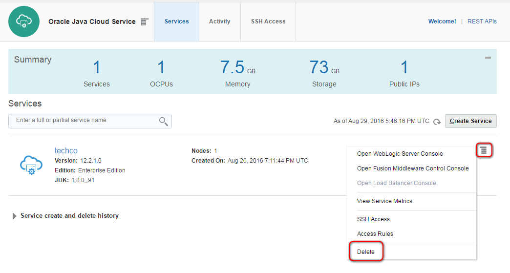
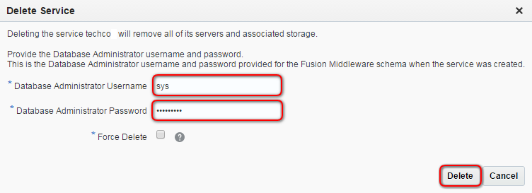
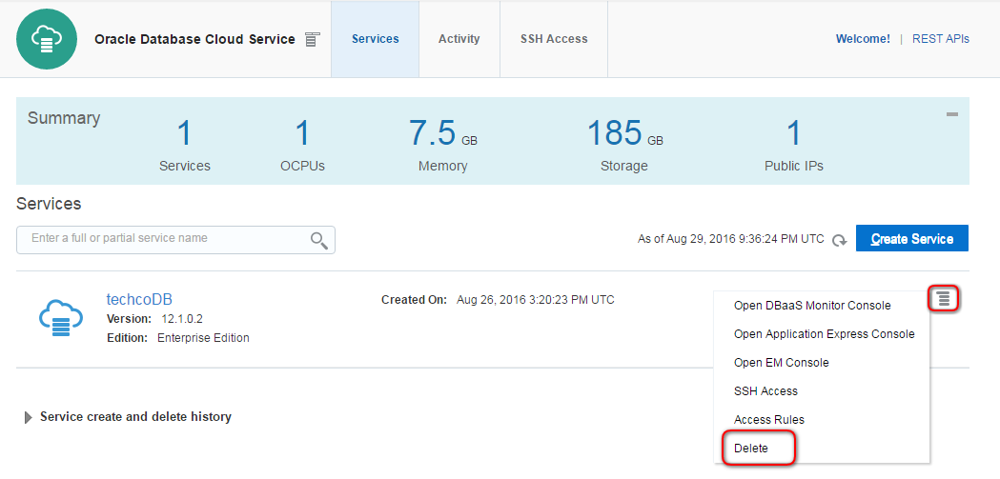

---
# ORACLE Cloud-Native DevOps workshop #
----
## Delete Java Cloud, Database Cloud and Application Cloud Container Services using user interface ##

### About this tutorial ###

This tutorial demonstrates how to 

+ delete Java Cloud Service using user interface
+ delete Database Cloud Service using user interface
	
### Prerequisites ###

+ [Create Database Cloud Service Instance using user interface](../dbcs-create/README.md)
+ [Create Java Cloud Service Instance using user interface](../jcs-create/README.md)

### Steps ###

#### Delete Java Cloud Service using user interface ####

[Sign in](../common/sign.in.to.oracle.cloud.md) to [https://cloud.oracle.com/sign-in](https://cloud.oracle.com/sign-in). On the dashboard open the Java Cloud Service Console.

Click hamburger icon to list available management options and select **Delete**.

Java Cloud Service has a repository stored in database so you need to provide database administrator credentials to remove the schema belongs to Java Cloud Service. Click Delete. When *Force Delete* selected, deleting schemas will still be attempted but the delete will continue even if an error occurs. In this case not necessary to select.

Trial Java Cloud Service termination and clean up takes roughly 15-20 minutes depending on the data center resources.

#### Delete Database Cloud Service using user interface ####

Open the Database Cloud Service console. To go back from other Cloud Service console to the myServices Dashboard click the Dashboard button on the top right corner of the Oracle Public Cloud user interface. Select the Database Cloud Service item in case of slim menu or tile in case of main Dashboard page.

Click on hamburger icon to list available management options and select Delete.

Click the Delete button to confirm.

Trial Database Cloud Service termination and clean up takes roughly 15-20 minutes depending the data center resources.