# Integrate Apps - SAML

Oracle Identity Cloud Service(IDCS) provides integration with any service that can be integrated via **SAML** (Security Access Markup Language) protocol. Administrations will be able to manage users into various applications via single control panel and end users will be able get to applications via single click.

IDCS provides support for standard SAML 2.0 Browser POST Login & Logout Profiles.

In this exercise, we will setup integration with **Salesforce** using SAML.

## Scenario

IDCS acting as Identity Provider for a Salesforce org. Once integrated Salesforce will authenticate users using IDCS. Also, users will be able to request access to Salesforce and launch Salesforce from a unified application portal in IDCS console.

In SAML terminology, IDCS will act as **IdP** (Identity Provider) and Salesforce org as **SP** (Service Provider also known as a Relying Party)

## Persona

Administrators, End-Users

## Logistics

* A Salesforce developer account is needed. One can be obtained from [here](https://developer.salesforce.com/signup?d=70130000000td6N).

* A custom domain needs to be setup in Salesforce for SP-initiated SSO to work i.e. SSO happens when user directly attempts to access Salesforce as opposed to accessing Salesforce App from IDCS MyApps portal (IDP-initiated SSO).


* Download IDCS Metadata to a local XML file. Metadata is available from the following location - [https://<<IDCSHOST>>/fed/v1/metadata](). Need to login using IDCS admin user credentials to access the URL;

	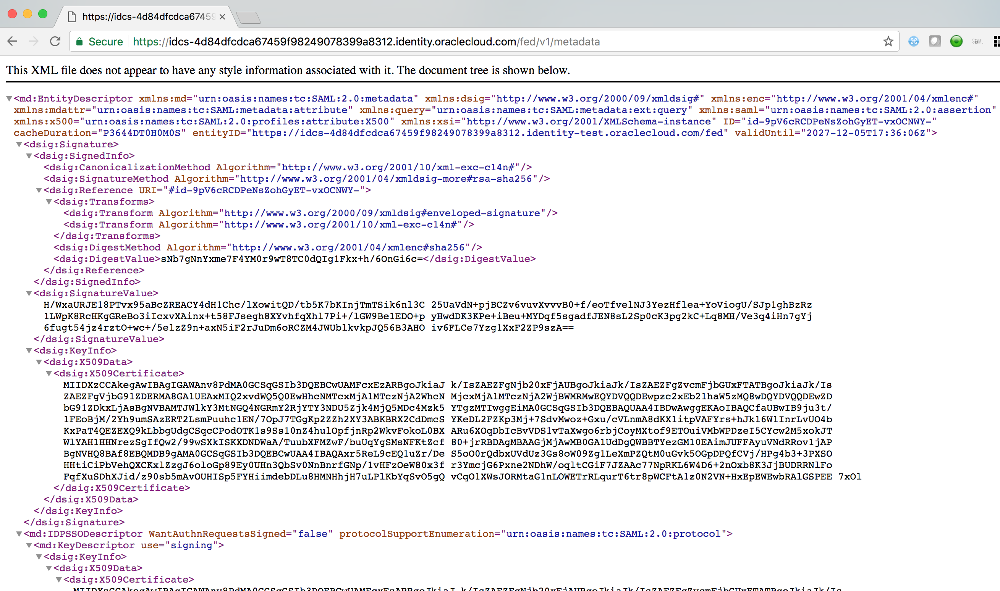
	
## Salesforce Setup
`(Persona: Administrators)`

Detailed instructions for setting up SAML SSO for Salesforce can be found from [Salesforce help article](https://help.salesforce.com/articleView?id=sso_saml.htm&type=5)


* Login to the Salesforce developer account.

* From side menu bar, go to **Settings** -> **Identity** -> **Single Sign-On Settings**

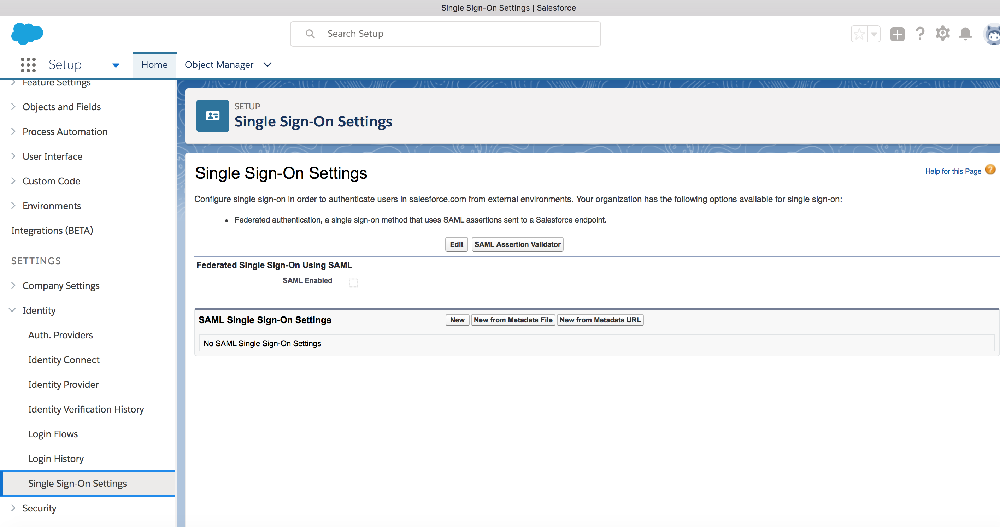

* Click on **Edit** and enable **Federated Single Sign-On Using SAML** option


* Click on **New from Metadata File** button to import IDCS metadata. Select the downloaded metadata file using **Choose File** button. Click on **Create**.


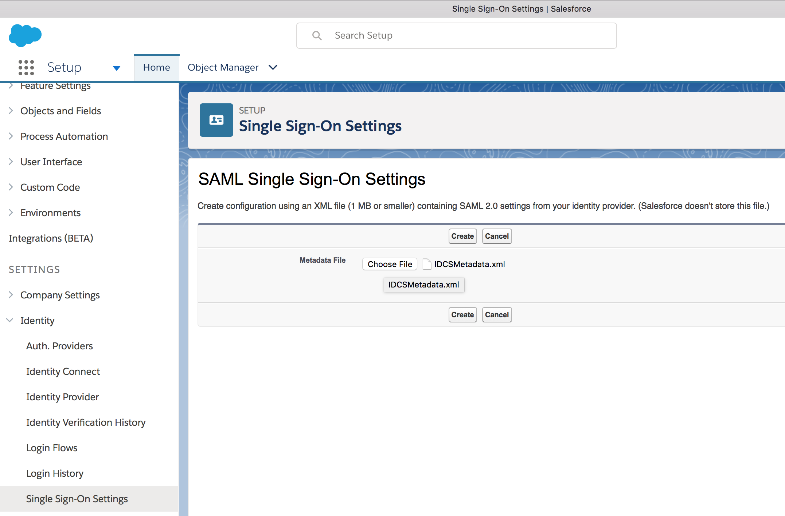

* Keep all the default information and click on **Save**


* Note the **Organization ID** value.


* Note the Org **Domain Name** value.


	
## IDCS Setup
`(Persona: Administrators)`

* Go to IDCS Admin console -> **Applications** tab

* Click on **Add button** and select **App Catalog**


* Search for **Salesforce** App and Add 


	
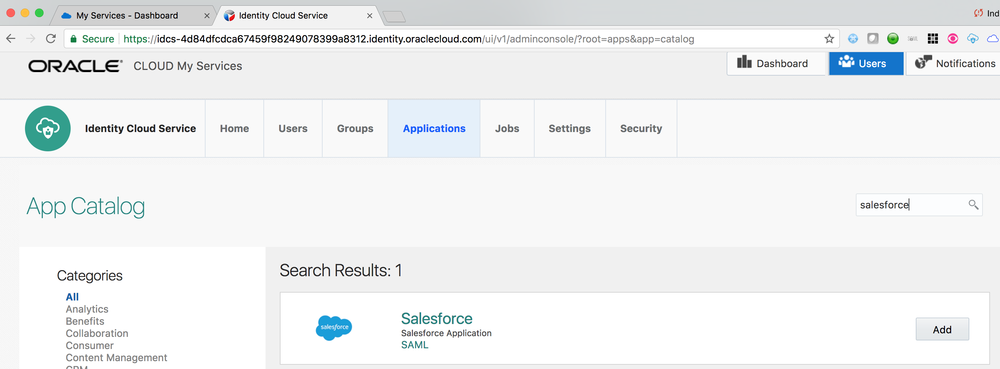


* On the first page of Configuration screen provide the **Organization ID** and **Domain Name** values

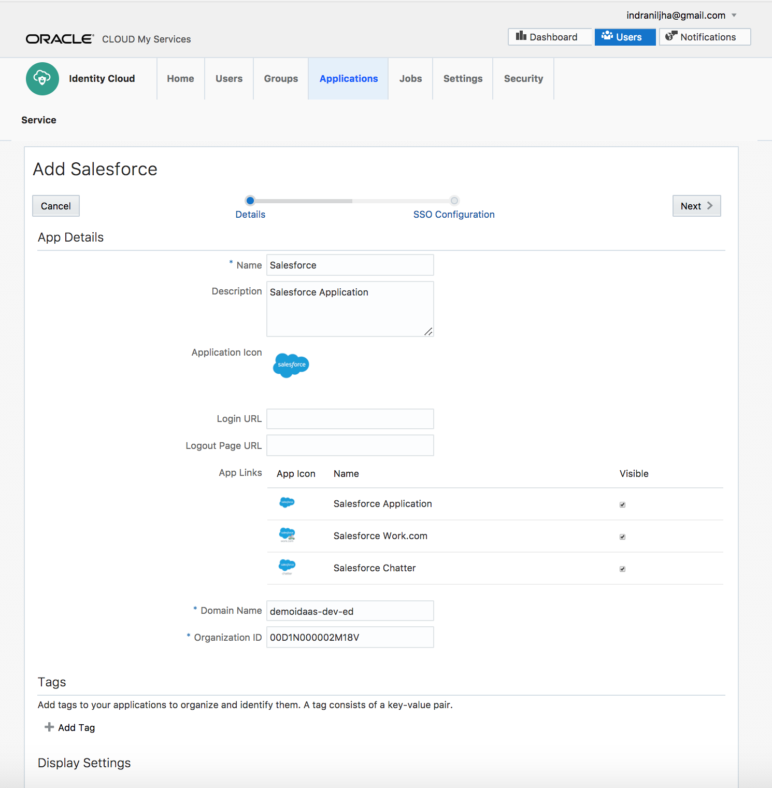

* Click on **Next** 


* Click on **Finish** button  

* **Activate** the application 

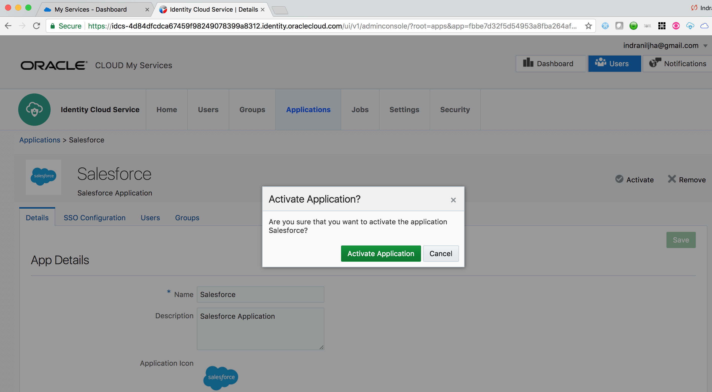

## Assign Apps to Group
`(Persona: Administrators)`

* Go to IDCS Admin Console -> **Groups** tab 

	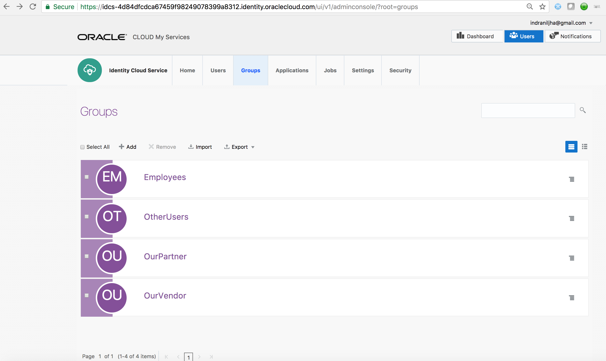

* Add group **Employees**, if not already there. Open the group details page.

	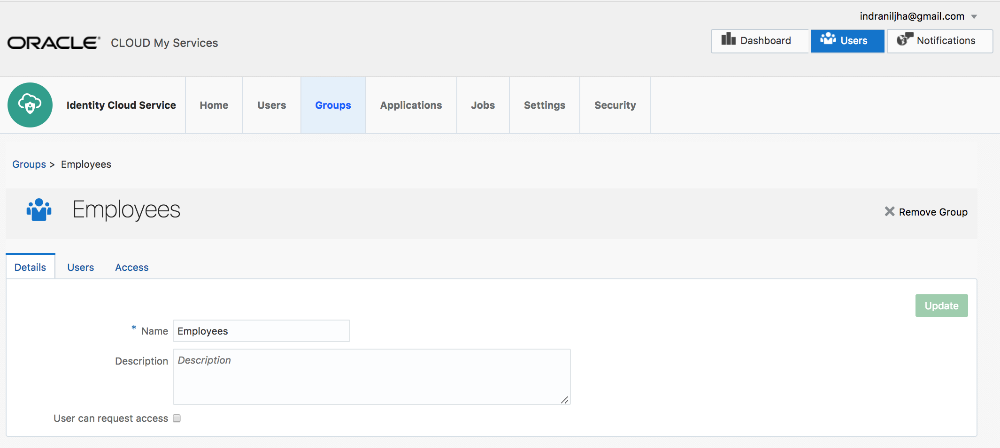

* Go to the `Access` tab. Click on `Assign`. 

* Select `Salesforce` and confirm 

	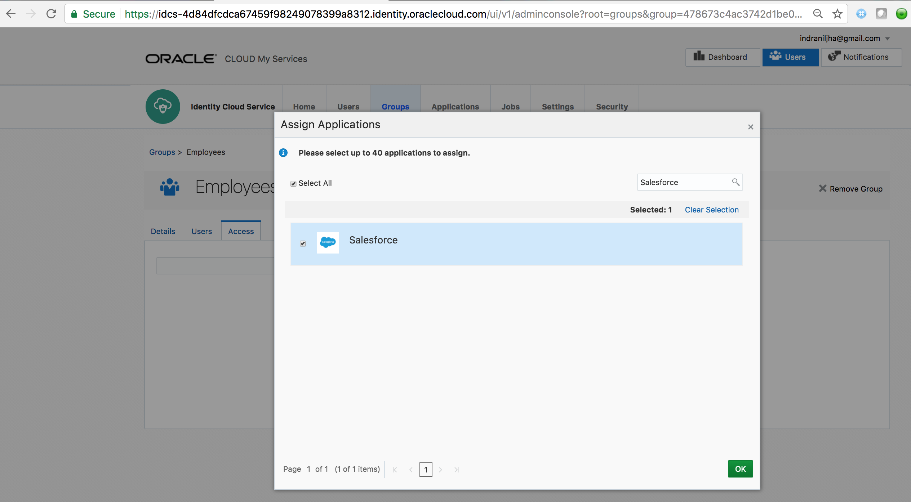
	
	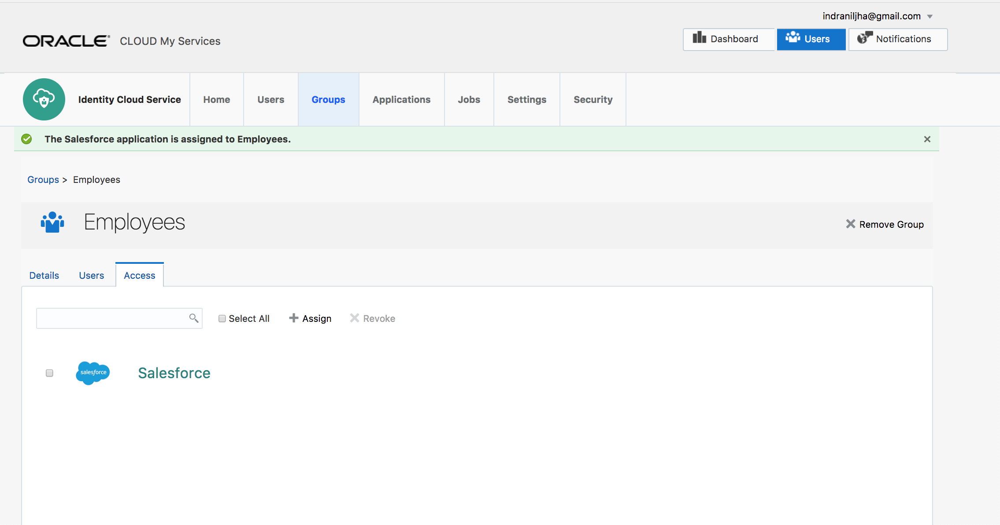
	
	
## Verify Apps SSO
`(Persona: End-Users)`

* Login in IDCS as employee **dcrane**
		
* Verify that the following Salesforce applications are visible now on the landing page - **MyApps** portal

```
Salesforce Application
Salesforce Chatter
Salesforce Work.com
```
	
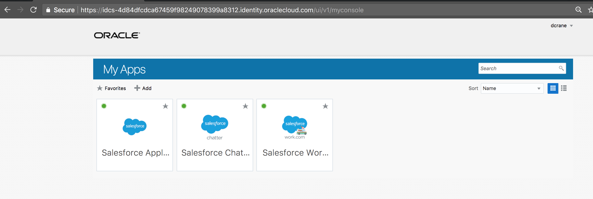

<blockquote>This is because <b>dcrane</b> is part of Employees group. <b>Salesforce</b> App has been assigned to the <b>Employees</b> group. So any user who is member of this group will automatically get access to all the Salesforce applications</blockquote>

* Click on the **Salesforce Chatter** app. 

* Verify that **dcrane** is automatically logged-in to Salesforce Chatter (**SSO**)

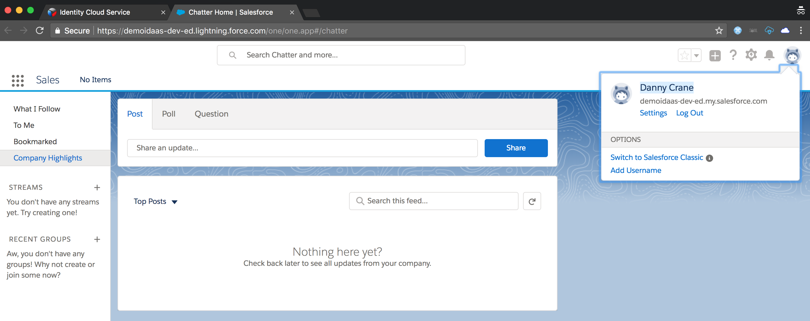
	

