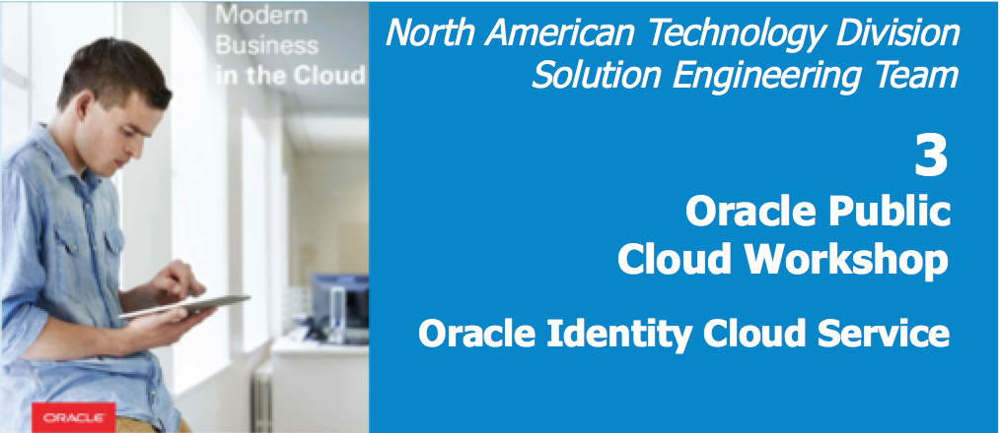
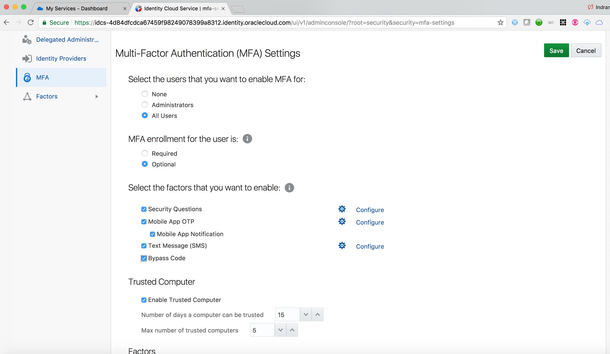
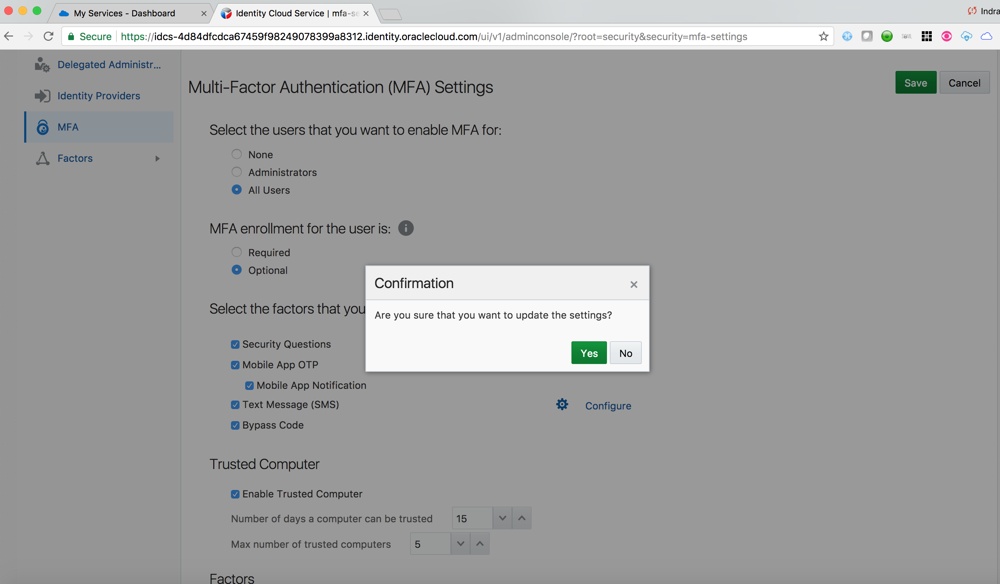
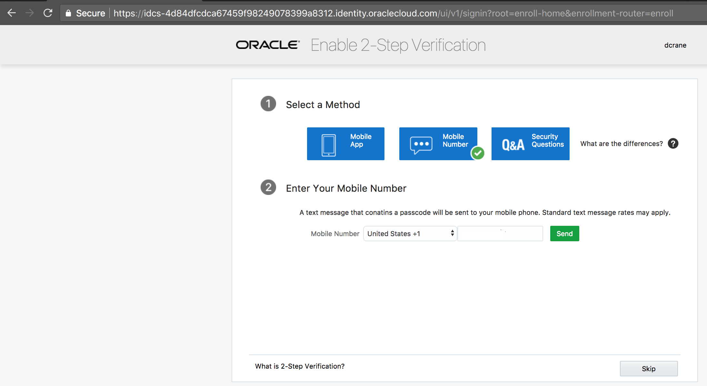
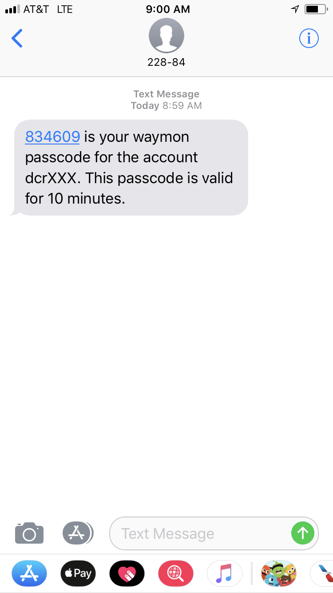
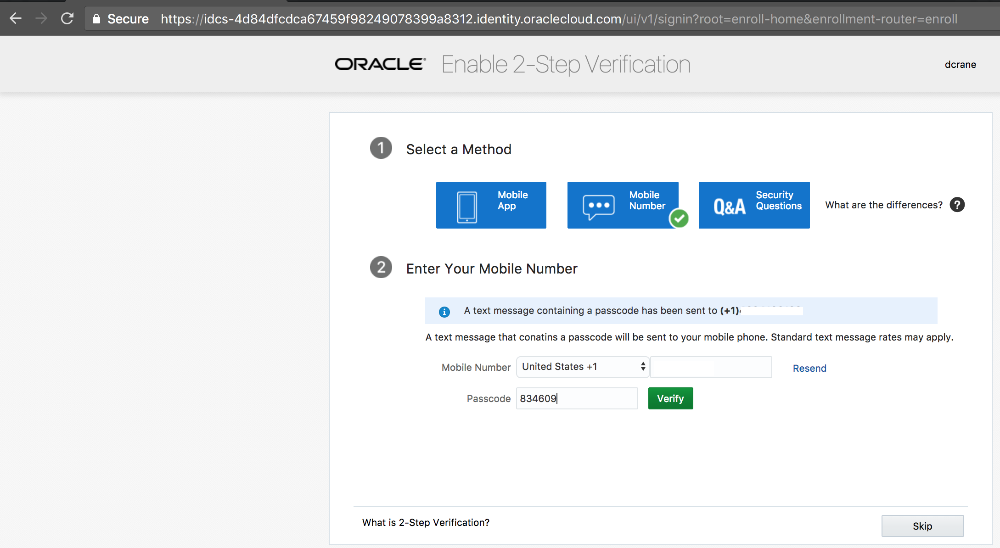
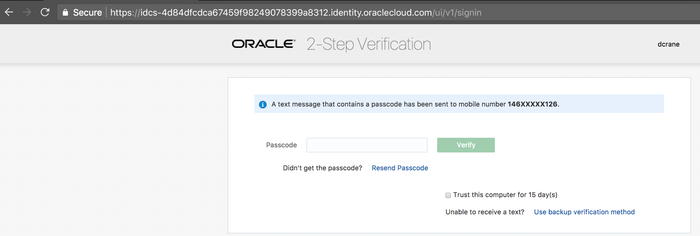
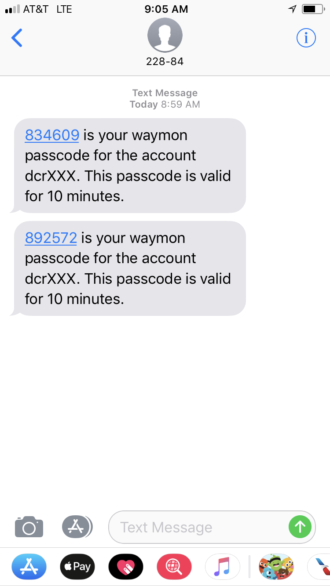
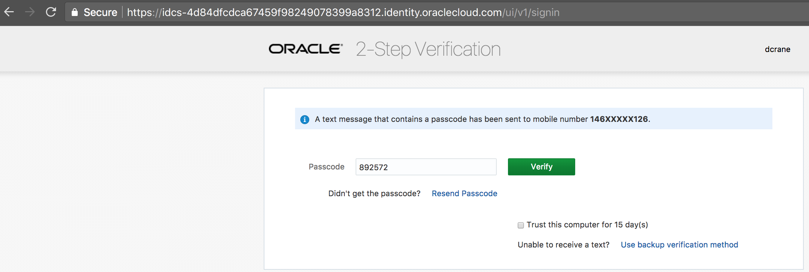

# Multi-Factor Authentication

## Introduction

This is the third of several labs that are part of the **Oracle Public Cloud Identity Cloud Service workshop.** This workshop will walk you through the multi-factor authentication capabilities in Identity Cloud Service (IDCS).

When a user signs in to an application, they are prompted for their user name and password, which is the first factor – something that they know. With **Multi Factor Authentication (MFA)** enabled in Oracle Identity Cloud Service (IDCS), the user is then required to provide a second type of verification. This is called **2-Step Verification**.

The two factors work together to add an additional layer of security by using either additional information or a second device to verify the user’s identity and complete the login process.

In this lab, you will enable multi-factor authentication in IDCS and verify the configuration by enrolling for SMS text messages.

**_To log issues_**, click here to go to the [GitHub oracle](https://github.com/oracle/learning-library/issues/new) repository issue submission form.

## Persona

Administrators, End-Users

## Objectives

- Configure MFA
	- Enable MFA
	- Enroll in MFA - Text Message (SMS)
	- Verify MFA

## Configure MFA

### **STEP 1**: Enable MFA

`(Persona: Administrators)`

- Go to IDCS Admin Console -> **Security** tab. Select **MFA** from the Sidebar to the left.

- Select `All Users` for the label **Select the users that you want to enable MFA for:**

- Select all the options for **Select the factors that you want to enable:**

	

- Keep all other parameters to their Default values. Click on **Save**

	
	
	
### **STEP 2**: Enroll in MFA - Text Message (SMS)

`(Persona: End-Users)`

_**Note**: After MFA is enabled, when an end-user logs in to IDCS, she is provided with MFA enrollment option. Since the default settings has enrollment as  **Optional**, user can **Skip** the enrollment. In that case, she will not be prompted for enrollment next time she logs in IDCS. However, she can do so from the **My Profile** page after login._

- Login to IDCS as **dcrane**

	

- On the **Enable 2-Step Verification** page after login to IDCS, click on **Enable**

	

- Select the method **Mobile Number**

- Provide your mobile number and click on **Send**

	
	
- Access the text message on your mobile and note the 6-digit One-time code on the message.
	
	

- Provide the 6-git code on the enrollment page and click on **Verify**

	
	
- Verify that the success enrollment message is displayed. Click on **Done**
	
	
	
	

- Logout from IDCS

### **STEP 3**: Verify MFA

`(Persona: End-Users)`

- Login to IDCS as **dcrane**

	

- Verify that IDCS prompts for **2-Step Verification** challenge

	

- Access the text message on your mobile and note the 6-digit One-time code on the message.

	

- Provide the 6-git code on the challenge page and click on **Verify**

	

- Verify that **dcrane** successfully logs in 

	