# Lab 300

## Introduction

In Lab 300 we will be adding a MySQL database to our microservice from lab 200. We will be using an automated build process to load our baseline schema onto the database after we have provisioned it.

**To log issues**, click here to go to the [github oracle](https://github.com/oracle/learning-library/issues/new) repository issue submission form.

## Objectives
- Provision a MySQL Database
- Create the baseline schema
- Bind the database to your microservice from lab 200

## Required Artifacts
- We will be leveraging scripts found within the MySQL Microservice from lab 200 that was pulled from [GitHub: https://github.com/CloudAccelerate/TTC-MySQLMicroservice.git](https://github.com/CloudAccelerate/TTC-MySQLMicroservice.git)
- We will require an ssh key: [labkey](labkey.pub)

## Prerequisites

- Expected that labs 100 and 200 have been completed already
- Expected that your storage policy has been set as described in the **prerequisite guide**

## Technologies Involved
- Oracle Cloud Services:
    - Developer Cloud Service
    - MySQL Cloud Service

## Architecture
You will be building out the first component of your Microservices Application


# Provision and Setup a MySQL Cloud Service Instance

## Provision your Database

### **STEP 1**: Login to the MySQL Cloud Service

MySQL Cloud service provides a complete MySQL instance easily provisioned in the cloud.

- Return to the main Cloud UI Dashboard

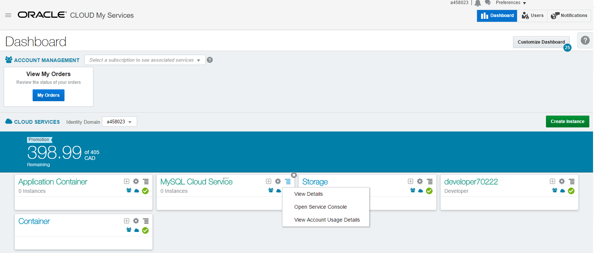
 
 - From the Cloud UI dashboard click on the **MySQL Cloud Service Menu** select **Open Service Console**.   


### **STEP 2**: Create a new MySQL Database

- Click **create service**. Give your service a name.

```
Name: CatalogDB
```


- On the details form fill out as follows and click **Next**.


```

Compute Shape: OC3
SSH Key: <use labkey.pub found in required artifacts>
Usable DB Storage: 25
Administration Username: root
Password: Oracle123!
Database Schema Name: catalog
Backup Destination: none

```
> Note: we have chosen no DB backup for our Demo Environement. If setting up a backup, you would simply set a container name (this container can be created on the fly or provisioned previously from your Storage Service) and set your account username and password.

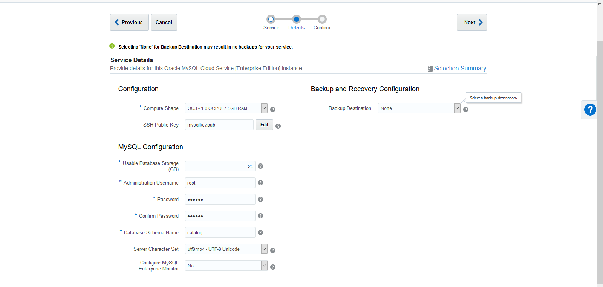

- Confirm your setup and **Create**

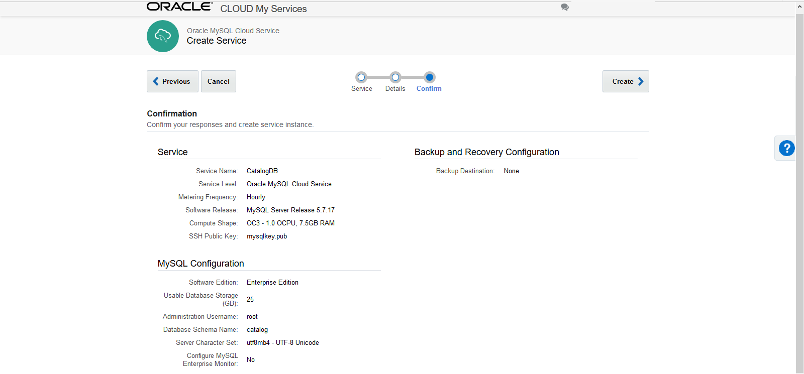

- Your Database is now being provisioned and will be ready shortly

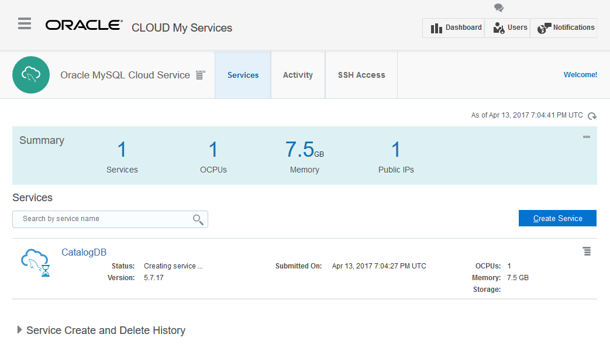

- Verify that your database is provisioned

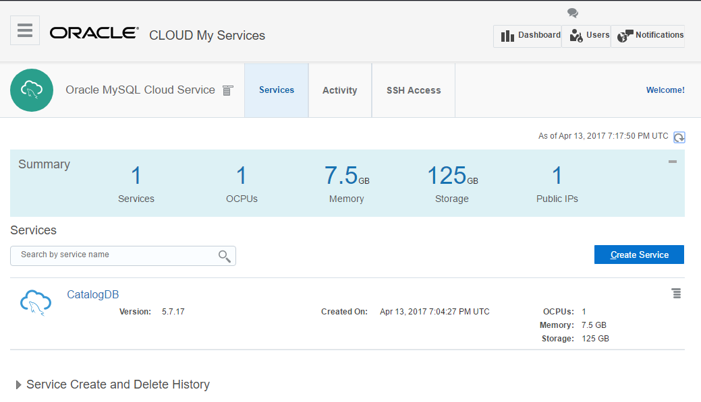

- Click on the instance to view details. Record the public IP of the database

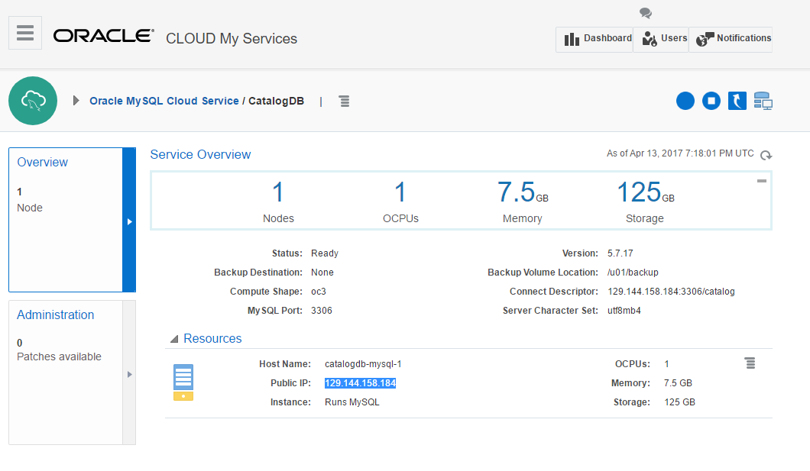

### **STEP 3**: Add a build for the baseline schema setup

- Return to the main project dashboard for your Touch the Cloud Demo in Developer Cloud Service

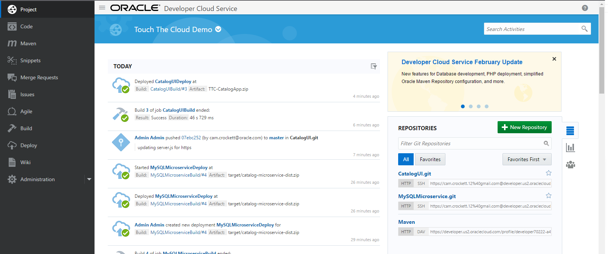

- Click **Build** on the left menu

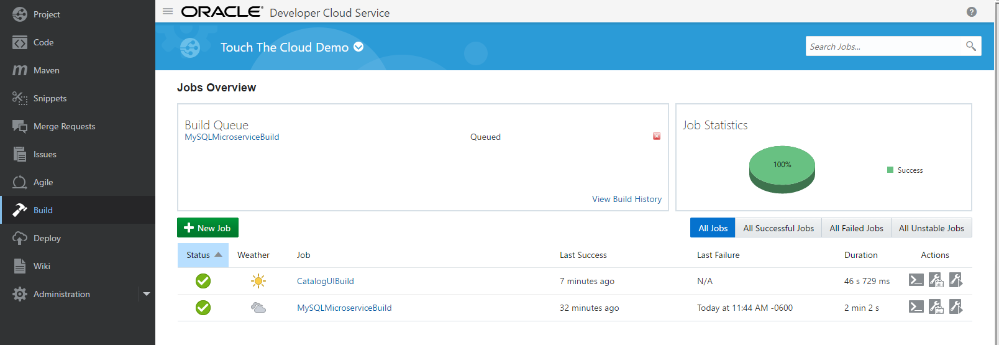

- Create a **New Job**. Fill out the form and click **Save**

> Name: MySQLDBSetup

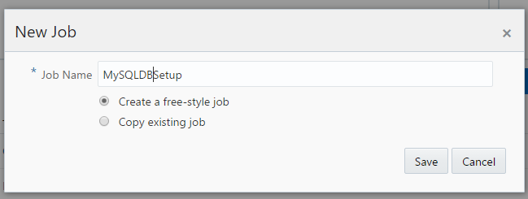

- You will now be able to configure your build.

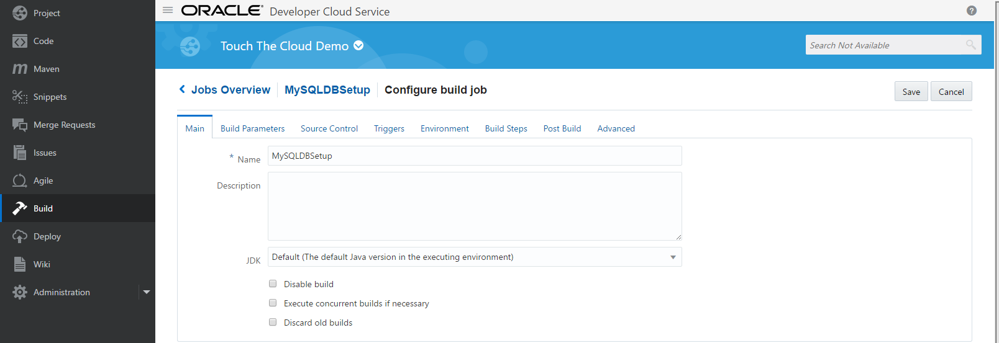

- Select the Build Parameters Tab and check parameterized build.

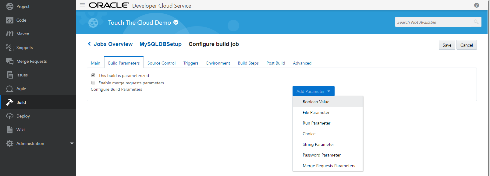

- Add a String Parameter


```

Name: MYSQL_IP
Default Value: <Public IP of MySQL DB>
```

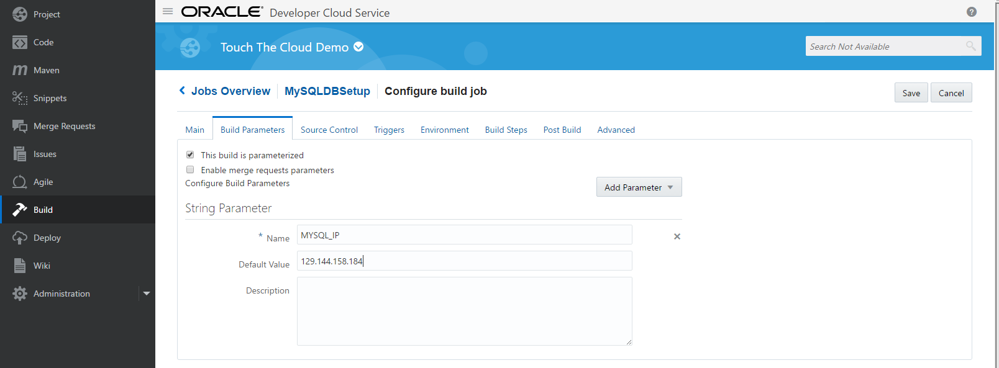

- Select the **Source Control** tab and select **Git**, followed by the **MySQLMicroservice** repository. Add the **Master branch**.

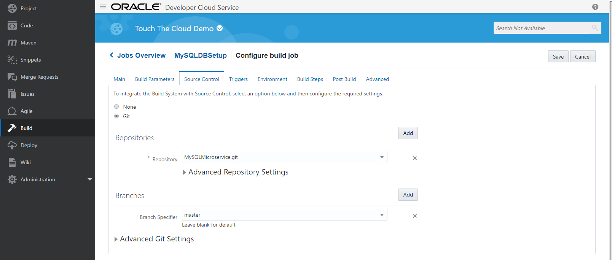

- Select the **Build Step** and add a Shell Build step

```shell

cd src/main/resources/db/setup
scp -i mysqlkey -o StrictHostKeyChecking=no mysql_setup.sql opc@${MYSQL_IP}:/tmp/mysql_setup.sql
ssh -i mysqlkey -o StrictHostKeyChecking=no opc@${MYSQL_IP} sudo su - oracle -c 'mysql "catalog" < "/tmp/mysql_setup.sql"'
```


- Save and Execute the Build. Note you will get a pop-up from your parameterized build to confirm the MYSQL_IP. Leave the default value in place.


- Your build should execute successfully


### **STEP 4**: Bind the database to your microservice
- Open your main Dashboard Console. Select Application Container and open the service console


- You should see both of your Applications

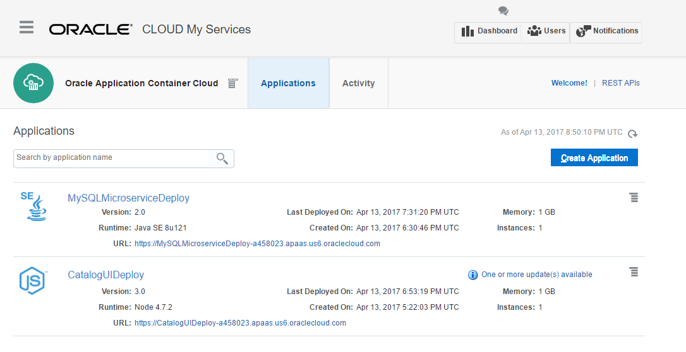

- Select the MySQLMicroserviceDeploy Application

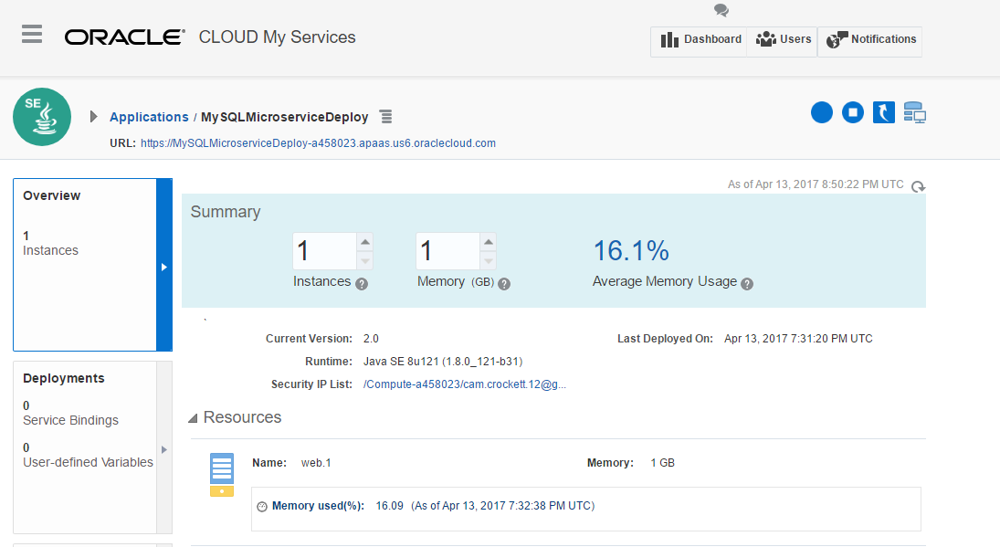

- Select the Deployments tab

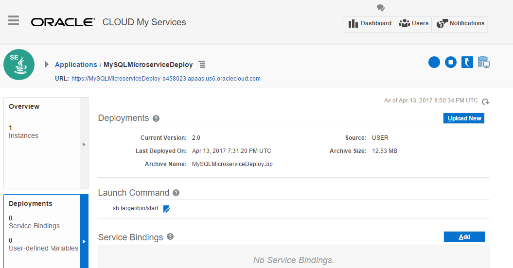

- Select Add under Service Bindings

```

Service Type: MySQL CS Service
Service name: Catalog DB
Username: root
Password: Oracle123!
```

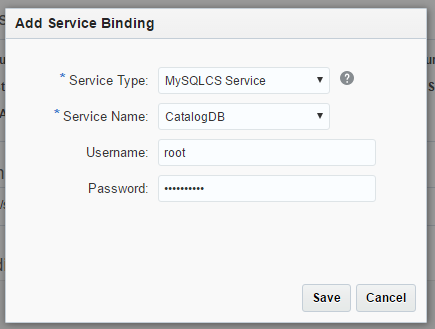

- Apply and Edit the changes to the MySQLMicroserviceDeploy application


- Once redeployment has finished you will see the service binding in the deployment details

> Note: Selecting the show all variables under environment variables will display all variables added that are associated with the binding

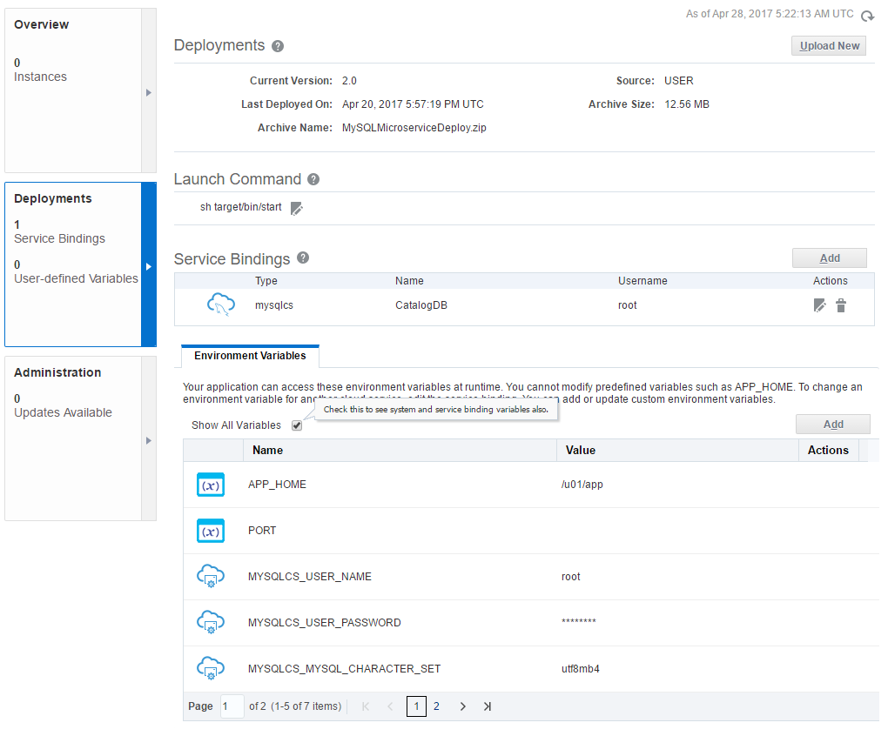

### **STEP 5**: Verify the Catalog Data

- Return to the main screen for Application Container Cloud Service


- Open the URL for the MySQLMicroserviceDeploy Application and append "/catalog/v1" to see the JSON data now available

```

ex: https://mysqlmicroservicedeploy-a458023.apaas.us6.oraclecloud.com/catalog/v1
```

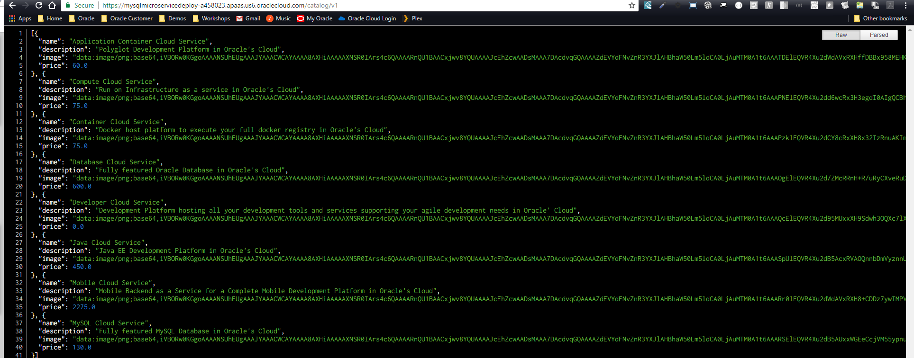

- Return to the main screen for Application Container Cloud Service


- Select the URL for the CatalogDeployUI to see the catalog on screen and achievement 3 unlocked.

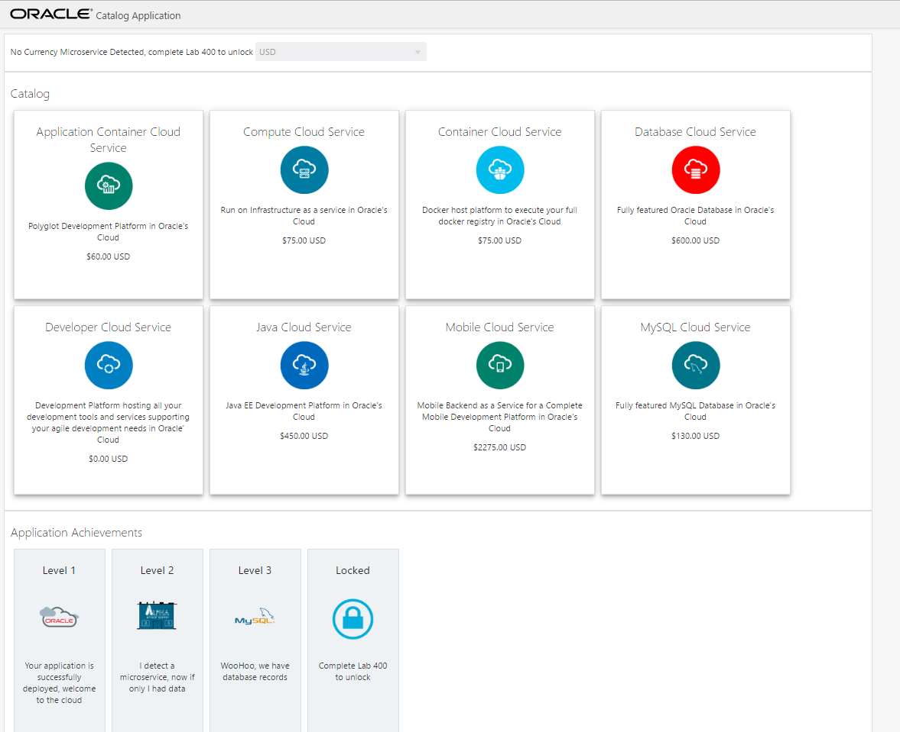

**You have now completed lab 300**
