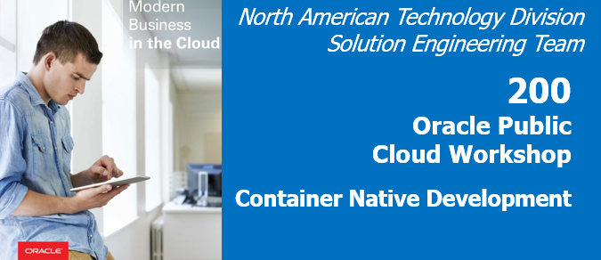
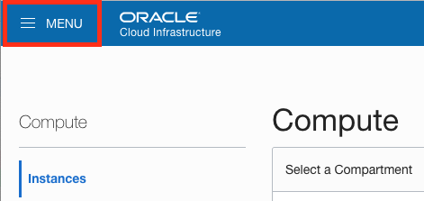
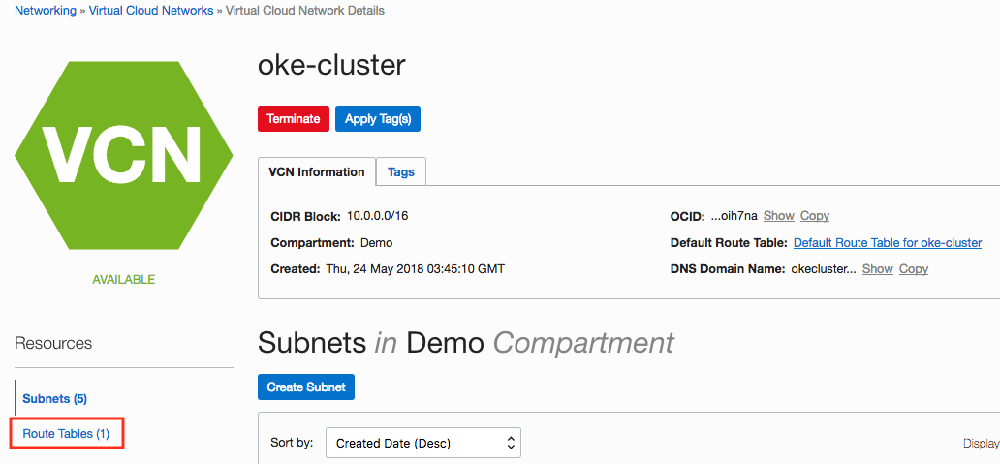
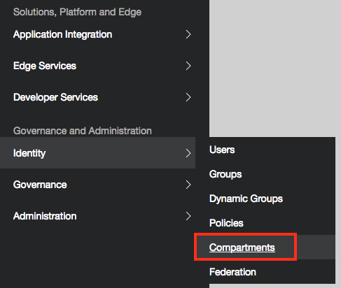
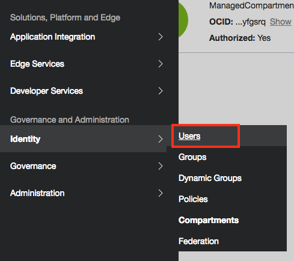
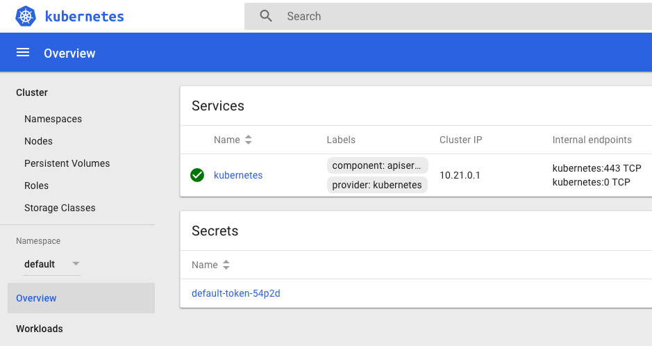
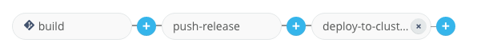
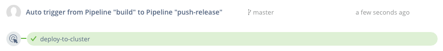

# Provision Oracle Container Engine for Kubernetes



## Introduction

This is the second of several labs that are part of the **Oracle Public Cloud Container Native Development workshop.** This workshop will walk you through the process of moving an existing application into a containerized CI/CD pipeline and deploying it to a Kubernetes cluster in the Oracle Public Cloud.

You will take on 2 personas during the workshop. The **Lead Developer Persona** will be responsible for configuring the parts of the automated build and deploy process that involve details about the application itself. The **DevOps Engineer Persona** will configure the parts of the automation involving the Kubernetes infrastructure. To containerize and automate the building and deploying of this application you will make use of Wercker Pipelines for CI/CD, Docker Hub for a container registry, and Terraform for provisioning a Kubernetes cluster on Oracle Cloud Infrastructure.

During this lab, you will take on the **DevOps Engineer Persona**. You will provision a Kubernetes cluster and all of the infrastructure that it requires using Terraform. Terraform will provision the Virtual Cloud Network, Load Balancers, Kubernetes Master and Worker instances, and etcd instance required to support your cluster.

**_To log issues_**, click here to go to the [GitHub oracle](https://github.com/oracle/learning-library/issues/new) repository issue submission form.

## Objectives

**Automate Deployment to Kubernetes**

- Create and Deploy to a Kubernetes Cluster
  - Set Up Oracle Cloud infrastructure
  - Provision Oracle Container Engine for Kubernetes
  - Configure and Run Wercker Deployment Pipelines
  - Deploy and Test the Product Catalog Application

## Required Artifacts

- The following lab requires:
  - an Oracle Cloud account that will be supplied by your instructor


# Provision Oracle Container Engine for Kubernetes

## Set Up Oracle Cloud infrastructure

### **STEP 1**: Log in to your OCI dashboard

- Please refer to the Cloud Account that has been provided by your workshop instructor. _Please note your account details will be provided separately and are not available on these pages._

- Once you receive the **Oracle Cloud Account**, make note of your **Username, Password, Cloud Tenant Name and Console URL**.

- Open your browser (Firefox or Chrome) and go to your Console URL. As en example, the Console URL will look something like the following:

   [https://console.us-ashburn-1.oraclecloud.com/#/a/](https://console.us-ashburn-1.oraclecloud.com/#/a/)
    
   _This URL may be different to the one your are provided with. Use the provided URL if it is different to the above_

Click on **Change tenant** button if you are not presented with **Cloud Tenant** input field.


- Enter your **Cloud Tenant Name** in the input field and click the **Continue** button. This is supplied by your workshop instructor earlier.

  

- Enter your **Username** and **Password** in the input fields and click **Sign In**. These are supplied by your workshop instructor earlier. The default user will be **api.user**

  


## **STEP 2**: Create Policy for Container Engine

To create and manage clusters in your tenancy, Container Engine must have access to all resources in the tenancy. To give Container Engine the necessary access, create a policy for the service as follows:

- In the Console, click **Identity**, and then click **Policies**. A list of the policies in the compartment you're viewing is displayed.

- Select the tenancy's **root** compartment from the list on the left

- Click **Create Policy**

- Enter the following:
  - **Name:** `oke-service`
  - **Description:** `allow OKE to manage all-resources in tenancy`
  - **Policy Versioning:** Select **Keep Policy Current**, select **Use Version Date** and enter that date in YYYY-MM-DD format.
  - **Statement:** The following policy statement:
  `allow service OKE to manage all-resources in tenancy`

- Leave the rest to default

- Click **Create**

  

## **STEP 3**: Configuring Network Resources

You must create a VCN for your cluster and it must include the following:

  - The VCN must have a CIDR block defined that is large enough for at least five subnets, in order to support the number of hosts and load balancers a cluster will have
  - The VCN must have an internet gateway defined
  - The VCN must have a route table defined that has a route rule specifying the internet gateway as the target for the destination CIDR block
  - The VCN must have five subnets defined, three subnets in which to deploy worker nodes and two subnets to host load balancers.

### **STEP 3.1**: VCN Configuration

- In the Console, click **Networking**, and then click **Virtual Cloud Network**

- Select your the tenancy's **Demo** compartment (for GSE env) from the list on the left

- Click **Create Virtual Cloud Network**

- Enter the following:
  - **Name:** `oke-cluster`
  - **CIDR Block:** `10.0.0.0/16`
  - **DNS Resolution:** Check box to **USE DNS HOSTNAMES IN THIS VCN**

- Leave the rest to default (Compartment defaults to **Demo** for GSE env)

- Click **Create Virtual Cloud Network**

  


### **STEP 3.2**: Internet Gateway Configuration

The VCN must have an internet gateway. The internet gateway must be specified as the target for the destination CIDR block 0.0.0.0/0 in a route rule in a route table.

Once the **oke-cluster** VCN is created

- Click on the **oke-cluster** VCN to enter the details page

- Select **Internet Gateways** from the list on the left

- Enter the following:
  - **Name:** `oke-gateway-0`

- Leave the rest to default (Compartment defaults to **Demo** for GSE env)

- Click **Create Internet Gateway**

  


### **STEP 3.3**: Route Table Configuration

The VCN must have a route table. The route table must have a route rule that specifies an internet gateway as the target for the destination CIDR block 0.0.0.0/0.

- Select **Route Tables** from the list on the left

  

  A `Default Route Table for oke-cluster` should have been created for you, similar to below.

  

If a default Route Table has not been created for you, then create a new Route Table.

- Click **Create Route Table**

- Enter the following:
  - **Name:** `routetable-0`
  - **Destination CIDR block:** `0.0.0.0/0`
  - **Target Type:** `Internet Gateway`
  - **Target Internet Gateway:** `oke-gateway-0`

- Leave the rest to default (Compartment defaults to **Demo** for GSE env)

- Click **Create Route Table**

  

However, if a default Route Table has been created, then you only need to add a new rule to the Route Table.

- Click on the **Default Route Table for oke-cluster** (default generated name) Route Table to enter the details page

- Click on **Edit Route Rules**

- Enter the following:
  - **Destination CIDR block:** `0.0.0.0/0`
  - **Target Type:** `Internet Gateway`
  - **Target Internet Gateway:** `oke-gateway-0`

  


### **STEP 3.4**: DHCP Options Configuration

The VCN must have a DHCP Options configured. The default value for DNS Type of Internet and VCN Resolver is acceptable.

- While still in the VCN `oke-cluster` details page, select **DHCP Options** from the list on the left

  A `Default DHCP Options for oke-cluster` should have been created for you, similar to below.

  


### **STEP 3.5**: Security List Configuration

The VCN must have security lists defined for the Worker Node Subnets and the Load Balancer Subnets. Two security lists need to be created (in addition to the default security list) to control access to and from the worker node subnets and load balancer subnets. The two security lists are named **oke-workers** and **oke-loadbalancers** respectively.

Create two additional security lists to the default `Default Security List for oke-cluster`
  - **Security List Name:** `oke-workers`
  - **Security List Name:** `oke-loadbalancers`
  
There are two types of rules, Ingress and Egress, for both Workers and Load Balancer security lists. There 12 rules in total for the Worker Node Subnet and two rules in total for the Load Balancer Subnet.

Let's create the security lists and rules.

- Select **Security** from the list on the left

  There should be one default security list `Default Security List for oke-cluster` similar to below.

  

### **STEP 3.5.1**: Create Security List for Work Node Subnets

- Click **Create Security Lists**

- Enter the following for first Ingress rule for **oke-worker** security list name:
  - **Security List Name:** `oke-workers`
  - **Source CIDR:** `10.0.10.0/24`
  - **IP Protocol:** `TCP`
  - **Source Port Range:** `ALL`
  - **Destination Port Range:** `ALL`

  

- Enter the rest of the Ingress rules following the table below:

  

- Before clicking on **Create Security List** button to complete, you need to enter the Ergress rules as well.

- Enter the rest of the Engress rules following the table below:

  

- Click on **Create Security List** button to complete


### **STEP 3.5.2**: Create Security List for Load Balancer Subnets

- Repeat Step 2.5.1 for the Load Balancer subnet using the rules below:

  

  You should now have three security lists similar to below:

  


### **STEP 3.6**: Subnet Configuration

We usually require five subnets in the VCN to create and deploy clusters in a highly available configuration. The following configuration assumes you will be deploying across all three Availability Domains.


  - Three subnets in which to deploy worker nodes. Each worker node subnet must be in a different availability domain. The worker node subnets must have different security lists to the load balancer subnets.
  
  - Two subnets to host load balancers. Each load balancer subnet must be in a different availability domain. The load balancer subnets must have different security lists to the worker node subnets.
  
- Still in the VCN page, select **Subnets** from the list on the left

- Click **Create Subnet**

- Enter the following for the first subnet:
  - **Name:** `oke-workers-1`
  - **Availability Domain:** `emra:US-ASHBURN-AD-1`
  - **CIDR Block:** `10.0.10.0/24`
  - **Route Table:** `Default Route Table for oke-cluster`
  - **Public Subnet:** `Allow public IP addresses for instances in this Subnet`
  - **DNS Resolution:** `Use DNS Hostnames In This Subnet`
  - **DHCP Options:** `Default DHCP Options for oke-cluster`
  - **Security Lists:** `oke-workers`

  You should have something similar to below:

  

- Click **Create**

- Repeat the above for the remaining two worker subnets **oke-workers-2** and **oke-workers-3** as below:

  


- Repeat the above for the two load balancer subnets **oke-loadbalancer-1** and **oke-loadbalancer-2** as below:

  

With the five subnets connected, we are ready to create a Kubernetes cluster.


## **STEP 4**: Create a Kubernetes Cluster
  
  
- In the Console, click **Containers**, choose the **Demo** compartment, and then click **Clusters**

- Click **Create Cluster**

- Enter the following configuration details for the new cluster:
  - **Name:** `Demo`
  - **Version:** `v1.9.7`
  - **VCN:** `oke-cluster`
  - **Kubernetes Service LB Subnets:** `oke-workers-1`, `oke-workers-2`
  - **Kubernetes Dashboard Enabled:** `Checked`
  - **Tiller (Helm) Enabled:** `Checked`

  Leave the rest of the fields to default and you should have something similar to below:

  

You can either Click **Create** now and create your node pools later OR add the node pools now. Let's add the node pools now to save a step.

- Click **Add Node Pool**

- Enter the following configuration details for the new node pool:
  - **Name:** `workbetter`
  - **Version:** `v1.9.7`
  - **Image:** `Oracle-Linux-7.4`
  - **Shape:** `VM.Standard2.1`
  - **Subnets:** `oke-wokrers-1`
  - **Quantity Per Subnet:** `1`

  Leave the rest of the fields to default and you should have something similar to below:

  

- Click **Create**

The Kubernetes cluster is now ready to use.


## **STEP 5**: Downloading a kubeconfig File to Enable Cluster Access

When you create a cluster, Container Engine creates a Kubernetes configuration file for the cluster called `kubeconfig`. The `kubeconfig` file provides the necessary details to access the cluster using **kubectl** and the Kubernetes Dashboard.

You must download the `kubeconfig` file and set an environment variable to point to it. Having completed the steps, you can start using **kubectl** and the Kubernetes Dashboard to manage the cluster.


### **STEP 5.1**: Generate an API Signing Key Pair

Use OpenSSL commands to generate the key pair in the required PEM format.

- If you haven't already, create a .oci directory to store the credentials:

  `mkdir ~/.oci`

- Generate the private key with one of the following commands:

  `openssl genrsa -out ~/.oci/oci_api_key.pem -aes128 2048`

- Ensure that only you can read the private key file:

  `chmod go-rwx ~/.oci/oci_api_key.pem`

- Generate the public key:

  `openssl rsa -pubout -in ~/.oci/oci_api_key.pem -out ~/.oci/oci_api_key_public.pem`

- Copy the contents of the public key to the clipboard using pbcopy, xclip or a similar tool (you'll need to paste the value into the Console later). For example:

  `cat ~/.oci/oci_api_key_public.pem | pbcopy`

- Get the key's fingerprint with the following OpenSSL command:

  `openssl rsa -pubout -outform DER -in ~/.oci/oci_api_key.pem | openssl md5 -c`

  When you upload the public key in the Console, the fingerprint is also automatically displayed there. It looks something like this: `12:34:56:78:90:ab:cd:ef:12:34:56:78:90:ab:cd:ef`


### **STEP 5.2**: Upload the Public Key of the API Signing Key Pair

You can now upload the PEM public key in the OCI Console.

- In the Console, click **api.user**, and then click **User Settings**. The user details page is now shown.

- Click **Add Public Key**

- Paste the contents of the PEM public key in the dialog box and click **Add**

  You should see something similar to below with the key's fingerprint under the API Keys.

  


### **STEP 4.3**: Installing the Oracle Cloud Infrastructure CLI

The command line interface (CLI) is a tool that enables you to work with Oracle Cloud Infrastructure objects and services. The CLI provides much the same functionality as the Console and includes additional advanced commands.

There are different installation options and steps to install the CLI and required software depending on your platform. It is not possbile to cover all the options on this page. Please refer to [Installing the CLI Link](https://docs.us-phoenix-1.oraclecloud.com/Content/API/SDKDocs/cliinstall.htm) to install your CLI.


### **STEP 5.4**: Configuring the Oracle Cloud Infrastructure CLI

Before using the CLI, you have to create a config file that contains the required credentials for working with Oracle Cloud Infrastructure. You can create this file using a setup dialog or manually, using a text editor. It is recommended to use the setup dialog.

- Open a shell and run the `oci setup config` command

  The command prompts you for the information required for the config file and the API public/private keys.

- When prompted for the API public/private keys, you can specify the keys you generated previously.


### **STEP 5.5**: Download the kubeconfig.sh File

- In the Console, open the navigation menu. Click **Containers**

- Choose the **Demo** compartment, and then click **Clusters**

- On the **Cluster** List page, click the **Demo** cluster you created. The Cluster page shows details of the cluster similar to below:

  

- Click the **Access Kubeconfig** button to display the How to **Access Kubeconfig dialog box**

- Click the **Download script** button to download the `get-kubeconfig.sh` file to a convenient location on the machine where you installed the Oracle Cloud Infrastructure CLI (for example, your home directory).

  

- Make the get-kubeconfig.sh file executable. For example on Linux or MacOS:

  `$ chmod +x ~/get-kubeconfig.sh`

- Set the **ENDPOINT** environment variable to point to the region in which you created the cluster. Use one of us-phoenix-1, us-ashburn-1, eu-frankfurt-1, or uk-london-1 to specify the region. For example, on Linux or MacOS:

  `$ export ENDPOINT=containerengine.us-phoenix-1.oraclecloud.com`

- Run the `get-kubeconfig.sh` file to download the `kubeconfig` file and save it in a location accessible to kubectl and the Kubernetes Dashboard. For example on Linux or MacOS:


  `$ ~/get-kubeconfig.sh ocid1.cluster.oc1.phx.aaaaaaaaae... > ~/kubeconfig`

  Where ocid1.cluster.oc1.phx.aaaaaaaaae... is the OCID of the current cluster.

- For convenience, the command in the How to **Access Kubeconfig** dialog box already includes the cluster's OCID. You can simply copy and paste that command.


### **STEP 5.6**: Set the KUBECONFIG environment variable

- In a terminal window, set the **KUBECONFIG** environment variable to the name and location of the `kubeconfig` file. For example, on Linux or MacOS:

  `$ export KUBECONFIG=~/kubeconfig`

- Verify that **kubectl** is available and that it can connect to the cluster

  `$ kubectl get nodes`

  Information about the nodes in the cluster should be shown.

You can now use kubectl and the Kubernetes Dashboard to perform operations on the cluster.


## **STEP 6**: Starting The Kubernetes Dashboard

Kubernetes Dashboard is a web-based user interface that you can use as an alternative to the Kubernetes kubectl command line tool to:

- deploy containerized applications to a Kubernetes cluster
- troubleshoot your containerized applications

You use the Kubernetes Dashboard to get an overview of applications running on a cluster, as well as to create or modify individual Kubernetes resources. The Kubernetes Dashboard also reports the status of Kubernetes resources in the cluster, and any errors that have occurred.

In contrast to the Kubernetes Dashboard, Container Engine enables you to create and delete Kubernetes clusters and node pools, and to manage the associated compute, network, and storage resources.

Before you can use the Kubernetes Dashboard, you need to specify the cluster on which to perform operations.

To start the Kubernetes Dashboard:

- In a terminal window where you have exported the `KUBECONFIG` environment variable, enter **kubectl proxy** to ebable the Kubernetes Dashboard access.

- Open a browser and go to http://localhost:8001/ui to display the Kubernetes Dashboard.


## **STEP 6**:

The Kubernetes cluster setup is complete and you are now able to deploy your application to this cluster. This cluster is can be reached by its cluster address. You can find this address either through the OCI console or in the `kubeconfig` file.

- Open the `kubeconfig` file and look for the line with the **server** tag. For example:

  `server: https://cygiyzvmi4w.us-ashburn-1.clusters.oci.oraclecloud.com:6443`
  
  This is the cluster address you should use for deployment, such as the one specified for `KUBERNETES_MASTER` in **Wercker Environment**.
  
Alternatively:

- In the Console, open the navigation menu. Click **Containers**

- Choose the **Demo** compartment, and then click **Clusters**

- On the **Cluster** List page, click the **Demo** cluster you created.

- Under the Cluster Details, you will find the Kubernetes Cluster address similar to below:

  

  This should be the same address as the one found in `kubeconfig`.
  
  You are ready to config Wercker to deploy to this cluster.


***********************


- During provisioning, Terraform generated a `kubeconfig` file that will authenticate you to the cluster. Let's configure and start the kubectl proxy server to make sure our cluster is accessible.

- You will need to set an environment variable to point `kubectl` to the location of your Terraform-generated `kubeconfig` file. Then you can start the Kubernetes proxy server, which will let you view the cluster dashboard at a localhost URL.

  ```bash
  export KUBECONFIG=`pwd`/generated/kubeconfig
  kubectl proxy
  ```

  **NOTE**: Should you need to change the IP address of your cluster in the future, you can configure `kubectl` with the updated connection information by running the following command, which will pass the current address and authentication details to **kubectl**: `terraform output kubeconfig | tr '\n' '\0' | xargs -0 -n1 sh -c`

- With the proxy server running and the Load Balancers showing a running status, navigate to the **[Kubernetes dashboard](http://localhost:8001/api/v1/namespaces/kube-system/services/http:kubernetes-dashboard:/proxy/)** in a new browser tab.

  

- Great! We've got Kubernetes installed and accessible -- now we're ready to get our microservice deployed to the cluster. The next step is to tell Wercker how and where we would like to deploy our application. In your **terminal window**, press **Control-C** to terminate `kubectl proxy`. We will need the terminal window to gather some cluster info in another step. We'll start the proxy again later.

## Configure and Run Wercker Deployment Pipelines

### **STEP 8**: Define Kubernetes Deployment Specification

- From a browser, navigate to your forked twitter-feed repository on GitHub. If you've closed the tab, you can get back by going to [GitHub](https://github.com/), scrolling down until you see the **Your repositories** box on the right side of the page, and clicking the **twitter-feed** link.

  

- Click **Create new file**

  

- In the **Name your file** input field, enter **kubernetes.yml.template**

  

- **Copy** the YAML below and **paste** it into the file editor.

  >This configuration consists of two parts. The first section (up to line 28) defines a **Deployment**, which tells Kubernetes about the application we want to deploy. In this Deployment we instruct Kubernetes to create two Pods (`replicas: 2`) that will run our application. Within those pods, we specify that we want one Docker container to be run, and compose the link to the image for that container using environment variables specific to this workflow execution (`image: ${DOCKER_REPO}:${WERCKER_GIT_BRANCH}-${WERCKER_GIT_COMMIT}`).

  >The second part of the file defines a **Service**. A Service defines how Kubernetes should expose our application to traffic from outside the cluster. In this case, we are asking for a cluster-internal IP address to be assigned (`type: ClusterIP`). This means that our twitter feed will only be accessible from inside the cluster. This is ok, because the twitter feed will be consumed by the product catalog application that we will deploy later. We can still verify that our twitter feed is deployed properly -- we'll see how in a later step.

  >A `.yml` file is a common format for storing Kubernetes configuration data. The `.template` suffix in this file, however, is not a Kubernetes concept. We will use a Wercker step called **bash-template** to process any `.template` files in our project by substituting environment variables into the template wherever `${variables}` appear. You'll add that command to a new pipeline in the next step.

```yaml
apiVersion: extensions/v1beta1
kind: Deployment
metadata:
  name: twitter-feed-v1
  labels:
    commit: ${WERCKER_GIT_COMMIT}
spec:
  replicas: 2
  selector:
    matchLabels:
      app: twitter-feed
  template:
    metadata:
      labels:
        app: twitter-feed
        commit: ${WERCKER_GIT_COMMIT}
    spec:
      containers:
      - name: twitter-feed
        image: ${DOCKER_REPO}:${WERCKER_GIT_BRANCH}-${WERCKER_GIT_COMMIT}
        imagePullPolicy: Always
        ports:
        - name: twitter-feed
          containerPort: ${PORT}
          protocol: TCP
      imagePullSecrets:
        - name: wercker
---
apiVersion: v1
kind: Service
metadata:
  name: twitter-feed
  labels:
    app: twitter-feed
    commit: ${WERCKER_GIT_COMMIT}
spec:
  ports:
  - port: 30000
    targetPort: ${PORT}
  selector:
    app: twitter-feed
  type: ClusterIP
---
```

- At the bottom of the page, click **Commit new file**

  

- Since you've committed to the repository, Wercker will trigger another execution of your workflow. We haven't defined the deployment pipelines yet, so this will just result in a new entry in Wercker's Runs tab and a new image pushed to the container registry. You don't need to do anything with those; you can move on to the next step.

### **STEP 9**: Define Wercker Deployment Pipelines

- Click the file **wercker.yml** and then click the **pencil** button to begin editing the file.

  

- **Copy** the YAML below and **paste** it below the pipelines we defined earlier.

  >This will define a new **Pipeline** called deploy-to-cluster. The pipeline will make use of a new type of step: **kubectl**. If you have used Kubernetes before, you will be familiar with kubectl, the standard command line interface for managing Kubernetes. The kubectl Wercker step can be used to execute Kubernetes commands from within a Pipeline.

  >The **deploy-to-cluster** Pipeline will prepare our kubernetes.yml file by filling in some environment variables. It will then use kubectl to tell Kubernetes to apply that configuration to our cluster.

```yaml
#Deploy our container from the Docker Hub to Kubernetes
deploy-to-cluster:
    box:
        id: alpine
        cmd: /bin/sh
    steps:

    - bash-template

    - script:
        name: "Visualise Kubernetes config"
        code: cat kubernetes.yml

    - kubectl:
        name: deploy to kubernetes
        server: $KUBERNETES_MASTER
        #username: $KUBERNETES_USERNAME
        token: $KUBERNETES_TOKEN
        insecure-skip-tls-verify: true
        command: apply -f kubernetes.yml
```

- At the bottom of the page, click **Commit new file**

  

- Since you've committed to the repository again, Wercker will once again trigger an execution of your workflow. We still haven't configured the deployment pipelines in Wercker yet, so we'll still end up with a new Run and a new image, but not a deployment to Kubernetes.

### **STEP 10**: Set up deployment pipelines in Wercker

- Open **[Wercker](https://app.wercker.com)** in a new tab or browser window, or switch to it if you already have it open. In the top navigation bar, click **Pipelines**, then click on your **twitter-feed** application.

  

- On the **Runs** tab you can see that Wercker has triggered another execution of our build and publish workflow, but it has not executed our new deploy-to-cluster pipeline. This is because we have not added the new pipeline to the workflow definition yet. Let's do that now -- click on the **Workflows** tab, then click the **Add new pipeline** button.

  

- Enter **deploy-to-cluster** into both the Name and YML Pipleine name fields. Click **Create**.

  

- Click the **Workflows** tab again to get back to the editor.

- Click the **plus** button to the right of the **push-release** pipeline to add to the workflow. In the **Execute Pipeline** drop down list, select **deploy-to-cluster** and click **Add**

  

- Your overall Workflow should now have three Pipelines:

  

- Now we've got our workflow updated with our deployment pipelines, but there's one more thing we need to do before we can actually deploy. We need to set two environment variables that tell Wercker the address of our Kubernetes master and provide an authentication token for Wercker to issue commands to Kubernetes.

### **STEP 11**: Set up environment variables in Wercker

- Our first step is to set our cluster's authentication token as a Wercker environment variable. In your **terminal window**, run the following command to output the token, then **select it and copy it** to your clipboard:

  ```bash
  terraform output api_server_admin_token
  ```

- Back in your Wercker browser tab, click the **Environment** tab. In the key field of the empty row below the last environment variable, enter the key **KUBERNETES_TOKEN**. In the value field, **paste** the token we just copied. Check the **Protected** box and click **Add**.

  

- The other environment variable we need to add is the address of the Kubernetes master we want to deploy to. We can get the URL from `kubectl`. Run the following command in your **terminal window** to output the URL, then **select it and copy it** to your clipboard:

  ```bash
  echo $(kubectl config view | grep server | cut -f 2- -d ":" | tr -d " ")
  ```

- In your Wercker browser tab, add a new environment variable with the key **KUBERNETES_MASTER**. In the value field, **paste** the value you copied from `kubectl`. The value **must start with https://** for Wercker to communicate with the cluster. When finished, click **Add**.

  

- Now we're ready to try out our workflow from start to finish. We could do that by making another commit on GitHub, since Wercker is monitoring our source code. We can also trigger a workflow execution right from Wercker. We'll see how in the next step.

### **STEP 12**: Trigger a retry of the pipeline

- On your Wercker application page in your browser, click the **Runs** tab. Your most recent run should have successful build and push-release pipelines. Click the **push-release** pipeline.

  

- From the **Actions** menu, click **deploy-to-cluster**.

  

- In the dialog box that appears, click **Execute pipeline**

  

- Click the **Runs** tab so you can monitor the execution of the pipeline. Within a minute or so, the deployment pipeline should complete successfully. Now we can use the Kubernetes dashboard to inspect and validate our deployment.

  

### **STEP 13**: Validate deployment

- In a terminal window, start the **kubectl proxy** using the following command. Your `KUBECONFIG` environment variable should still be set from a previous step. If not, reset it.

  ```bash
  kubectl proxy
  ```

- In a browser tab, navigate to the [**Kubernetes dashboard**](http://localhost:8001/api/v1/namespaces/kube-system/services/http:kubernetes-dashboard:/proxy/)

- You should see the overview page. In the pods section, you should see two twitter-feed pods running. Click the **name of one of the pods** to go to the detail page.

  

- On the pod detail page, in the top menu bar, click **Exec**. This will give us a remote shell on the pod where we can verify that our application is up and running.

  

- In the shell that is displayed, **paste** the following command and press **Enter**.

  **NOTE:** You may need to use ctrl-shift-v to paste. Alternatively, you can use the mouse-driven browser menu to paste the command.

  `curl -s http://$HOSTNAME:8080/statictweets | head -c 100`

- You should see some JSON data being returned by our twitter feed service. Our microservice has been deployed successfully! But the twitter feed service is just one part of our product catalog application. Let's deploy the rest of the application so we can validate that everything works together as expected. Leave this browser tab open, as we will use it in a later step.

  

**NOTE**: You may be wondering why we had to use the Kubernetes remote terminal to test our application. Remember the kubernetes.yml file that we created earlier -- we specified a cluster-internal IP address for our twitter-feed service. This means that only other processes inside the cluster can reach our service. If we wanted to access our service from the internet, we could have used a load balancer instead.

## Deploy and Test the Product Catalog Application

### **STEP 14**: Download the Product Catalog Kubernetes YAML file

- From a browser, navigate to your forked twitter-feed repository on GitHub. If you've closed the tab, you can get back by going to [GitHub](https://github.com/), scrolling down until you see the **Your repositories** box on the right side of the page, and clicking the **twitter-feed** link.

  

- Click on the **alpha-office-product-catalog.kubernetes.yml** file.

  

- Right click on the **Raw** button and choose **Save Link As** or **Save As**. In the save file dialog box that appears, note the location of the file and click **Save**

  

**NOTE**: This YAML file contains the configuration for a Kubernetes deployment and service, much like the configuration for our twitter feed microservice. In a normal development environment, the product catalog application would be managed by Wercker as well, so that builds and deploys would be automated. In this workshop, however, you will perform a one-off deployment of a pre-built Docker image containing the product catalog application from within the Kubernetes dashboard.

### **STEP 15**: Deploy and test the Product Catalog using the Kubernetes dashboard

- Switch back to your **Kubernetes dashboard** browser tab. If you have closed it, navigate to the Kubernetes dashboard at [**Kubernetes dashboard**](http://localhost:8001/api/v1/namespaces/kube-system/services/http:kubernetes-dashboard:/proxy/)

- In the upper right corner of the dashboard, click **Create**.

  

- Click the **Upload a YAML or JSON file** radio button, then click the **three dots** button to browse for your file. In the dialog, select the YAML file you just downloaded from GitHub and click **Open**, then click **UPLOAD**.

  

- In the left side navigation menu, click **Overview**. You should see two new product-catalog-app pods being created and soon change state to Running.

  

- Instead of a cluster-internal IP address, the product-catalog-service will be exposed to the internet via a load balancer. The load balancer will take a few minutes to be instantiated and configured. Let's check on its status--click **Services** from the left side menu, then click on the **product-catalog-service**.

  

- On the service detail page, you will see a field called **External endpoints**. Once the load balancer has finished provisioning, the External endpoints field will be populated with a link to the product catalog application. If the link is not shown yet, wait a few minutes, refresh your browser, and check again. Once the link is displayed, **click it** to launch the site in a new tab.

  

- You should see the product catalog site load successfully, validating that our new Kubernetes deployment and service were created correctly. Let's test the twitter feed functionality of the catalog. Click the first product, **Crayola New Markers**. The product's twitter feed should be displayed.

  

  **NOTE**: You may have noticed that we did not need to alter the pre-built product catalog container with the URLs of the twitter feed pods or service. The product catalog app makes use of Kubernetes DNS to resolve the service name (twitter-feed) into its IP address. Kubernetes DNS assigns a DNS name to every service defined in your cluster, so any service can be looked up by doing a DNS query for the name of the service (prefixed by _`namespace.`_ if the service is in a different namespace from the requester). The product catalog server uses the following JavaScript code to make an HTTP request to the twitter feed microservice:

  `request('http://twitter-feed:30000/statictweets/color', function (error, response, body) { ... });`

- Some tweets are indeed displayed, but they aren't relevant to this product. It looks like there is a bug in our twitter feed microservice! Continue on to the next lab to explore how to make bug fixes and updates to our microservice.

**You are now ready to move to the next lab.**
