# Create Oracle Container Engine for Kubernetes (OKE) on Oracle Cloud Infrastructure (OCI) #

## Before You Begin
### Objectives
- Open the OCI console.
- Create Compartment
- Create an OKE cluster.
- OCI Cloud Shell
- Configure kubectl

### Introduction

Oracle Cloud Infrastructure Container Engine for Kubernetes is a fully-managed, scalable, and highly available service that you can use to deploy your container applications to the cloud. Use the Container Engine for Kubernetes (sometimes abbreviated OKE) when your development team wants to reliably build, deploy, and manage cloud-native applications. You specify the compute resources that your applications require, and OKE provisions them on an Oracle Cloud Infrastructure in an existing OCI tenancy.

This lab shows you the way the **Quick Start** feature creates and configures all the necessary resources for a three node Kubernetes cluster. All the nodes will be deployed in different availability domains to ensure high availability.

During this lab, you will Create Oracle Container Engine for Kubernetes (OKE) on Oracle Cloud Infrastructure (OCI).

## Required Artifacts

- You should already have completed Introduction before beginning this lab.
- You must have an [Oracle Cloud Infrastructure](https://cloud.oracle.com/en_US/cloud-infrastructure) enabled account.

- **Works better with the Chrome browser**.

## **STEP 1**: Open the OCI console   

- If you already opened the OCI console you can proceed step 2. Otherwise, open the OCI console.

## **STEP 2**: Create a Compartment for your Kubernetes nodes

Compartments are used to isolate resources within your OCI tenant. Role-based access policies can be applied to manage access to compute instances and other resources within a Compartment.

- Click the **hamburger icon** in the upper left corner to open the navigation menu. Under the **Identity** section of the menu, click **Compartments**

    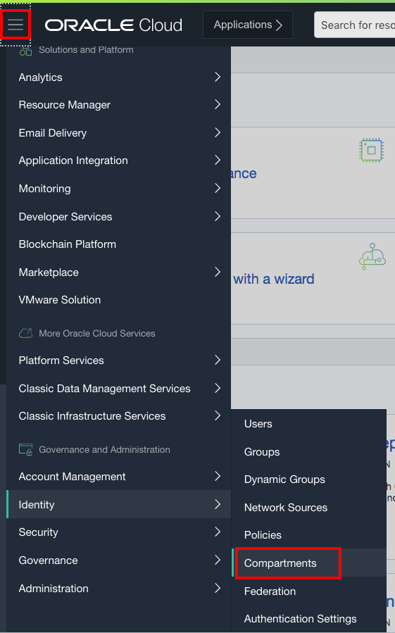

  - If you have a **Demo** compartment already, _**SKIP THIS STEP**_. Otherwise, Click **Create Compartment**

    

  - In the **Name** field, enter `Demo`. Enter a description of your choice. In the **Parent Compartment** field, ensure that the `root` compartment is selected (it will have the same name as your Oracle Cloud Account). Click **Create Compartment**.

    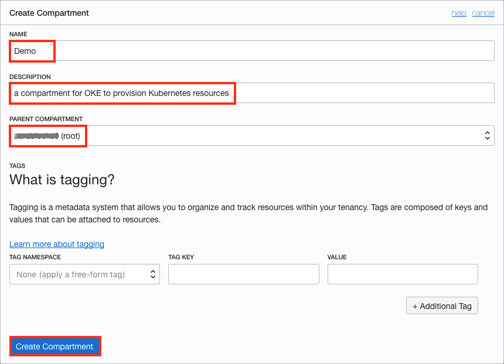

## **STEP 3**: Create an OKE cluster

The *Quick Create* feature uses the default settings to create a *quick cluster* with new network resources as required. This approach is the fastest way to create a new cluster. If you accept all the default values, you can create a new cluster in just a few clicks. New network resources for the cluster are created automatically, along with a node pool and three worker nodes.

In the Console, open the navigation menu. Under *Solutions, Platform and Edge*, go to *Developer Services* and select **Kubernetes Clusters**.

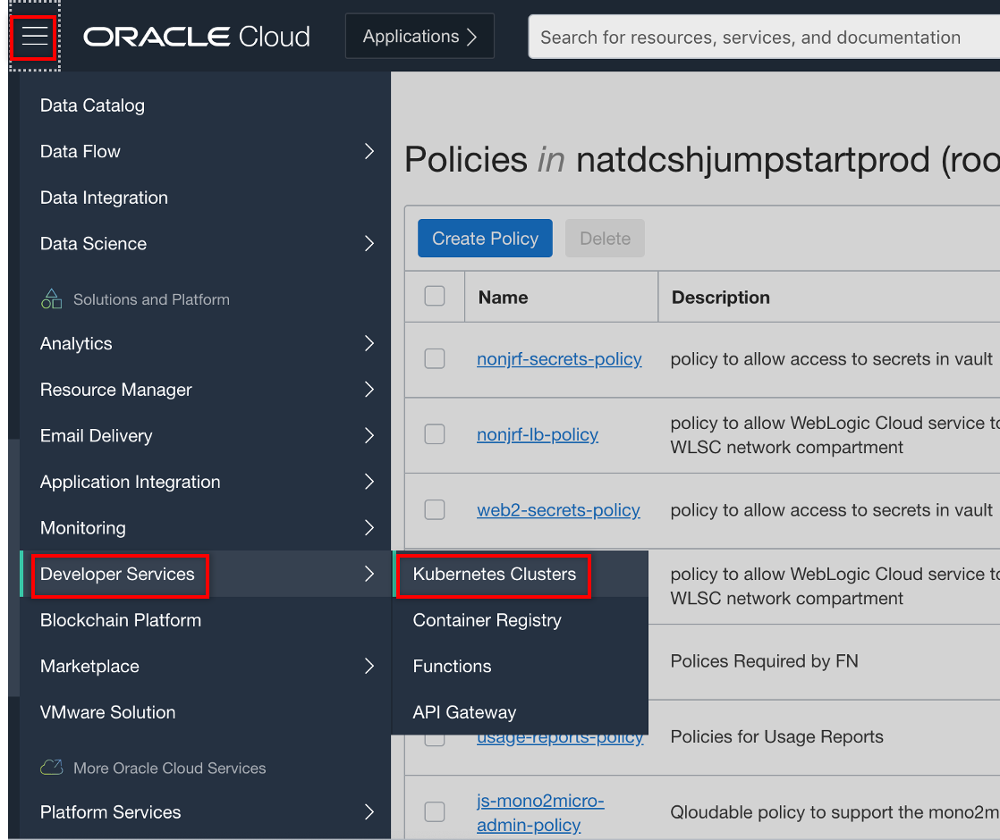

On the Cluster List page, click **Create Cluster**.

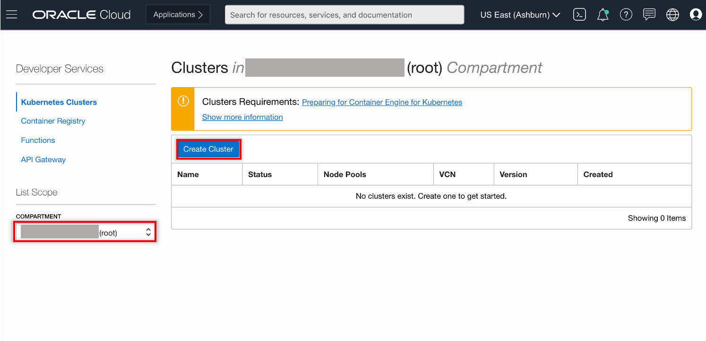

In the Create Cluster Solution dialog, select *Quick Create* and click **Launch Workflow**.

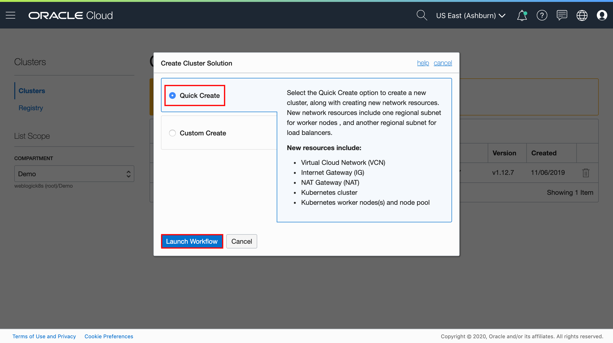

Select **Quick Create** to create a new cluster with the default settings, along with new network resources for the new cluster.

**Quick Create** will create a new cluster with default settings, along with new network resources for the new cluster.

Specify the following configuration details on the Cluster Creation page:
- **Name**: The name of the cluster. Leave the default value.
- **Compartment**: The name of the compartment. Leave the default value.
- **Kubernetes version**: The version of Kubernetes. Leave the default value which should be `1.19.7`.
- **Kubernetes API Endpoint**: Are the cluster master nodes going to be routable or not. Select the *Public Endpoint* value.
- **Kubernetes Worker Nodes**: Are the cluster worker nodes going to be routable or not. Leave the default *Private Workers* value.
- **Shape**: The shape to use for each node in the node pool. The shape determines the number of CPUs and the amount of memory allocated to each node. The list shows only those shapes available in your tenancy that are supported by OKE. Select the available *VM.Standard2.1*.
- **Number of nodes**: The number of worker nodes to create. Leave the default value, *3*

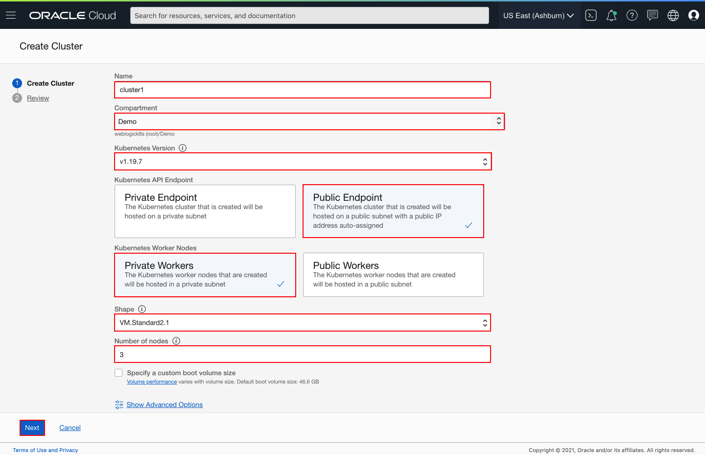

Click **Next** to review the details you entered for the new cluster.

On the *Review* page, click **Submit** to create the new network resources and the new cluster.

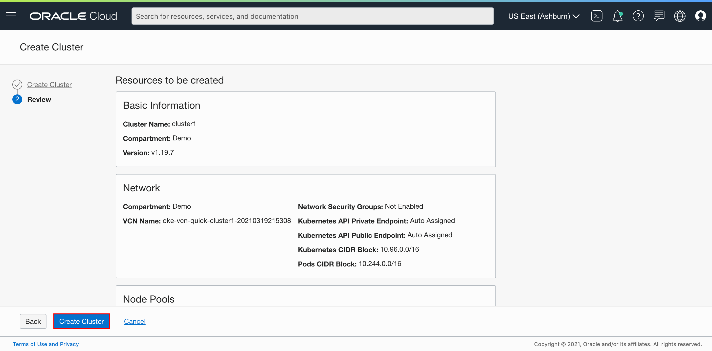

You see the network resources being created for you.

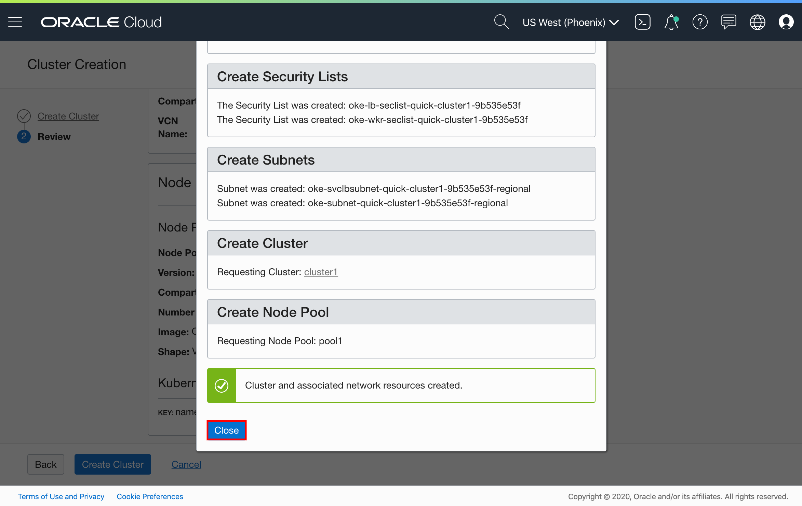

Click **Close** and the new cluster is shown on the *Cluster Details* page. When it has been created, the new cluster has a status of *Active*.

## **STEP 4**:  OCI Cloud Shell

Oracle Cloud Infrastructure (OCI) Cloud Shell is a web browser-based terminal, accessible from the Oracle Cloud Console. Cloud Shell provides access to a Linux shell, with a pre-authenticated Oracle Cloud Infrastructure CLI and other useful tools (*Git, kubectl, helm, OCI CLI*) to complete the operator tutorials. Cloud Shell is accessible from the Console. Your Cloud Shell will appear in the Oracle Cloud Console as a persistent frame of the Console, and will stay active as you navigate to different pages of the Console.

Click the Cloud Shell icon in the Console header (top right area in the browser).

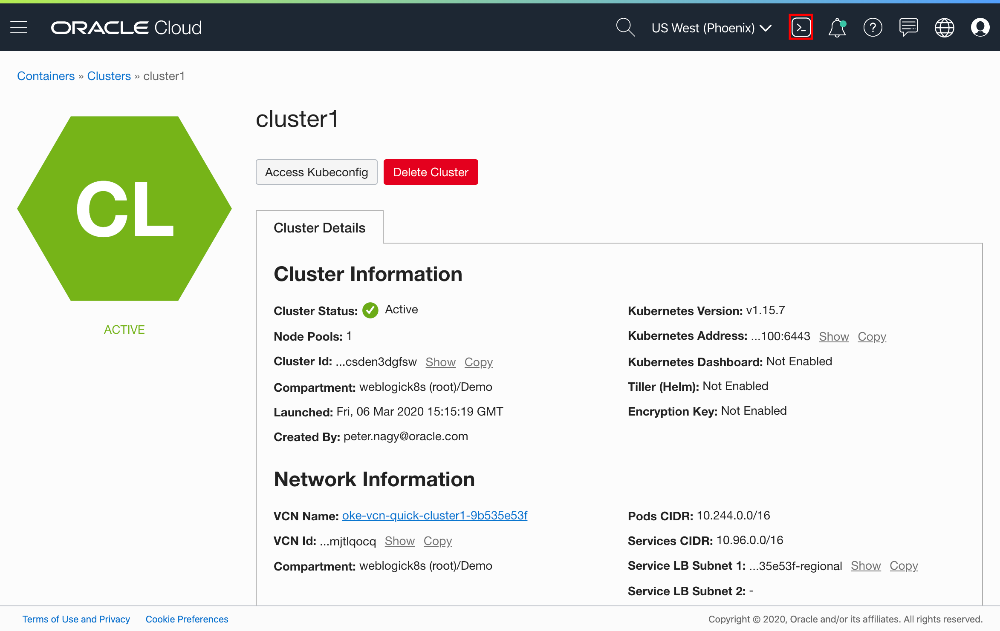

Wait a few seconds for the Cloud Shell to appear.

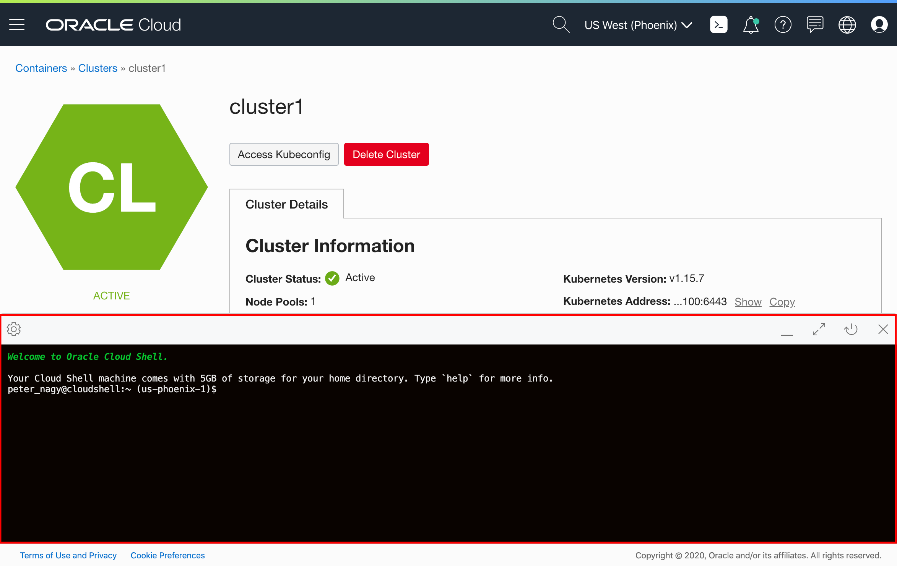

You can minimize and restore the terminal size at any time.

## **STEP 5**: Configure kubectl

Your Cloud Shell comes with the OCI CLI pre-authenticated, so there’s no setup to do before you can start using it.

To complete the `kubectl` configuration, click **Access Kubeconfig** on your cluster detail page. (If you moved away from that page, then open the navigation menu and under **Developer Services**, select **Clusters**. Select your cluster and go the detail page.

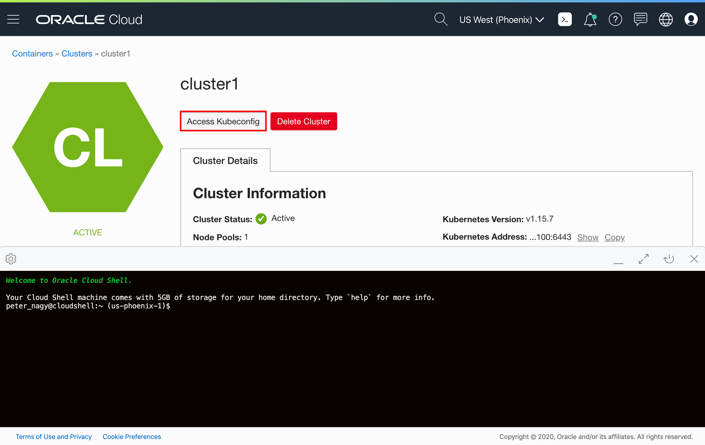

A dialog appears which contains the customized OCI command that you need to execute, to create a Kubernetes configuration file.

Select the **Copy** link to copy the `oci ce...` command to Cloud Shell, then close the configuration dialog before you paste the command into the terminal.

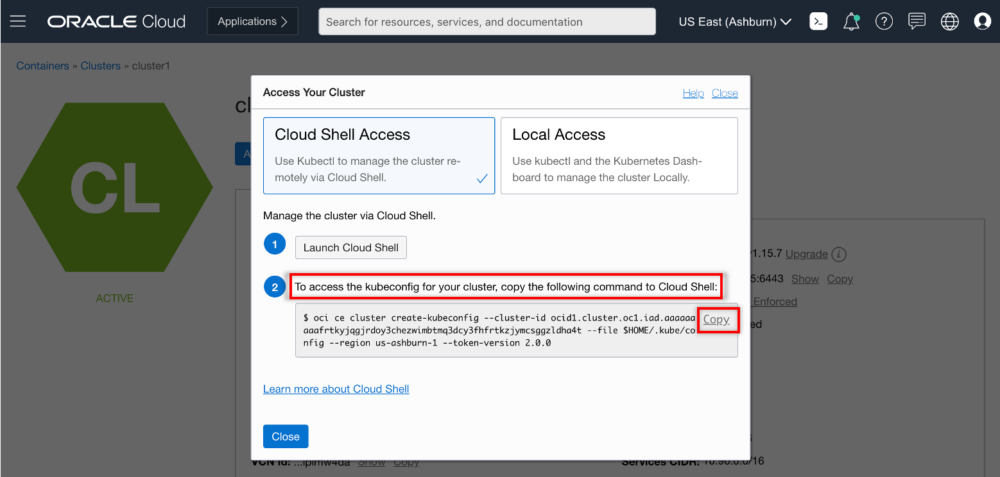
For example, the command looks like the following:
```bash
$ oci ce cluster create-kubeconfig --cluster-id ocid1.cluster.oc1.THIS_IS_EXAMPLE_DONT_COPY_PASTE_FROM_HERE --file $HOME/.kube/config --region us-phoenix-1 --token-version 2.0.0
New config written to the Kubeconfig file /home/peter_nagy/.kube/config
```
Now check that `kubectl` is working, for example, using the `get node` command:
```bash
$ kubectl get node
NAME        STATUS   ROLES   AGE    VERSION
10.0.10.2   Ready    node    56m   v1.19.7
10.0.10.3   Ready    node    56m   v1.19.7
10.0.10.4   Ready    node    56m   v1.19.7
```
If you see the node's information, then the configuration was successful.

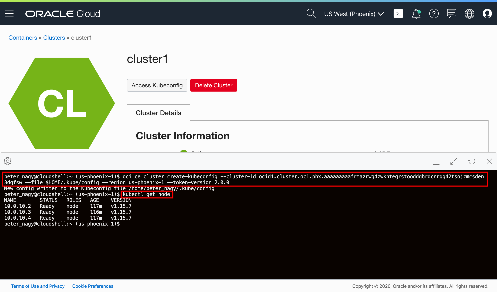

Congratulation, now your OCI OKE environment is ready to deploy your WebLogic domain.

## Acknowledgements

- **Authors/Contributors** -
- **Last Updated By/Date** March 22, 2021
- **Workshop Expiration Date** - March 31, 2022

## See an issue?
Please submit feedback using this [form](https://apexapps.oracle.com/pls/apex/f?p=133:1:::::P1_FEEDBACK:1). Please include the *workshop name*, *lab* and *step* in your request.  If you don't see the workshop name listed, please enter it manually. If you would like for us to follow up with you, enter your email in the *Feedback Comments* section.    Please include the workshop name and lab in your request.
